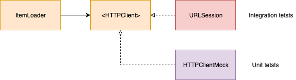

- [Words](#words)
- [Why we need to run automated test?](#why-we-need-to-run-automated-test)
- [Programmer Test Principles](#programmer-test-principles)
- [The Test Pyramid](#the-test-pyramid)
  - [1. Unit/Isolated tests](#1-unitisolated-tests)
    - [Argument against Unit/Isolated tests](#argument-against-unitisolated-tests)
  - [2. Integration/System tests](#2-integrationsystem-tests)
  - [3. UI tests](#3-ui-tests)
- [Test Strategy](#test-strategy)
- [Drawbacks of integration tests as a primary strategy](#drawbacks-of-integration-tests-as-a-primary-strategy)
  - [A tendency for tight coupling and bad design decisions](#a-tendency-for-tight-coupling-and-bad-design-decisions)
  - [Limited team collaboration](#limited-team-collaboration)
  - [Testing can quickly become an unsustainable/costly liability for the team and the company](#testing-can-quickly-become-an-unsustainablecostly-liability-for-the-team-and-the-company)
- [Some types of UI tests in iOS](#some-types-of-ui-tests-in-ios)
  - [XCUITest](#xcuitest)
  - [Acceptance Testing](#acceptance-testing)
  - [Snapshot Testing](#snapshot-testing)
- [Refactoring and test](#refactoring-and-test)
- [We should strive to test behaviors instead of implementations.](#we-should-strive-to-test-behaviors-instead-of-implementations)
- [We should strive to test through the public interfaces](#we-should-strive-to-test-through-the-public-interfaces)
- [Dependencies which make unit tests difficult (FIRE rules)](#dependencies-which-make-unit-tests-difficult-fire-rules)
  - [(F)ast](#fast)
  - [(I)solated](#isolated)
    - [Global variables](#global-variables)
    - [Persistent storage.](#persistent-storage)
  - [(R)epeatable](#repeatable)
  - [(E)xaminable:](#examinable)
- [Making dependencies explicit](#making-dependencies-explicit)
- [Dealing with side-effects and stateful components in tests](#dealing-with-side-effects-and-stateful-components-in-tests)
- [Make tests expressive](#make-tests-expressive)
- [Triangulating a specific data point to decide which values to test](#triangulating-a-specific-data-point-to-decide-which-values-to-test)
- [Testing effectively with 3rd-party frameworks](#testing-effectively-with-3rd-party-frameworks)
- [Test tips](#test-tips)
  - [UI layout changes not applied immediately](#ui-layout-changes-not-applied-immediately)
  - [RunLoop tricks](#runloop-tricks)
  - [Simulate user drags scroll](#simulate-user-drags-scroll)
  - [Avoid singletons by Subclass and Override Method.](#avoid-singletons-by-subclass-and-override-method)
- [The Transformation Priority Premise](#the-transformation-priority-premise)
- [Code Analysis](#code-analysis)
  - [Overall test lines of code per production lines of code](#overall-test-lines-of-code-per-production-lines-of-code)
  - [Test lines of code per production lines of code over time](#test-lines-of-code-per-production-lines-of-code-over-time)
  - [Conditional statements per test file](#conditional-statements-per-test-file)
  - [Comments per test file](#comments-per-test-file)
  - [Setup lines of code per test file](#setup-lines-of-code-per-test-file)
  - [Lines of code per test method](#lines-of-code-per-test-method)
  - [Code Coverage](#code-coverage)
  - [Test time per commit](#test-time-per-commit)

# Words

component: functions, modules, classes, protocols, interfaces, data structures, dependencies and any language/platform or component-like types in the codebase

# Why we need to run automated test?

- Guarantee the correctness and quality of our apps and a productive development process
- Provide us with the confidence to continue implementing the company’s vision
- Keep delivering great features at a fast and constant pace.

# Programmer Test Principles

Programmer tests should:
- Minimize programmer waiting.
- Run reliably.
- Predict deployability.
- Respond to behavior changes.
- Not respond to structure changes.
- Be cheap to write.
- Be cheap to read.
- Be cheap to change.

[Programmer Test Principles](https://medium.com/@kentbeck_7670/programmer-test-principles-d01c064d7934)

# The Test Pyramid

<br/>


<br/>
<br/>

There are 3 kinds of test and it is represented by the pyramid:

- Unit/Isolated tests
- Integration/System tests
- UI tests

## 1. Unit/Isolated tests

They test individual components or functionalities to validate that they work as expected in isolated conditions.

### Argument against Unit/Isolated tests

In unit or isolated testing, we create test doubles to behave as we wish.

Some developers argue against the isolated testing approach since test doubles are not the real implementations used in production, so they don’t give us enough confidence that our code actually does what it needs to do. Test doubles prove our code works with the given test double.

It's valid, but it doesn’t mean we should not write isolated tests. A better solution is to write a few integration tests to test the implementations in integration. This way you get the benefits of isolated tests as the primary testing strategy and avoid the integration tests unsustainable drawbacks.

※ In my view, we tend to write only unit tests when we notice the importance of automated tests. But it's not enough since implementing each functions individually requests us to connect them together somewhere. Only with unit tests, there is possibility for us to forget to do it. So, integration tests are important to find such kind of mistake.

## 2. Integration/System tests

In order to test how this code interacts with other code (that form the entire software), integration tests need to be run. 

A critical difference between integration and unit/isolated tests as the primary testing strategy is how much we need to know or how many decisions we have to make up front. Integration tests often require us to make many more upfront decisions.

In practice, they check two or more components collaborating without mocks, stubs, spies, or any other test double.

Integration tests are usually necessary, however, we need to avoid using them as our primary testing strategy in the light of the cost and complexity involved in integration tests is usually hidden and can drastically decrease the team’s productivity and morale over time.

Comparing with unit/isolated tests:

- require at least two components collaborating, tests are bound to be lengthy (e.g. require more setup)
- more complex or more laborious to maintain (e.g. shared state management)
- fragile (e.g. tiny changes in one component may create a cascade of failing tests that are hard to debug and fix) 
- tend to increase the amount of code used in all three Given/When/Then test blocks potentially leading to unreadable and unmaintainable blocks of code, then the cost for diving back in later—to extend or debug an issue—is too high
- the number of integration tests required corresponds to the number of paths/states the system can be in.
- use real implementations are frequent and also very expensive, time wise operations.

## 3. UI tests

They represent end-to-end tests we run through the user interface. 

# Test Strategy

The testing pyramid instructs us to focus on Unit tests as the primary strategy since they are fast, reliable , cheaper to write than other tests(with mocking environment). As we step up on the pyramid, and more components are added in integration, the time and cost for each added test increase much. The more components we check in integration, the more expensive testing becomes.


<br/>
<br/>

# Drawbacks of integration tests as a primary strategy

We need concrete frameworks(implementation details) for integration tests. If we try to use them as a primary strategy. It could cause some problems.

## A tendency for tight coupling and bad design decisions

Implementing business logic based on a concrete framework tend to make wrong design decisions up front. It often leads to the lack of our design flexibility due to high coupling. In addition, it would lose productivity. For example:

- Analysis paralysis: can’t decide on actions for lack of information or fear of negative impacts of the decision.
- Burnout: working in big batches and not often merging, leading to nightmarish merge conflicts, inability to estimate work, missed deadlines, development & product bottlenecks, and eventually low morale and high turnover.
- Bugs & Regressions: inability to write good tests, leading to faulty software.

## Limited team collaboration

When we divide our tasks into some teams and a real implementation for integration tests is being developed by an other team. we need to wait for the implementation(it's not efficient). In addition, it might cause huge merge conflicts, rebuild/retest/redeploy.

## Testing can quickly become an unsustainable/costly liability for the team and the company

The number of tests required when testing in integration is equivalent to at least the amount of combination of states the components participating in the integration can be at.

For example, if component A has 4 possible states, and component B has 5 possible states, we need 20 tests (4x5) to guarantee correctness when relying on integration tests as the primary testing strategy.(If we use unit tests as the primary strategy, we only need 9 isolated tests.)

Also, integration tests needs much larger setup codes than unit tests. Then it will result in increasing much more complexity and test times.

# Some types of UI tests in iOS

we can take some UI Test strategies.

## XCUITest

It allows us to test our app as a "black-box." We interact with and validate the UI elements of our app. 
We use the `XCUITest`(parts of `XCTest`) APIs that integrate with Accessibility controls.

UI tests don’t have access to any concrete implementations of our app. Thus, UI tests require a running application to execute. It makes UI testing a costly testing strategy as it often introduces flakiness in test results and can take a long time to run.

That’s why UI tests allocate a very small portion of the testing strategy pyramid

[XCUITest](https://developer.apple.com/documentation/xctest/user_interface_tests)

## Acceptance Testing

It is the process of validating the system’s compliance with high-level acceptance criteria or business requirements.

In teams following BDD or similar processes, the acceptance criteria and tests are written by business folks (e.g. business analysts), and they are implemented by QA engineers or developers.

They can be expensive to run as they check real scenarios and the whole system running in integration, usually through the UI.

But we don’t need to run those tests through the UI.

When possible, write them as plain `XCTest`s that can be faster and more reliable since we have more control over the infrastructure details (network, databases, UI, etc).

## Snapshot Testing

They record a “snapshot” of parts of our system in order to compare them against previously recorded states.

A common use case for snapshot testing is validating the UI of an app. The idea is to automatically store snapshot images of the UI as "recorded states" in tests. Then, we can run those tests again to compare the “current” state matches the “recorded state”.

The tests will pass if the recorded state is the same as the received one, and they will fail if the two snapshots don’t match. So we can ensure the UI looks exactly the same after refactoring, for example.

But they aren’t limited to only images. We can also use snapshot tests with other data representations like JSON, XML, and Data.

We should avoid using snapshot tests to validate the logic/behavior of our applications because they aren’t as precise as other testing strategies such as unit/integration testing. 

- When a snapshot test fails, it can be hard to figure out why. We’ll probably have to spend some time debugging. 
- Snapshot tests are also much slower than unit tests since they rely on expensive operations such as rendering the UI and reading stored state from disk

# Refactoring and test

We mean Refactoring if:

1. We **have tests** to guarantee the current behavior of the system.
2. We're **not** adding/changing/removing behavior.
3. We're improving the code somehow.

Refactoring should be backed up by tests (and the compiler). We did not add, remove or change any behavior. We improved the code structure by decoupling modules + clarified names to match the business folks language (while keeping the exact same behavior).

Since we're restructuring production code, we start in prod and let the tests + compiler guide us. Sometimes, prod types restructuring break tests that depend on that type signature (that's why it's important to also abstract the tests from the prod code when possible), and we must fix it with the compiler's help (without altering behavior). In more mature typed languages/IDEs, such refactoring can be done with just a few keystrokes so it wouldn't require such a manual process. (Hopefully, Swift/Xcode will get there).

Now, if we're adding/changing/removing behavior—that's not refactoring, that's **factoring**. So we recommend the factoring rule: always start with a test. 

A comprehensive suite of tests (that you trust) gives us the confidence/freedom to repurpose the code since it guarantees the behavior will stay the same after the refactoring.

When working on legacy code bases with tests we don't trust (or no tests at all), we won't have that confidence. In that case, we need to add tests to validate the system behavior, and only then start the refactoring. 

# We should strive to test behaviors instead of implementations.

Low coupling between tests and implementation details makes tests resilient to changes in production. This way, we’re free to change production implementation without breaking tests.

For example, assuming that there is a button which users can save data by tapping it. In a UIViewController test,  we want to simulate its tapping action.

We can do this like the below.

```swift

func testUserSaveData() {
    // ...
    button.allTargets.forEach { target in
        actions(forTarget: target, forControlEvent: .touchUpInside)?.forEach {
            (target as NSObject).perform(Selector($0))
        }
    }
}

```

But, it's verbose if we need to do it all over the place. So we can create `UIButton` extension(so-called DSL).

```swift
extension UIButton {
	func simulateTap() {
		allTargets.forEach { target in
			actions(forTarget: target, forControlEvent: .touchUpInside)?.forEach {
				(target as NSObject).perform(Selector($0))
			}
		}
	}
}

func testUserSaveData() {
    // ...
    button.simulateButtonTap()
}
```

[allTargets](https://developer.apple.com/documentation/uikit/uicontrol/1618207-alltargets)
[actions(forTarget:forControlEvent:)](https://developer.apple.com/documentation/uikit/uicontrol/1618251-actions)

It makes tests lighter. But, it still leaks the implementation details since if we want to change the button to a link, we have to change test code in the long run. This means that implementation affects test codes. it's not ideal since tests should check the behavior, so UI component change is none of its business.

So, we prefer to hide the details completely.

```swift
extension UIControl {
	func simulate(event: UIControl.Event) {
		allTargets.forEach { target in
			actions(forTarget: target, forControlEvent: event)?.forEach {
				(target as NSObject).perform(Selector($0))
			}
		}
	}
}

// in ViewControllerTests file
private extension ViewController {
    func simulateUserSaveData() {
        button.simulate(event: .touchUpInside)
    }
}

func testUserSaveData() {
    // ...
    viewController.simulateUserSaveData()
}
```

We don't need any test code even when changing the button and get the more behavior-oriented name.


※ If we run tests with a Hosting Application, we can also use `sendActions(for: UIControl.Event)`.

```swift
private extension ViewController {
    func simulateUserSaveData() {
        button.sendActions(for: .touchUpInside)
    }
}
```

[sendActions(for:)](https://developer.apple.com/documentation/uikit/uicontrol/1618211-sendactions)

# We should strive to test through the public interfaces

Related to the above, by not exposing internal/private types to tests, the refactoring was safe and easy. That’s the power of testing only through the public interfaces: behavior is guaranteed to stay the same while we have the freedom to move things around and repurpose the design as needed.

# Dependencies which make unit tests difficult (FIRE rules)

Many times, external dependencies are key points for good tests, especially tests.

There are two kinds of dependencies.
- Problem-free dependencies
- Difficult dependencies

There are some criteria for which one is which, FIRE:

※ They isn't a complete list of difficult dependencies. But they illustrate guidelines that will help us identify most of them.

[Recognizing Code that Resists Unit Testing](https://youtu.be/FFk583ZtGd8?t=627)

## (F)ast

Function or computed property run very fast.

iOS programs often include code that will execute in response to some external trigger like delegate methods.

If there’s no way for tests to trigger the code execution immediately, that’s a slow dependency (e.g. Calls to web services, Timer).

## (I)solated

Neither function has any side effects that would persist beyond the test run.

There are two common ways that dependencies break the rule of isolation: 

### Global variables

- Variables defined outside of any type
- Singletons
- Static properties

※ They aren't a problem if they're read-only, such as constants, When we can change the value of a global , so-called shared mutable state, we ru into the challenges.


### Persistent storage.

- File system
- UserDefaults
- Keychain
- Local database
- Remote database

It's similar to global variables except that we store the state in something that outlasts the app's life cycle.

We need each test to run in  a clean state. Earlier test runs or manual testing should not change the outcome of automated tests. Also automated tests should not leave any trace that affect later manual testing.

## (R)epeatable

The same input always get the same output. No external services that might fail. No race conditions.

In the opposite, the below dependencies make different results when called:

- Current time or date
- Camera or microphone input
- Face ID or Touch ID
- Core Motion sensors
- Random numbers

We can predict those differences, but there are also unpredictable differences:

- External services - they can fail
- Writing to a log file - we can run out of disk space
- Time zone of the machine running tests - when writing tests, it's easy to assume they'll always run in our time zone. But if our team is global, there are hidden problems.

## (E)xaminable:

When calling a dependency, how can we know if the call was correct? If there's a return value, tests can simply check the return value. Even when there is no return value, if we can check  a property of the dependency for an expected value, that is also easy. But, a call has an external effect we can't access, that dependency is harder to test.

For example:

- Analytics
- Playing audio or video

 When logging events to a server, there is no way for the mobile API to ask for the events we sent.

# Making dependencies explicit

Ideally, we want to avoid implicit details in tests. Tests should be short, but every important detail to a test should be clearly defined within the test method. By doing so, when there’s a test failure, we can easily understand the test set up by looking at its short scope (without having to debug or go through many levels of abstractions).

As a rule of thumb, when following the Given/When/Then test structure, every value used in the When and Then portions should be defined in the Given portion.

Instead of

```swift

func test() {
    // Given 
    // Looks no dependency
    let store = makeCacheStore()

    // When 
    // call testCacheStoreURL() directly
    try! "some test data".write(to: testCacheStoreURL(), atomically: true, encoding: .utf8)

    // Then
    XCTAssertNotNil(store.data)
}
```


```swift

func test() {
    // Given
    // Pass dependency explicitly
    let testStoreURL = testCacheStoreURL()
    let store = makeCacheStore(url: testStoreURL)

    // When
    // Use defined dependency in Given
    try! "some test data".write(to: testStoreURL, atomically: true, encoding: .utf8)

    // Then
    XCTAssertNotNil(store.data)
}
```

# Dealing with side-effects and stateful components in tests

When testing with the real environment(e.g. File system, Core Data), we must reset the state of it before(`setUp`) and after(`tearDown`) a test. We sometimes forget to reset it before tests. If we do not reset, there is the possibility of problematic edge cases such as crashes and breakpoints that can prevent the test from completing and the tearDown from being invoked.

# Make tests expressive

Even though calling the same method int the long run, it's better to create a tiny DSL to make tests descriptive.

For example, when we test async code, we have to wait for async result.

```swift
final class ItemLoader {
    func loadItems(@escaping: (Result<[Item], Error>) -> Void) {
        // ...
    }
}

class ItemLoaderTest: XCTestCase {
    func test_loadTwice_getSameItems() {
        let loader = ItemLoader()

        let exp = expectation(description: "wait for load")
        loader.loadItems { result in
            let firstItems = XCTUnwrap(try result.get())) 
            loader.loadItems { result in
                let secondItems = XCTUnwrap(try result.get())) 
                XCTAssertEqual(firstItems, secondItems)
                exp.fulfill()
            }
        }
        wait(for: [exp], timeout: 1)
    }
}
```

This nested code is hard to read. INstead we can extract the code into a function:

```swift
class ItemLoaderTest: XCTestCase {
    func test_load_getItems() throws {
        // Given
        let loader = ItemLoader()

        // When
        let firstItems = XCTUnwrap(try? load(loader).get()) 
        let secondItems = XCTUnwrap(try? load(loader).get()) 

        // Then
        XCTAssertEqual(firstItems, secondItems)
    }

    private func load(loader: ItemLoader) -> Result <[Item], Error> {
        var receivedResult: Result <[Item], Error>!
        let exp = expectation(description: "wait for load")
        loader.loadItems {
            receivedResult = $0
            exp.fulfill()
        }
        wait(for: [exp], timeout: 1)
        return receivedResult
    }
}
```

This private method:

- Made the test simpler
- Enabled us to read the test in the natural order(Given/When/Then)
- Enabled us to reuse the same method in many tests

# Triangulating a specific data point to decide which values to test

Triangulating specific data points helps us de-risk and increase the test coverage of the system. For example, assuming that we need to delete local data in 3 days as a business rule. We need to check 3 days, less then 3 days, and more than 3 days at least.

We can improve our process of testing “hidden” behaviors simply by triangulating examples around a specific data point.

# Testing effectively with 3rd-party frameworks

Test-driving 3rd-party frameworks like UIKit is different from test-driving your implementations because you need to know how to use the framework upfront.

When testing with 3rd-party frameworks in the mix, you shouldn’t have to “test that the framework works.” You should trust that 3rd-party frameworks work as intended.
# Test tips

When testing UIViewController, we sometimes meet difficulties because of UIKIt internal(hidden) behaviors.

## UI layout changes not applied immediately

`didEndDisplayingCell` is one of delegate methods of `UITable(Collection)ViewDelegate`. This is triggered only when the cell is removed from the view. But, layout changes is not started immediately, it's done in the next layout cycle instead, due to performance reasons.

We need to call `layoutIfNeeded()` to force the layout to be updated immediately. But it's not enough. We also need to run the current `RunLoop` to avoid memory leaks during the test. If not, some instances might be retained in memory even after the test is finished.

```swift

extension ViewController {
    func forceRendering() {
        tableView.layoutIfNeeded()
        RunLoop.current.run(until: Date())
    }
}
```
Plus, on iOS14+, it seems that we may need to run `RunLoop` one more after asserting UI states.

[RunLoop](https://developer.apple.com/documentation/foundation/runloop)

## RunLoop tricks

There are any other cases which we need to run RunLoop since some of UIKit’s actions aren’t immediate but add an event to the run loop. The run loop is a UIKit mechanism for handling events like mouse and keyboard input. UIKit also uses it for other things. Pushing onto a navigation controller is one example. When we want to check if the specific view is pushed or not(e.g. checking navigation stack), we need to call `RunLoop.current.run(until: Date())`.

## Simulate user drags scroll

When we need to test a pagination request triggered by a user's scroll action. 

It's normal to prevent extra request by checking `isDragging` property in `scrollViewDidScroll` delegate method. 
```swift
override func scrollViewDidScroll(_ scrollView: UIScrollView) {
    guard scrollView.isDragging else { return }
}
```

It's impossible(at least I don't know) to simulate this action from `XCTest`.

Instead, we can subclass `UIScrollView` and use it.

```swift
private final class DraggingScrollView: UIScrollView {
    override var isDragging: Bool {
        true
    }
}
```

## Avoid singletons by Subclass and Override Method.

If existing code uses singletons, we can use Subclass and Override Method technique to avoid their effects.

For example,

```swift
class OverrideViewController: UIViewController {
    override func viewDidAppear(_ animated: Bool) {
        super.viewDidAppear(animated)
        Analytics.shared.track(event: "viewDidAppear - \(type(of: self))")
    }
}
```

We want to avoid Analytics singleton. So, extract `Analytics.shared` to a method.

```swift
class OverrideViewController: UIViewController {
    ​func​ ​analytics​() -> ​Analytics​ { ​Analytics​.shared }
    override func viewDidAppear(_ animated: Bool) {
        super.viewDidAppear(animated)
        ​analytics​().track(event: "viewDidAppear - \(type(of: self))")
    }
}
```

Then, we can override this class in the test code.

```swift
private​ ​class​ ​TestableOverrideViewController​: ​OverrideViewController​ {
​   ​override​ ​func​ ​analytics​() -> ​Analytics​ { ​Analytics​() }
​}
```

※ There are some limitations:

- It can apply only to `class`.
- We might remove `final` modifier to make it possible to subclass.
- Storyboard-based view controllers can't br subclassed

※ We might want to use this technique in many places, be careful not to apply it excessively. it's better to use this technique only for preexisting code without tests. In other cases, we should use other DI techniques like constructor injection.

```swift
final class OverrideViewController: UIViewController {
    ​private​ ​let​ analytics: ​Analytics​​ ​
    ​init​(analytics: ​Analytics​ = ​Analytics​.shared) {​     ​
        self​.analytics = analytics​
        ​super​.​init​(nibName: ​nil​, bundle: ​nil​)​
    }
}
```

[Subclass and Override: A Legacy Code Technique](https://medium.com/pragmatic-programmers/subclass-and-override-a-legacy-co-de-technique-44dbc6ac1a74)

# The Transformation Priority Premise

It’s tempting to just fix the code at once, but it will increase the risk of mistakes. Moving forward in small steps reduces the risk of mistakes.

When you edit code, you transform it from one working state to another. The point is to keep the time when the code is invalid as short as possible. There is a prioritized list of code transformations. We can use it as a guideline.

```
({}→nil) no code at all → code that employs nil
(nil→constant)
(constant→constant+) a simple constant to a more complex constant
(constant→scalar) replacing a constant with a variable or an argument
(statement→statements) adding more unconditional statements
(unconditional→if) splitting the execution path
(scalar→array)
(array→container)
(statement→recursion)
(if→while)
(expression→function) replacing an expression with a function or algorithm
(variable→assignment) replacing the value of a variable
```

The list is ordered roughly so that the simpler transformations are at the top, and the more complex changes are at the bottom.

The point is to move in small increments.

[The Transformation Priority Premise](https://blog.cleancoder.com/uncle-bob/2013/05/27/TheTransformationPriorityPremise.html)


# Code Analysis

It doesn't take much to make an unmaintainable codebase or decrease the quality of a good codebase. It's the same as test codebase.

There are indicators help us examine the past and evaluate the present state of the test codebase.

## Overall test lines of code per production lines of code

Revealing how much work has been done in a test suite

※ It can't be accurate about how much of the actual codebase has been tested, or whether tests were written first or not. But it shows the effort the team put into testing overall.

## Test lines of code per production lines of code over time

The ratio of each commit in a graph and let the graph lines tell the story, regardless of whether the tests were written first or last.

If the test lines of code index is flat or with small spikes when compared to the production lines of code index, you know the codebase is not built with testing.

## Conditional statements per test file

Understanding whether conditional logic is being separated in multiple tests instead of one. Tests should also be responsible for a single objective. The goal is to have a clearer view of what is being tested. Also, when a test fails it's much easier to understand the scope that generated such failure.

## Comments per test file

Commented out tests signifies missing checks in the system's behavior. When deadlines are approaching and pressure increases it might be tempting for some teams to defer the implementation or rewriting of these tests to the future, after they have made the deadline. This behavior should be considered harmful, as clearly not all automated checks have been performed to the system, thus it increases the probability of deploying faulty behaviors to customers.

## Setup lines of code per test file

It quickly shows how developers set up their systems under test(※).

※ Systems under test: Whatever thing we are testing 
[SUT](http://xunitpatterns.com/SUT.html)


It should signify that there is an excess of configuration code for the system under test to start for each test. A lengthy configuration usually signifies a lot of dependencies that are required from the system under test to start and function properly.

These behaviors can help us point out design issues with our components. For example, component A has a dependency on the concrete component B, then to test A we may have to also create and configure component B. The configuration of B can create an excess of test setup code. We can fix these problems by hiding concrete collaborator implementations(dependency inversion) behind an interface/protocol and using the real implementation in the tests only when actually required, and a reusable test-double implementation everywhere else.

## Lines of code per test method 

It allows us to see the consistency level of our tests' structure. To make our tests more readable and easier to maintain, we can follow the arrange/act/assert(or given/when/then) paradigms. A test method should be small, concise and test one and only one behavior at a time. We can:

- Simplifying setup
- Removing duplication
- Clarifying intention 
- Removing statements that are being repeated more than once
- Organizing assertion code
- Creating functions that hide complexity and allow extensibility

## Code Coverage

It shows the percentage of code exercised by tests. A high code coverage may indicate developers' consistency for writing tests along with the production code. A low (or zero) code coverage implies that the team doesn't care for automated testing.

※ It doesn't guarantee that all the production code behavior has been checked through the tests.

## Test time per commit

It shows the accumulating test times per commit. There are various factors that can affect a project's  test times, so there are a lot of options for us to check and try to improve.

- Try removing unnecessary operations and refactoring your test cases to induce reusability with the help of properties, functions and assertions.
- Try to remove expensive operations that integrate two or more components instead of testing them in isolation like avoiding real configurations and implementations of components(These types of integration tests can be helpful. But we can consider optimizing or moving them to a separate test suite.)
- Move tests to a separate test suite(e.g. when start separating our code into independent modules)
