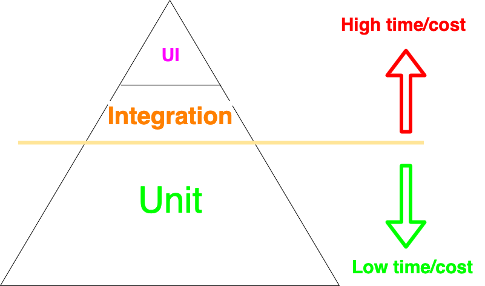

# Swift Automated Test Strategy

## Why we need to run automated test?

- Guarantee the correctness and quality of our apps and a productive development process
- Provide us with the confidence to continue implementing the company’s vision
- Keep delivering great features at a fast and constant pace.

## Programmer Test Principles

Programmer tests should:
- Minimize programmer waiting.
- Run reliably.
- Predict deployability.
- Respond to behavior changes.
- Not respond to structure changes.
- Be cheap to write.
- Be cheap to read.
- Be cheap to change.

[Programmer Test Principles](https://medium.com/@kentbeck_7670/programmer-test-principles-d01c064d7934)

## The Test Pyramid

<br/>



<br/>
<br/>

There are 3 kinds of test and it is represented by the pyramid:

### 1. Unit/Isolated tests

They test individual components or functionalities to validate that they work as expected in isolated conditions.

They are the foundation or primary testing strategy because they are swift, reliable, and cheap to write. 

### 2. Integration/System tests

In order to test how this code interacts with other code (that form the entire software), integration tests need to be run. 

A critical difference between integration and unit/isolated tests as the primary testing strategy is how much we need to know or how many decisions we have to make up front. Integration tests often require us to make many more upfront decisions.

In practice, they check two or more components collaborating without mocks, stubs, spies, or any other test double.

Integration tests are usually necessary, however, we need to avoid using them as our primary testing strategy in the light of the cost and complexity involved in integration tests is usually hidden and can drastically decrease the team’s productivity and morale over time.

Comparing with unit/isolated tests:

- require at least two components collaborating, tests are bound to be lengthy (e.g. require more setup), 
- more complex or more laborious to maintain (e.g. shared state management)
- fragile (e.g. tiny changes in one component may create a cascade of failing tests that are hard to debug and fix) 
- tend to increase the amount of code used in all three Given/When/Then test blocks potentially leading to unreadable and unmaintainable blocks of code, then the cost for diving back in later—to extend or debug an issue—is too high
- the number of integration tests required corresponds to the number of paths/states the system can be in.
- use real implementations are frequent and also very expensive, time wise operations.

### 3. UI tests

They represent end-to-end tests we run through the user interface. 

## Argument against Unit/Isolated tests

In unit or isolated testing, we create test doubles to behave as we wish.

Some developers argue against the isolated testing approach since test doubles are not the real implementations used in production, so they don’t give us enough confidence that our code actually does what it needs to do. Test doubles prove our code works with the given test double.

It's valid, but it doesn’t mean we should not write isolated tests. A better solution is to write a few integration tests to test the implementations in integration. This way you get the benefits of isolated tests as the primary testing strategy and avoid the integration tests unsustainable drawbacks.

※ In my view, we tend to write only unit tests when we notice the importance of automated tests. But it's not enough since implementing each functions individually requests us to connect them together somewhere. Only with unit tests, there is possibility for us to forget to do it. So, integration tests are important to find such kind of mistake.


## Some types of UI tests in iOS

we can take some UI Test strategies.

### XCUITest

It allows us to test our app as a "black-box." We interact with and validate the UI elements of our app. 
We use the `XCUITest`(parts of `XCTest`) APIs that integrate with Accessibility controls.

UI tests don’t have access to any concrete implementations of our app. Thus, UI tests require a running application to execute. It makes UI testing a costly testing strategy as it often introduces flakiness in test results and can take a long time to run.

That’s why UI tests allocate a very small portion of the testing strategy pyramid

[XCUITest](https://developer.apple.com/documentation/xctest/user_interface_tests)

### Acceptance Testing

It is the process of validating the system’s compliance with high-level acceptance criteria or business requirements.

In teams following BDD or similar processes, the acceptance criteria and tests are written by business folks (e.g. business analysts), and they are implemented by QA engineers or developers.

They can be expensive to run as they check real scenarios and the whole system running in integration, usually through the UI.

But we don’t need to run those tests through the UI.

When possible, write them as plain `XCTest`s that can be faster and more reliable since we have more control over the infrastructure details (network, databases, UI, etc).

### Snapshot Testing

They record a “snapshot” of parts of our system in order to compare them against previously recorded states.

A common use case for snapshot testing is validating the UI of an app. The idea is to automatically store snapshot images of the UI as "recorded states" in tests. Then, we can run those tests again to compare the “current” state matches the “recorded state”.

The tests will pass if the recorded state is the same as the received one, and they will fail if the two snapshots don’t match. So we can ensure the UI looks exactly the same after refactoring, for example.

But they aren’t limited to only images. We can also use snapshot tests with other data representations like JSON, XML, and Data.

We should avoid using snapshot tests to validate the logic/behavior of our applications because they aren’t as precise as other testing strategies such as unit/integration testing. 

- When a snapshot test fails, it can be hard to figure out why. We’ll probably have to spend some time debugging. 
- Snapshot tests are also much slower than unit tests since they rely on expensive operations such as rendering the UI and reading stored state from disk

## Refactoring and test

We mean Refactoring if:

1. We **have tests** to guarantee the current behavior of the system.
2. We're **not** adding/changing/removing behavior.
3. We're improving the code somehow.

Refactoring should be backed up by tests (and the compiler). We did not add, remove or change any behavior. We improved the code structure by decoupling modules + clarified names to match the business folks language (while keeping the exact same behavior).

Since we're restructuring production code, we start in prod and let the tests + compiler guide us. Sometimes, prod types restructuring break tests that depend on that type signature (that's why it's important to also abstract the tests from the prod code when possible), and we must fix it with the compiler's help (without altering behavior). In more mature typed languages/IDEs, such refactoring can be done with just a few keystrokes so it wouldn't require such a manual process. (Hopefully, Swift/Xcode will get there).

Now, if we're adding/changing/removing behavior—that's not refactoring, that's **factoring**. So we recommend the factoring rule: always start with a test. 

A comprehensive suite of tests (that you trust) gives us the confidence/freedom to repurpose the code since it guarantees the behavior will stay the same after the refactoring.

When working on legacy code bases with tests we don't trust (or no tests at all), we won't have that confidence. In that case, we need to add tests to validate the system behavior, and only then start the refactoring. 

## We should strive to test behaviors instead of implementations.

Low coupling between tests and implementation details makes tests resilient to changes in production. This way, we’re free to change production implementation without breaking tests.

For example, assuming that there is a button which users can save data by tapping it. In a UIViewController test,  we want to simulate its tapping action.

We can do this like the below.

```swift

func testUserSaveData() {
    // ...
    button.allTargets.forEach { target in
        actions(forTarget: target, forControlEvent: .touchUpInside)?.forEach {
            (target as NSObject).perform(Selector($0))
        }
    }
}

```

But, it's verbose if we need to do it all over the place. So we can create `UIButton` extension(so-called DSL).

```swift
extension UIButton {
	func simulateTap() {
		allTargets.forEach { target in
			actions(forTarget: target, forControlEvent: .touchUpInside)?.forEach {
				(target as NSObject).perform(Selector($0))
			}
		}
	}
}

func testUserSaveData() {
    // ...
    button.simulateButtonTap()
}
```

[allTargets](https://developer.apple.com/documentation/uikit/uicontrol/1618207-alltargets)
[actions(forTarget:forControlEvent:)](https://developer.apple.com/documentation/uikit/uicontrol/1618251-actions)

It makes tests lighter. But, it still leaks the implementation details since if we want to change the button to a link, we have to change test code in the long run. This means that implementation affects test codes. it's not ideal since tests should check the behavior, so UI component change is none of its business.

So, we prefer to hide the details completely.

```swift
extension UIControl {
	func simulate(event: UIControl.Event) {
		allTargets.forEach { target in
			actions(forTarget: target, forControlEvent: event)?.forEach {
				(target as NSObject).perform(Selector($0))
			}
		}
	}
}

// in ViewControllerTests file
private extension ViewController {
    func simulateUserSaveData() {
        button.simulate(event: .touchUpInside)
    }
}

func testUserSaveData() {
    // ...
    viewController.simulateUserSaveData()
}
```

We don't need any test code even when changing the button and get the more behavior-oriented name.


※ If we run tests with a Hosting Application, we can also use `sendActions(for: UIControl.Event)`.

```swift
private extension ViewController {
    func simulateUserSaveData() {
        button.sendActions(for: .touchUpInside)
    }
}
```

[sendActions(for:)](https://developer.apple.com/documentation/uikit/uicontrol/1618211-sendactions)

## We should strive to test through the public interfaces

Related to the above, by not exposing internal/private types to tests, the refactoring was safe and easy. That’s the power of testing only through the public interfaces: behavior is guaranteed to stay the same while we have the freedom to move things around and repurpose the design as needed.

## Dependencies which make unit tests difficult (FIRE rules)

Many times, external dependencies are key points for good tests, especially tests.

There are two kinds of dependencies.
- Problem-free dependencies
- Difficult dependencies

There are some criteria for which one is which, FIRE:

※ They isn't a complete list of difficult dependencies. But they illustrate guidelines that will help us identify most of them.

[Recognizing Code that Resists Unit Testing](https://youtu.be/FFk583ZtGd8?t=627)

### (F)ast

Function or computed property run very fast.

iOS programs often include code that will execute in response to some external trigger like delegate methods.

If there’s no way for tests to trigger the code execution immediately, that’s a slow dependency (e.g. Calls to web services, Timer).


### (I)solated

Neither function has any side effects that would persist beyond the test run.

There are two common ways that dependencies break the rule of isolation: 

#### Global variables

- Variables defined outside of any type
- Singletons
- Static properties

※ They aren't a problem if they're read-only, such as constants, When we can change the value of a global , so-called shared mutable state, we ru into the challenges.


#### Persistent storage.

- File system
- UserDefaults
- Keychain
- Local database
- Remote database

It's similar to global variables except that we store the state in something that outlasts the app's life cycle.

We need each test to run in  a clean state. Earlier test runs or manual testing should not change the outcome of automated tests. Also automated tests should not leave any trace that affect later manual testing.

### (R)epeatable

The same input always get the same output. No external services that might fail. No race conditions.

In the opposite, the below dependencies make different results when called:

- Current time or date
- Camera or microphone input
- Face ID or Touch ID
- Core Motion sensors
- Random numbers

We can predict those differences, but there are also unpredictable differences:

- External services - they can fail
- Writing to a log file - we can run out of disk space
- Time zone of the machine running tests - when writing tests, it's easy to assume they'll always run in our time zone. But if our team is global, there are hidden problems.

### (E)xaminable:

When calling a dependency, how can we know if the call was correct? If there's a return value, tests can simply check the return value. Even when there is no return value, if we can check  a property of the dependency for an expected value, that is also easy. But, a call has an external effect we can't access, that dependency is harder to test.

For example:

- Analytics
- Playing audio or video

 When logging events to a server, there is no way for the mobile API to ask for the events we sent.

## Test tips

When testing UIViewController, we sometimes meet difficulties because of UIKIt internal(hidden) behaviors.

### UI layout changes not applied immediately

`didEndDisplayingCell` is one of delegate methods of `UITable(Collection)ViewDelegate`. This is triggered only when the cell is removed from the view. But, layout changes is not started immediately, it's done in the next layout cycle instead, due to performance reasons.

We need to call `layoutIfNeeded()` to force the layout to be updated immediately. But it's not enough. We also need to run the current `RunLoop` to avoid memory leaks during the test. If not, some instances might be retained in memory even after the test is finished.

```swift

extension ViewController {
    func forceRendering() {
        tableView.layoutIfNeeded()
        RunLoop.current.run(until: Date())
    }
}
```
Plus, on iOS14+, it seems that we may need to run `RunLoop` one more after asserting UI states.

[RunLoop](https://developer.apple.com/documentation/foundation/runloop)

### RunLoop tricks

There are any other cases which we need to run RunLoop since some of UIKit’s actions aren’t immediate but add an event to the run loop. The run loop is a UIKit mechanism for handling events like mouse and keyboard input. UIKit also uses it for other things. Pushing onto a navigation controller is one example. When we want to check if the specific view is pushed or not(e.g. checking navigation stack), we need to call `RunLoop.current.run(until: Date())`.


### Simulate user drags scroll

When we need to test a pagination request triggered by a user's scroll action. 

It's normal to prevent extra request by checking `isDragging` property in `scrollViewDidScroll` delegate method. 
```swift
override func scrollViewDidScroll(_ scrollView: UIScrollView) {
    guard scrollView.isDragging else { return }
}
```

It's impossible(at least I don't know) to simulate this action from `XCTest`.

Instead, we can subclass `UIScrollView` and use it.

```swift
private final class DraggingScrollView: UIScrollView {
    override var isDragging: Bool {
        true
    }
}
```

### Avoid singletons by Subclass and Override Method.

If existing code uses singletons, we can use Subclass and Override Method technique to avoid their effects.

For example,

```swift
class OverrideViewController: UIViewController {
    override func viewDidAppear(_ animated: Bool) {
        super.viewDidAppear(animated)
        Analytics.shared.track(event: "viewDidAppear - \(type(of: self))")
    }
}
```

We want to avoid Analytics singleton. So, extract `Analytics.shared` to a method.

```swift
class OverrideViewController: UIViewController {
    ​func​ ​analytics​() -> ​Analytics​ { ​Analytics​.shared }
    override func viewDidAppear(_ animated: Bool) {
        super.viewDidAppear(animated)
        ​analytics​().track(event: "viewDidAppear - \(type(of: self))")
    }
}
```

Then, we can override this class in the test code.

```swift
private​ ​class​ ​TestableOverrideViewController​: ​OverrideViewController​ {
​   ​override​ ​func​ ​analytics​() -> ​Analytics​ { ​Analytics​() }
​}
```

※ There are some limitations:

- It can apply only to `class`.
- We might remove `final` modifier to make it possible to subclass.
- Storyboard-based view controllers can't br subclassed

※ We might want to use this technique in many places, be careful not to apply it excessively. it's better to use this technique only for preexisting code without tests. In other cases, we should use other DI techniques like constructor injection.

```swift
final class OverrideViewController: UIViewController {
    ​private​ ​let​ analytics: ​Analytics​​ ​
    ​init​(analytics: ​Analytics​ = ​Analytics​.shared) {​     ​
        self​.analytics = analytics​
        ​super​.​init​(nibName: ​nil​, bundle: ​nil​)​
    }
}
```

[Subclass and Override: A Legacy Code Technique](https://medium.com/pragmatic-programmers/subclass-and-override-a-legacy-co-de-technique-44dbc6ac1a74)
