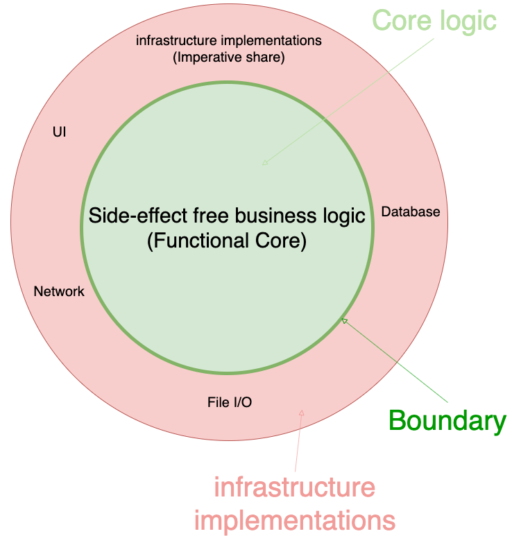
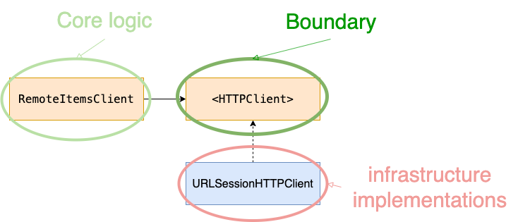
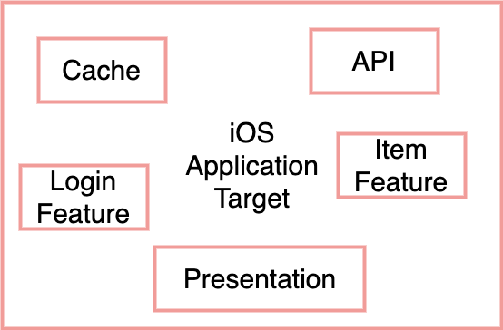
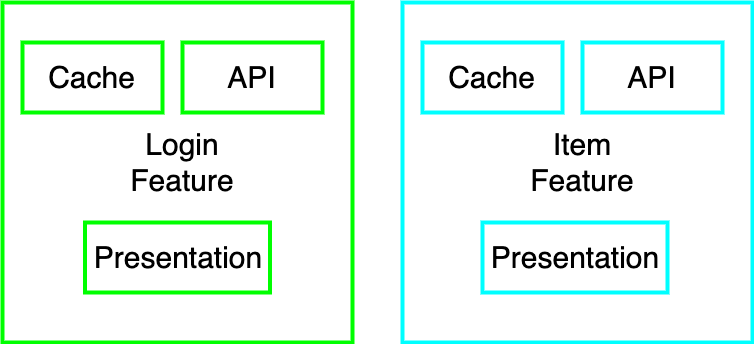
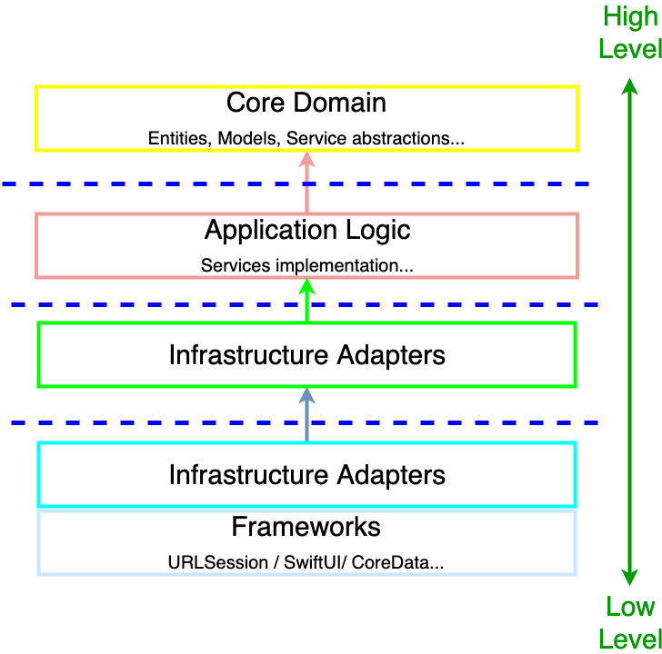
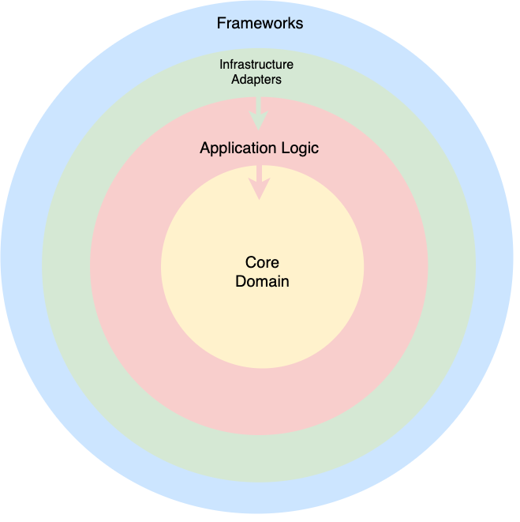
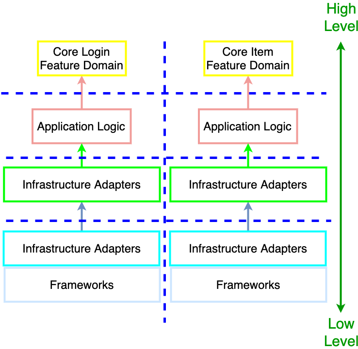
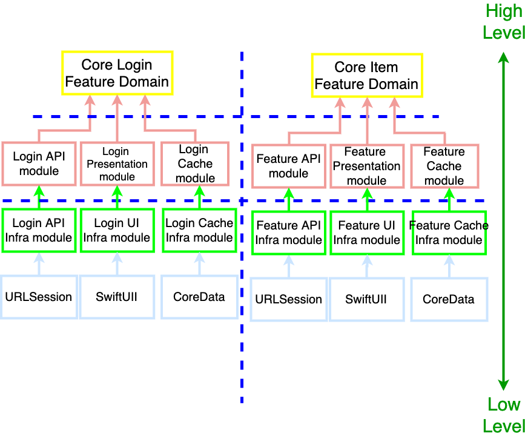

- [Words](#words)
- [Some aspects of good architecture](#some-aspects-of-good-architecture)
- [Modular design & modularization](#modular-design--modularization)
  - [Effective modular design](#effective-modular-design)
  - [Functional Independence is a factor](#functional-independence-is-a-factor)
  - [High cohesion, low coupling is the goal](#high-cohesion-low-coupling-is-the-goal)
  - [Guidelines of high cohesion, low coupling](#guidelines-of-high-cohesion-low-coupling)
  - [Be prepared for continuous improvement](#be-prepared-for-continuous-improvement)
- [To achieve high cohesion, low coupling](#to-achieve-high-cohesion-low-coupling)
  - [Decoupling business logics(rules) from any framework(infrastructure) logics](#decoupling-business-logicsrules-from-any-frameworkinfrastructure-logics)
    - [Two types of business logic](#two-types-of-business-logic)
      - [Application-specific business logic](#application-specific-business-logic)
      - [Application-agnostic business logic](#application-agnostic-business-logic)
    - [Framework (Infrastructure) logic](#framework-infrastructure-logic)
    - [Dependency Inversion](#dependency-inversion)
- [Creating good abstractions is a key point](#creating-good-abstractions-is-a-key-point)
  - [Interfaces should be single-purpose and small](#interfaces-should-be-single-purpose-and-small)
    - [Notice: single-purpose doesn't mean a single method](#notice-single-purpose-doesnt-mean-a-single-method)
  - [Interfaces have different roles](#interfaces-have-different-roles)
  - [Good abstraction & SOLID principles](#good-abstraction--solid-principles)
  - [Good abstraction & Design patterns](#good-abstraction--design-patterns)
  - [Good abstraction & Universal abstraction](#good-abstraction--universal-abstraction)
- [Domain models](#domain-models)
  - [Unified vs Segregated models](#unified-vs-segregated-models)
  - [Creating Segregated models (DTO)](#creating-segregated-models-dto)
  - [Be careful not to cross boundaries when they are in the same project](#be-careful-not-to-cross-boundaries-when-they-are-in-the-same-project)
  - [Be careful not to diverge related concepts too much at the same time](#be-careful-not-to-diverge-related-concepts-too-much-at-the-same-time)
  - [Using a unified model controlled by an external team](#using-a-unified-model-controlled-by-an-external-team)
  - [Trade-off of cross-boundary Codable requirements](#trade-off-of-cross-boundary-codable-requirements)
- [The Decorator pattern](#the-decorator-pattern)
- [From the Decorator pattern to handleEvents](#from-the-decorator-pattern-to-handleevents)
- [The Composition pattern](#the-composition-pattern)
- [From the Composition pattern to catch](#from-the-composition-pattern-to-catch)
- [Who should control threads?](#who-should-control-threads)
- [Do we want the operation to proceed regardless of whether `self` still exists when the closure is called?](#do-we-want-the-operation-to-proceed-regardless-of-whether-self-still-exists-when-the-closure-is-called)
- [Code Organization Pattern](#code-organization-pattern)
  - [Monolith](#monolith)
  - [Feature vertical slicing](#feature-vertical-slicing)
  - [Horizontal slicing](#horizontal-slicing)
  - [Horizontal slicing within Feature vertical slicing](#horizontal-slicing-within-feature-vertical-slicing)
  - [Horizontal modular slicing within Feature vertical slicing](#horizontal-modular-slicing-within-feature-vertical-slicing)
- [Codebase analysis(Health check)](#codebase-analysishealth-check)
  - [The number of files changed per commit](#the-number-of-files-changed-per-commit)
  - [Lines of code per file](#lines-of-code-per-file)
  - [Indentations per file](#indentations-per-file)
  - [Conditional statements per production file](#conditional-statements-per-production-file)
  - [Method and property count per interface/protocol](#method-and-property-count-per-interfaceprotocol)
  - [Method and property count per interface/protocol over time](#method-and-property-count-per-interfaceprotocol-over-time)
  - [Boolean flags as parameters or properties per module](#boolean-flags-as-parameters-or-properties-per-module)
  - [Private properties count per public and internal properties count in modules](#private-properties-count-per-public-and-internal-properties-count-in-modules)
  - [Comments per production file](#comments-per-production-file)
  - [File count per merge](#file-count-per-merge)
  - [Build time per commit](#build-time-per-commit)
  - [Recurrent file changes committed or merged together](#recurrent-file-changes-committed-or-merged-together)

# Words

component: functions, modules, classes, protocols, interfaces, data structures, dependencies and any language/platform or component-like types in the codebase

# Some aspects of good architecture

- Low cost for change
    - Welcome requirement changes
    - Allow the business to adapt quickly
- Easy to develop, extend, maintain, test
- Break down complexity into simple constructs
- Make it easier to maintain a fast and constant pace
- Protect the system against volatile dependencies(later)
- Improve estimation accuracy
- Low coupling, high cohesion
- Allow independent development(and development), and testing in isolation/parallel)

# Modular design & modularization

To achieve them, we often use modular design. It subdivides a system into smaller parts called modules, which can be independently created, modified, replaced, or exchanged with other modules or between different systems.

The process of breaking down a software into multiple independent modules where each module is developed separately is called Modularization.

## Effective modular design

Effective modular design can be achieved if the partitioned modules are separately solvable, modifiable as well as compilable. So, one of the sign of achieving it is that there is no need of recompiling the whole software system after making changes in a module.

It makes our code:

- Understandable
- Reusable
- Testable
- Scalable
- Easy to improve
- Easy to refactor

## Functional Independence is a factor

Functional Independence means that a function is atomic in nature so that it performs only a single task of the software without or with least interaction with other modules."


## High cohesion, low coupling is the goal

Independence of modules of a software system can be measured using 2 criteria, **cohesion** and **coupling**.

Cohesion: a measure of strength in relationship between various functions within a module. It is of 7 types which are listed below in the order of high to low cohesion:

1. Functional cohesion
2. Sequential cohesion
3. Communicational cohesion
4. Procedural cohesion
5. Temporal cohesion
6. Logical cohesion
7. Co-incidental cohesion 

Coupling: a measure of strength in relationship between various modules within a software. It is of 6 types which are listed below in the order of low to high coupling:

1. Data Coupling
2. Stamp Coupling
3. Control Coupling
4. External Coupling
5. Common Coupling
6. Content Coupling 

The modular design goal is to achieve **high cohesion within each individual module** and **low coupling between modules**.

[Effective Modular Design in Software Engineering](https://www.geeksforgeeks.org/effective-modular-design-in-software-engineering/)

## Guidelines of high cohesion, low coupling

As a guideline, when looking at the modules, let's ask ourselves:

**Can we refactor or add new features to this module without touching any files of the other module?**

If yes, we succeed in separating. If not, we might couple modules more highly than expected. The bigger our team becomes, the more this violation has effect on us.

In addition, in the light of each individual module, let's ask ourselves:

**Are all methods related and responsible for one and only one responsibility?**

This is the Single Responsibility Principle(SRP). 

SRP: A component should have only one reason to change.

If not, it violates the SRP.

Moreover, let's ask ourselves:

**Are all method that client is forced to depend on used for all the clients?**

This is the Interface Segregation Principle(ISP). 

ISP: No client should be forced to depend on methods it does not use


If there is more than NO answers in the above questions, it’s clear that the design does not facilitate change. The design actually fights change, so we must act early and prevent such bottlenecks. 

## Be prepared for continuous improvement

It's quite difficult to find a great modular design in the first try. As far as we can refactor and change the design, we can keep improving it. For a sustainable codebase, we need to find ways of minimizing the work of refactoring modules. To do so, we need to prepare to support refactoring and welcome change in fast iterations. 

# To achieve high cohesion, low coupling

## Decoupling business logics(rules) from any framework(infrastructure) logics 

- Business logics(rules): **what** the system do
- Framework(Infrastructure) logics: **how** to do

The dependency should be from the framework to the business logic since the "how to do" needs to conform to the "what to do" and "what" is agnostic of "how".

This difference is very important to achieve the modular design goal

-  A clear separation of concerns enables us to create decentralized components that are agnostic of the internals of their collaborators and have access only to essential-for-their-functionality behaviors
- It makes changes in the codebase easier and cheaper, enabling the team to welcome new requirements
- It makes the codebase more resilient as it decreases the number of places that can break when a code change is required(avoiding component, modular and even systemic level break)

### Two types of business logic

There are two common types of business logic. If we don’t distinguish between them when discussing with other developers, the lack of context can lead to miscommunication.

#### Application-specific business logic

Use Cases describe application-specific business logic and is often implemented by a Controller (there are many alternative names like Interactor, Service, etc) type collaborating with other components (coordinating domain models and application infrastructure abstractions). Controllers deal with application interactions (e.g., coordinating asynchronous operations from collaborators) with strict boundaries (protocol/closure) to protect the application from depending on low-level details (e.g. 3rd-party frameworks). 

It should not depend on concrete (specific) framework details.

#### Application-agnostic business logic

Domain Models describe application-agnostic business logic. This kind of logic is independent of application, also known as core business logic. 

Core business logic is often reused across Use Cases within the same application and even across other applications. 

It should not depend on any application or framework details. 

Domain Models are usually tiny little objects when compared with the size of the system. But its importance is much greater than its size. Domain Models implement the essential business logic (the code that really matters to the business), so we don’t lose sight of the domain within the technical and infrastructure complexities. Notice how, for example, we strive to keep our models simple, with no asynchronous or impure behavior (application detail) leaking into the domain models.

### Framework (Infrastructure) logic

Framework (Infrastructure) logic should not implement any business rules. Mixing business logic with infrastructure details is one of the most common (and one of the biggest mistakes) we find in code bases (e.g. Database and Network clients implementing validation or business rules operations or Domain Models inheriting from framework types, CoreData’s `NSManagedObject`). Doing so will scatter business logic across your code with no central source of truth. Tangled business rules and infrastructure code is harder to use, reuse, maintain, and test.

For example, assuming that changing our local database from CoreData to Realm forced to change(more to say rewrite) our business logics, it's not good.

The more we separate code (the less a piece of code knows/does), the easier it is to develop, use, reuse, maintain, and test (because it will naturally depend on less context). Infrastructure interface implementations should be as simple as possible. It should only fulfill infrastructure commands sent by the Controller types through the abstract interface (protocol/closure) like fetch something from the cache, store cache, download an image from a remote URL, etc.

### Dependency Inversion

To achieve the separation between business and framework logics, Dependency Inversion is essential. It means that instead of depending on framework requirements, we make the framework depend on our needs.

Dependency inversion between business and framework logics is the basis for designing modular systems. 

Three roles take part in the dependency inversion

1. A high-level component, such as business rules has no references to low-level implementation details, such as the delivery mechanism (e.g. UI, hardware, databases, network, etc).
2. A low-level component that is aware of the delivery mechanism (e.g., UI, hardware, databases, network, etc).
3. A boundary component, such as a protocol or closure, acting as an abstraction to guarantee the high-level component doesn’t depend on low-level details.



When the high-level component needs to communicate with low-level implementation details, it does so through the boundary abstraction. The low-level component implements the boundary abstraction and performs actions based on the high-level component’s commands.

The boundary provides the flexibility for making the other two participants (high and low level components) free from ever knowing about each other’s existence.



# Creating good abstractions is a key point

Interfaces can hide concrete implementations.

There are some points to create good interfaces.

## Interfaces should be single-purpose and small

To achieve good abstractions, we should avoid packing all method declarations into a single interface. So, we should separate the interface's methods into as many interfaces as needed by their clients.

We need to be careful to the below things:

1. Avoid concrete implementations having to implement any unnecessary methods
2. Decoupling clients from methods they do not need

1 is called the Liskov Substitution Principle(LSP) and 2 is called the Interface-Segregation Principle (ISP).

The Interface Segregation Principle (ISP): No client should be forced to depend on methods it does not use.

The Liskov Substitution Principle (LSP): Objects in a program should be replaceable with instances of their subtypes without altering the correctness of the program.

**Before declaring a interface with more than one method, take some time to think if all implementations of the interface should implement all of its methods.** If not, then you should consider a way for segmenting the methods into more than one interface, respecting the ISP and LSP.

For example, assuming that there is a protocol to communicate with an interface to access web services via HTTP. If a client wants only get method, but another one wants get and post methods, they should be separate interfaces. If they share the same one and one client comes to need delete method, we need to change both clients.

### Notice: single-purpose doesn't mean a single method

Common misunderstanding is that interfaces must have only one method. Ideally, it could be one since it's much easier to deal with dependencies that do only one thing. Also, we don't need to care about the order of method invocations. However, it's sometimes not true. If they are related and always change together, are used together, they should be in the same interface. If not, we will always have to import and couple with different module.

The thing is whether **all methods are related and responsible for one thing or not**.

## Interfaces have different roles

Interfaces can be used in several situations:

- As boundaries between business logics and infrastructure details(like HTTP, File system, etc). Protocol adapts the communication between them. It doesn't contain any core business logics. 
- AS contracts between business logics both in a module and across modules).

※ In Swift, many developers think that interface is protocol, but we can also use other components like closure, struct, etc....

## Good abstraction & SOLID principles

Good abstractions are highly connected with SOLID principles. They help us quickly develop and test parts of the application in isolation by: 
- representing a single purpose abstraction(the Interface Segregation Principle), 
- being responsible for a specific functionality(the Single Responsibility Principle) 
  hiding low-level implementation details(the Dependency Inversion Principles)
- allowing us to compose, replace, and inject different implementation via an interface(the Liskov Substitution Principle)
- extending the behavior without altering existing code(the Open/Closed Principle)

## Good abstraction & Design patterns

In addition, We can use Design Patterns to solve common challenges with a good abstraction.

Design Patterns offer a common vocabulary and proven solutions to recurring problems in software development. And they can help us use the full power of SOLID abstractions and modularity.

For example:
- Bridge different interfaces(Adapter)
- Add functionality to an existing objects and deal with cross-cutting concerns(Decorator)
- Combine components in different ways to achieve higher goals(Composite)

## Good abstraction & Universal abstraction

There’s a cost for developing, testing, and maintaining implementations of the Design Patterns. It's a kind of reinventing the wheel.

Instead, we can use built-in abstractions called "Universal Abstraction" from Category Theory which act as building blocks for some design patterns.


Design patterns requires prior knowledge and correct implementation. 
This makes design patterns ambiguous.

Category theory generalizes some intuitive relations, such as how numbers combine (e.g. via addition or multiplication). Instead of discussing numbers, however, category theory considers abstract 'objects'(= universal abstractions).

some design patterns are essentially ad-hoc, informally specified, specialized instances of basic category theory concepts. 
The objects of category theory are universal abstractions(It's different from objects of  object-oriented programming).

[From design patterns to category theory](https://blog.ploeh.dk/2017/10/04/from-design-patterns-to-category-theory/)

The Combine framework by Apple provides us building blocks based on those universal abstractions.  This means that, with SOLID abstractions, you can seamlessly replace some existing design pattern implementations with built-in Combine operators.

Examples are shown in the following:
- [From the Decorator pattern to handleEvents](#from-the-decorator-pattern-to-handleevents)
- [From the Composition pattern to catch](#from-the-composition-pattern-to-catch)


# Domain models

To achieve high cohesion within each individual module, we also need to consider how to design our domain models.

## Unified vs Segregated models

A model should be a simple and consistent representation of a domain concept. When we share models across boundaries, it gets easy to start adding methods and properties that one of the modules need, but the others don't. When this happens, our models grow in size and start to lose consistency. For example, in a module, we need some special properties for API, but not for UI, Cache etc. In multiple modules environment, all dependencies on one model leads to tremendous change all over the place. It disturbs parallel development(many conflicts).

The system's boundaries, based on their specifications, may require multiple model representations. Opting to use a single model across modules may lead to complex, costly-to-maintain, and hard-to-use code. Trying to solve everyone’s problems at once will solve no one’s.

As developers, we often strive to find perfect abstractions, so multiple representations of a data model seem inelegant. For this reason, it’s common to see code bases where a desire to fully unify the domain model leads to inconsistent and hard to reason/maintain design. A unified model can be a good starting solution, but it is often not scalable or cost-effective.

※ Of course, a unified model is not always bad. For example, if we believe the model won't change or the domain model and all segregated models always change together.

## Creating Segregated models (DTO)

Thus, instead of always passing models across boundaries, consider using a data transfer representation (also known as data transfer objects or DTO). Creating separate model representations helps us keep the code concise and easy to develop, use and maintain. At first, the separate representations may look similar, but over time they often change at a distinct pace and for different reasons. 

When the models start becoming different, it's important to be ready to separate the concepts in a way which will prevent the system from being in inconsistent states. In addition, team members should have a common/shared view of the context for each model, and work towards maintaining its consistency. The context breakdown will vary from project to project, depending on the domain and subdomain models, frameworks in use, parts of the application that requires separation, and even cross-team structure.

## Be careful not to cross boundaries when they are in the same project

When we keep them within the same module, we must be disciplined with our actions as it’s much easier to cross boundaries accidentally or to trade modularity for quick conveniences (but costly and debt in the end). To prevent such unwanted dependency accidents, separate modules. Also, if modules reused in other projects is ever a requirement, moving such modules to isolated projects will be necessary. The cost of maintenance and extension might increase with separate projects, but when done right, the collaboration/integration friction is minimal, and the modularity and reuse benefits are high. 

## Be careful not to diverge related concepts too much at the same time

However, we must also be careful with the other extreme: a design that diverges related concepts too much. Otherwise, the system grows in complexity, the cost of integration increases, communication between teams becomes harder, and we won’t be able to clearly see the correlations within the boundaries. 

We prevent harmful model diversion by keeping the translation layer (the mapping to and from data representations) very close to the model representations (within the same project) and having a continuous integration process in place.
- When we separate related classes into many separate modules. And every time we need to use one of those classes, we could need to import all those modules together in the long run since they are related and there is high possibility to use them together.

- When we always need to import separate modules to use a specific model or class, that's a sign that those concepts should be bundled together in the same module. Separating them will increase the cost of change and maintenance with no big benefits (which can be harmful to the team productivity).

- If changing one module always requires changes in another module, that's a sign of high-coupling

- We could duplicate the exact same model logic in multiple modules. And when there's a change in the logic, we need to change it in multiple places to keep the system consistent.

On the other hand, by keeping modules within the same project, we must be disciplined with our actions as it’s much easier to cross boundaries accidentally or to trade modularity for quick (but costly) conveniences (debt). If we want to prevent such unwanted dependency accidents, separate modules in different projects. Also, if module reuse in other projects is ever a requirement, moving such modules to isolated projects will be necessary. The cost of maintenance and extension might increase with separate projects, but don’t be discouraged from doing so. When done right, the collaboration/integration friction is minimal, and the modularity and reuse benefits are high. 

※ We don't always need one DTO per module. It's a choice. If we believe both modules should always change together, we don't need a separate DTO. And if they change together, we should probably combine them into a single module. Also, if the model is just a data(no logic), we could not need its DTO.

## Using a unified model controlled by an external team

This approach (e.g. using backend API models directly) throughout the application has merits as it can speed up development at early stages of simple API-consumer app projects. If the app we’re building does nothing more than consuming and displaying data from some external APIs, such an approach might pay off while its requirements don’t change. If there is possibility to change it, it's better to have more options to be able to identify when to switch strategies and refactor the design towards independence/freedom from external actors.

## Trade-off of cross-boundary Codable requirements

`Codable` hides from the developer all the complexity and volume of code that comes from encoding and decoding models. It's very convenient. But, we need to consider if our domain model should conform to `Codable` or not.

When `Codable` conformance makes our model aware of framework-specific requirements. It creates implicit coupling with the framework implementation that may affect other components. Also, it could send a wrong message to other developers that it’s ok to add framework details in this part of the system though it's not true.

Instead, we can create a new private(local) model which conform to `Codable` and transform it into our model and vice versa. It makes our domain model keep framework-agnostic.

There is no right or wrong option that can be applied universally. Such decisions must be filtered through your own needs and goals. This decision-making process is about understanding the current design of the system, the team preferences, the team size, culture and even future plans for the codebase.

# The Decorator pattern

The Decorator pattern adds behavior to an individual object dynamically without subclassing or changing the objects's class. 

To implement the Decorator pattern, we create a new object (decorator) that encloses and conforms to the interface of the component (decoratee) it decorates. The decorator class will contain the extended behavior and forward messages to the decoratee.

the key point is that by doing so, the decorator can be used by the clients of the interface, extending the behavior of the system without needing to alter any existing components.

It's supported by the Single Responsibility, Liskov Substitution, and Open/Closed Principles..

That's polymorphism: a single interface/abstraction with many implementations.

For example, we define a protocol and its implementation.

```swift
protocol HTTPClient {
    func get(from url: URL,
             completion: @escaping (Result<(Data, HTTPURLResponse), Error>) -> Void)
}

final class URLSessionHTTPClient: HTTPClient {
    func get(from url: URL,
             completion: @escaping (Result<(Data, HTTPURLResponse), Error>) -> Void)
    ) { /*  */ }
}

protocol ItemLoader {
    func load(from url: URL, completion: @escaping (Result<[Item], Error>) -> Void)
}

final class RemoteItemLoader: ItemLoader {
    private let client: HTTPClient
    // ...
}

```

Then, we want to check urls which passed by callers, so we want to add logs for every request. For it, we can decorate `ItemLoader`.

```swift
final class LoggingItemLoader: ItemLoader {
    private let decoratee: ItemLoader
    private let logger: (_ message: String) -> Void
    init(decoratee: ItemLoader, logger: @escaping (_ message: String) -> Void) {
        self.decoratee = decoratee
        self.logger = logger
    }
    func load(
        from url: URL,
        completion: @escaping (Result<[Item], Error>) -> Void
    ) {
        logger("Requesting: \(url)")
        decoratee.load(from: url) { [logger] result in
            switch result {
            case .success(let item):
                logger("Success: \(item)")
            case .failure(let error):
                logger("Failure: \(error)")
            }
            completion(result)
        }
    }
}
```

```swift
let url = URL(/*  */)
let loader = LoggingItemLoader(decoratee: RemoteItemLoader(client: URLSessionHTTPClient(/*  */)), 
                              logger: { print($0) })
loader.load(from: url) { /*  */ }
```

For users of `ItemLoader`, they don't need to know the implementation details of `LoggingItemLoader`(the Single Responsibility Principle). And it's replaceable with any other implementation without changing their implementation (the Open/Closed Principle). When users are in other modules, we don't need to recompile it, avoid disturbing parallel development, etc. Also, we can avoid duplicate code.

The idea is to maintain the same logic when decorating.

It might not be the best solution. This could also need extra logics. The thing is that by using the Decorator pattern, we can avoid duplication of code all over the place and change behavior without affecting existing components. It depends on the situation(e.g. team's understanding and agreement)

# From the Decorator pattern to handleEvents

We can replace it with Combine:

```swift
extension ItemLoader {
	  typealias Publisher = AnyPublisher<[Item]], Error>

	  func loadPublisher(from url: URL) -> Publisher {
	    	return Deferred {
			      Future { completion in
				        self.load(from: url, completion: completion)
			      }
		    }
		    .eraseToAnyPublisher()
	  }
}

let url = URL(/*  */)
var cancellables = Set<AnyCancellable>()
RemoteItemLoader(client: URLSessionHTTPClient(/*  */))
    .loadPublisher(from: url)
    .handleEvents(receiveOutput: { print("Requesting: \(url)") })
    .sink { /*  */ }
    .store(&cancellables)
```

In this case, we need to convert completion handler to a publisher, and cancellables. But we don't need extra classes(`ItemLoader`, `LoggingHTTPClient`) and extra dependency injections(`logger`). 

Also, We can replace the implementation with any other one. It looks more descriptive.

# The Composition pattern

The Composite pattern allows us to compose objects into tree structures to represent part or whole hierarchies. A Composite enables its clients to treat individual objects and compositions of objects uniformly, through a single interface.

Let's assume that we want to load items from a local cache first, then if the result was error, try to get items from a remote server. 

```swift
struct Store {
  let get: () -> [Item]
  let set: (_ newItems: [Item]) -> Void
}

final class LocalItemLoader: ItemLoader {
    private let store: Store
    func load(from url: URL, completion: @escaping (Result<[Item], Error>) -> Void) {/*  */}
}
```

Then, we can compose them.

```swift
final ItemLoaderWithFallback: ItemLoader {
    private let primary: ItemLoader
    private let fallback: ItemLoader
    init(primary: ItemLoader, fallback: ItemLoader) {
        self.primary = primary
        self.fallback = fallback
    }
    func load(from url: URL, completion: @escaping (Result<[Item], Error>) -> Void) {
        primary.load(from: url) { result in
            switch result {
            case .success:
                completion(result)
            case .failure:
                fallback.load(from: url, completion: completion)
            }
        }
    }
}
```

```swift

let inMemoryStore = Store(get: { /*  */ }, set: { /*  */ })

let loader: ItemLoader = ItemLoaderWithFallback(
    primary: LocalItemLoader(store: inMemoryStore),
    fallback: RemoteItemLoader(client: URLSessionHTTPClient(/*  */)))

loader.get { /*  */ }
```

Like the Decorator pattern, clients don't need to know the implementation details of `ItemLoaderWithFallback`.


# From the Composition pattern to catch

Like the Decorator pattern, We can replace the above with Combine:

```swift
extension Publisher {
    func fallback(to publisher: @escaping () -> AnyPublisher<Output, Failure>) -> AnyPublisher<Output, Failure> {
        self.catch { _ in publisher() }.eraseToAnyPublisher()
    }
}
```

```swift
var cancellables = Set<AnyCancellable>()
LocalItemLoader(store: inMemoryStore)) 
    .loadPublisher(from: url)
    .fallback(to: { RemoteItemLoader(client: URLSessionHTTPClient(/*  */))).loadPublisher(from: url) })
    .sink { /*  */ }
    .store(&cancellables)
```

We can mix it with the above Decorator pattern's functionality.

```swift

// Design pattern

let logger: (String) -> Void = { print($0) }

ItemLoaderWithFallback(
    primary: LoggingItemLoader(decoratee: LocalItemLoader(store: inMemoryStore), 
                              logger: logger),
    fallback: LoggingItemLoader(decoratee: RemoteItemLoader(client: URLSessionHTTPClient(/*  */)), 
                              logger: logger)
)


// Combine

LocalItemLoader(store: inMemoryStore)).loadPublisher(from: url)
    .fallback(to: { RemoteItemLoader(client: URLSessionHTTPClient(/*  */))).loadPublisher(from: url) })
    .handleEvents(receiveOutput: { print("We can add logs freely") })
    .sink { /*  */ }
    .store(&cancellables)
```

# Who should control threads?

When developing for multithreaded platforms such as iOS and macOS, we need to consider and evaluate how thread dispatching affects the composition, correctness, and ease of use of the system.

As a rule of thumb, we prefer to let the clients of our APIs decide to dispatch to appropriate threads if needed since we can’t predict the client’s needs. Some clients may want to update the UI (need to dispatch to the main thread), while others may have to carry on mapping and to combine the data with other operations (maybe need to dispatch background threads).

Another possible solution is to allow the clients to provide the desired dispatch queue for the completion callbacks (via dependency injection, for example).

In any solution, it’s always a good idea to provide documentation to the clients of our APIs to help them use the APIs correctly (as we intended them to).

# Do we want the operation to proceed regardless of whether `self` still exists when the closure is called?

When handling a escaping closure, we need to think about `self` capture.

For example, when we don't want to proceed the operation after `self` was deallocated, we need to check if `self` still exists or not.

```swift
class SomeClass {
    let fixedNumber = 1
    func run() {
        DispatchQueue.global().async { [weak self] in
            guard let self = self else { return }
            print(self.fixedNumber)
        }
    }
}
```

On the other hand, when we want, we don't check it.

```swift
class SomeClass {
    func run() {
        let fixedNumber = self.fixedNumber
        DispatchQueue.global().async {
            print(fixedNumber)
        }
        /* OR just capture fixedNumber
        DispatchQueue.global().async { [fixedNumber] in
            print(fixedNumber)
        }
        */
    }
}
```

It depends on what we're trying to achieve. `self` check is not fit for all cases.

※ Notice: if we use `self` directly in the closure, it holds `self` instance strongly and outlives it by the time the closure has finished.

```swift
class SomeClass {
    func run() {
        DispatchQueue.global().async {
            print(self.fixedNumber) // ⚠️
        }
    }
}
```

# Code Organization Pattern

## Monolith

Keep all components in a single project with a single application target.



Good: Simple

Not good: As the app grows, it's harder to manage. It will take longer time to build, More conflicts will happen on team development, etc.

## Feature vertical slicing

Slicing a project into features is common for projects where developers are organized into feature teams.



A feature team is a team dedicated to a specific feature of the app. 

Good: Even when we add a new feature team, it can be developed in isolation in a separate target or project.

Not good: Some functionality duplication could cause across modules

## Horizontal slicing

Organize projects is to break our app down into horizontal layers and manage the dependencies between layers following the Dependency Inversion Principle. It's commonly used by developer teams that work on all features at the same time(not feature teams)



It's also described by a circular shape.



Inner rings (higher-level) don’t depend on outer rings (lower-level). And outer rings only know about their direct inner ring.

Good: No duplication between features

Not good: There’s no separation between features, so it could cause conflicts between therm

## Horizontal slicing within Feature vertical slicing

Break down the project into both layers (horizontal slices) and features (vertical slices)

Good: The features don’t know about each other. They are decoupled and modular. We have much more control to develop, maintain, extend, replace, reuse, and test the features and layers in isolation

Not good: More complex and could increase management cost



## Horizontal modular slicing within Feature vertical slicing

Break down the horizontal slices within the feature into many modules



Good: Create a stronger separation between the components:
Not good: More complex and could increase management cost

# Codebase analysis(Health check)

It doesn't take much to make an unmaintainable codebase or decrease the quality of a good codebase.

Many tiny lousy decisions makes codebase and products rigid and faulty.

There are indicators help us examine the past and evaluate the present state of the codebase.

## The number of files changed per commit

It provides a quick overview and may indicate potential **hidden**-coupling. A system designed with good abstractions allows us to change specific components without affecting others. In reverse, lousy abstractions will force us to affect multiple components in multiple files at the same time even for minor changes. Also, a larger file count per commit makes the system's reversibility much harder.

※ This number could depend on developer's committing style. That's why it's potential.

## Lines of code per file

A high ratio can indicate potential problems with the amount of responsibilities and dependencies various components might have.

※ Depending on the type of components that exist in a file, the ratio will vary.

## Indentations per file

It represents a nested structure like nested conditional statements, flow of control statements and closures in an implementation. Each nested statement increases the complexity of the system, which can result in more state management and a lot more difficulty in testing, or even worse, making certain behaviors untestable.

Developers tend to make them extract such statements in new methods in the same component. This option solves the arrow issue. But, it also increases the component's lines of code as well as hiding a logical flow of data, especially if the code isn't organized properly within the file.

## Conditional statements per production file

It implies the existence of state in the application. 

※ It's almost impossible, perhaps even wrong, to create systems without the option for other possibilities. But, their placement is quite important for the health of the codebase in the long run.

Utilizing conditionals to make decisions in all levels of the application complicates communication and data flows between the layers. That's why it is an excellent practice to isolate most conditional state in the highest level possible, so the lower level components don't have to make too many decisions, as they will act upon commands.

## Method and property count per interface/protocol

It gives us an average of the protocol sizes which is a good indicator as to whether or not we are respecting good design principles.

To achieve concise and reusable abstractions, we should avoid stuffing all method declarations into a single protocol.

We should aim to separate the interface/protocol's methods into as many interfaces as needed by their specific clients. By doing so, we can avoid concrete implementations having to implement any unnecessary methods, while decoupling clients from methods they do not need.

Ideally, one method per protocol. It's much easier to deal with dependencies that do only one thing. However, there are times where it makes sense to add multiple method declarations to a protocol. The Single Responsibility Principle (SRP) is a great guideline. Ask yourself: **are all methods related and responsible for one and only one responsibility (e.g. cache control: add/remove)?** If it's a no, we should probably create a new protocol unless we have a better reason not to.

## Method and property count per interface/protocol over time

It provides how protocol declarations change over time. It's not uncommon for developers, in order to achieve current needs, to break the contract the interface offers and add additional behavior to facilitate their task. This behavior should be considered harmful as it can break not only the interface segregation between modules and components, but also the Liskov Substitution Principle, resulting in a more rigid and fragile system.

## Boolean flags as parameters or properties per module

It gives you a hint as to whether your components are managing too much state internally. We should split their responsibility into one or more components and redirect the condition to a higher level.

## Private properties count per public and internal properties count in modules

It helps us identify what percentage of our component properties are visible to the rest of the system, internally or publicly. Ideally, we would want a small percentage of them. If our properties are exposed, they can be used by other components to query their values and create unnecessary complexity with conditional statements. They can also obstruct the dependency inversion between components, as their users will be able to cross boundaries. 

Hiding implementation details is a key ingredient for forming modular and extensible systems. As a guideline, make things private until there's a very good reason not to.

## Comments per production file

It encapsulates commented out code and annotations such as “TODO,” “FIX” or other instructions in our components

It indicates to overuse of these annotations which should be avoided in a team scope project because there should be a universal source of truth for work in progress or work required in the future. By using such annotations, we increase the probability of diverging from a single source of truth, like a project management tool.

※ If we use a tool to link them to the management tool, the situation might be different.

## File count per merge

It indicates the average size of batches developers work with. A large file count shows that they create big-sized branches that can cause delays in the development and release cycles, psychological fatigue and burnout for the developers and increase in costs for the firm.

## Build time per commit

It shows unsustainable build times that will decrease productivity and team morale and identifies patterns for introducing overhead from dependencies.

## Recurrent file changes committed or merged together

It indicates a potentially hidden coupling between components. By identifying files that often change together, we may expose weak abstractions between components. Such a fact might not be harmful within a module, but it's alarming when crossing module boundaries that seem decoupled on the surface. For example, if every time we add a new UI action we have to update the analytics module to track such action, even if there's an abstract interface between the modules, they're tightly coupled.

A better abstraction should allow new actions to be tracked without requiring cross-boundary changes.