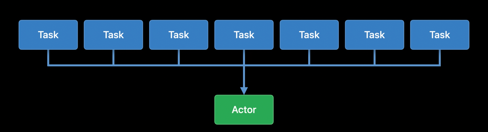
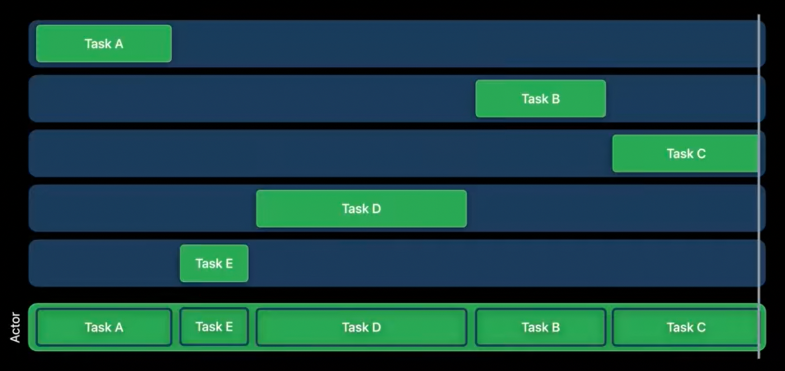
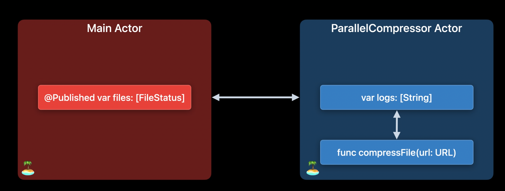
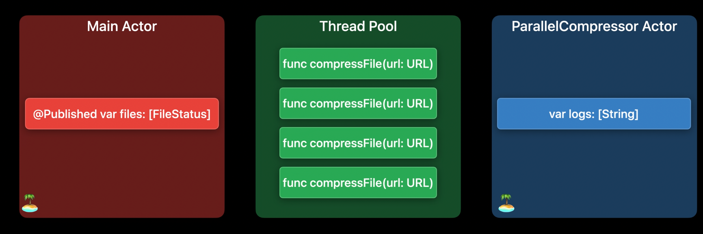
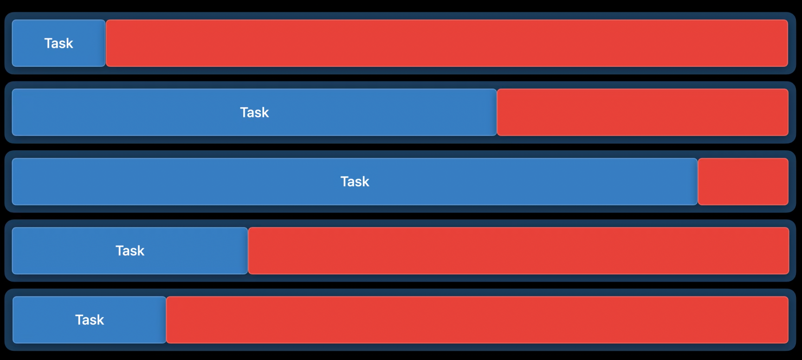
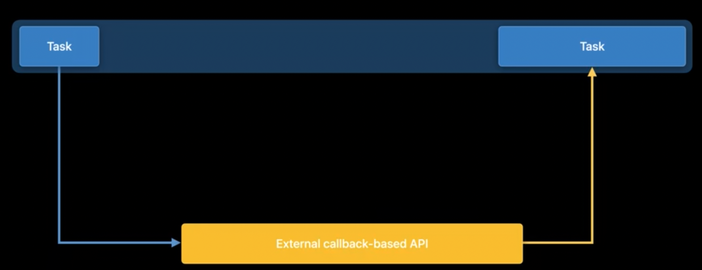

- [Common Problems](#common-problems)
  - [Main actor blocking](#main-actor-blocking)
    - [Problem](#problem)
    - [Example](#example)
    - [Solution](#solution)
  - [Actor contention](#actor-contention)
    - [Problem](#problem-1)
    - [Solution](#solution-1)
    - [Thread Pool Exhaustion](#thread-pool-exhaustion)
      - [Problem](#problem-2)
      - [Solution](#solution-2)
        - [Avoid blocking calls in tasks](#avoid-blocking-calls-in-tasks)
    - [Continuation misuse](#continuation-misuse)
      - [Problem](#problem-3)
      - [Solution](#solution-3)
  - [References](#references)

# Common Problems

Swift concurrency makes it easy to to write correct concurrent and parallel code. However, it's still possible to write code that misuses concurrency constructs. It's also possible to use them correctly but in a way that doesn't get the performance benefits we were aiming for.

- Main actor blocking
- Actor contention
- Thread pool exhaustion
- Continuation misuse

## Main actor blocking

The main actor blocking occurs when a long-running task runs on the main actor.

### Problem

The main actor is a special actor which executes all of its work on the main thread. UI work must be done on the main thread, and the main actor allows us to integrate UI code into Swift Concurrency. 

However, because the main thread is so important for UI, it needs to be available and can't be occupied by a long-running unit of work. When this happens, our app appears to lock up and becomes unresponsive. 

### Example

```swift
@MainActor // 1 
class CompressionState: ObservableObject {
    @Published var files: [FileStatus] = []
    var logs: [String] = []

    func update(url: URL, progress: Double) {
        if let loc = files.firstIndex(where: {$0.url == url}) {
            files[loc].progress = progress
        }
    }

    func update(url: URL, uncompressedSize: Int) {
        if let loc = files.firstIndex(where: {$0.url == url}) {
            files[loc].uncompressedSize = uncompressedSize
        }
    }

    func update(url: URL, compressedSize: Int) {
        if let loc = files.firstIndex(where: {$0.url == url}) {
            files[loc].compressedSize = compressedSize
        }
    }

    func compressAllFiles() {
        for file in files {
            Task {
                let compressedData = compressFile(url: file.url)
                await save(compressedData, to: file.url)
            }
        }
    }

    func compressFile(url: URL) -> Data { // 2
        log(update: "Starting for \(url)")
        let compressedData = CompressionUtils.compressDataInFile(at: url) { uncompressedSize in
            update(url: url, uncompressedSize: uncompressedSize)
        } progressNotification: { progress in
            update(url: url, progress: progress)
            log(update: "Progress for \(url): \(progress)")
        } finalNotification: { compressedSize in
            update(url: url, compressedSize: compressedSize)
        }
        log(update: "Ending for \(url)")
        return compressedData
    }

    func log(update: String) {
        logs.append(update)
    }
}
```


1. The entire `CompressionState` class is annotated to run on the `@MainActor`. The `@Published` property here must only be updated from the Main Thread, otherwise, we could run into runtime issues. 
2. The `compressFile` function is located within the `CompressionState` class. So, the Task also ran on the Main Thread.

### Solution

Code running on the main actor must finish quickly, and either complete its work or move computation off of the main actor and into the background. Work can be moved into the background by putting it in a normal actor or in a detached task. Small units of work can be executed on the main actor to update UI or perform other tasks that must be done on the main thread. 

We have two different pieces of mutable state here within this class. 

- @Published var files: [FileStatus]: The main actor
- var logs: [String]: needs to be protected from concurrent access, but doesn't actually need to be on the main actor

So, we wrap `logs` in its own actor.

```swift
actor ParallelCompressor { // 1
    var logs: [String] = []
    unowned let status: CompressionState

    init(status: CompressionState) {
        self.status = status
    }

    func compressFile(url: URL) -> Data {
        log(update: "Starting for \(url)")
        let compressedData = CompressionUtils.compressDataInFile(at: url) { uncompressedSize in
            Task { @MainActor in
                status.update(url: url, uncompressedSize: uncompressedSize)
            }
        } progressNotification: { progress in
            Task { @MainActor in
                status.update(url: url, progress: progress)
                await log(update: "Progress for \(url): \(progress)")
            }
        } finalNotification: { compressedSize in
            Task { @MainActor in
                status.update(url: url, compressedSize: compressedSize)
            }
        }
        log(update: "Ending for \(url)")
        return compressedData
    }

    func log(update: String) {
        logs.append(update)
    }
}

@MainActor
class CompressionState: ObservableObject {
    @Published var files: [FileStatus] = []
    var compressor: ParallelCompressor!

    init() {
        self.compressor = ParallelCompressor(status: self)
    }

    func update(url: URL, progress: Double) {
        if let loc = files.firstIndex(where: {$0.url == url}) {
            files[loc].progress = progress
        }
    }

    func update(url: URL, uncompressedSize: Int) {
        if let loc = files.firstIndex(where: {$0.url == url}) {
            files[loc].uncompressedSize = uncompressedSize
        }
    }

    func update(url: URL, compressedSize: Int) {
        if let loc = files.firstIndex(where: {$0.url == url}) {
            files[loc].compressedSize = compressedSize
        }
    }

    func compressAllFiles() {
        for file in files {
            Task {
                let compressedData = await compressor.compressFile(url: file.url) // 2
                await save(compressedData, to: file.url)
            }
        }
    }
}
```

1. Remove the code that referred to the logs variable from the CompressionState class, and add it to our ParallelCompressor actor
2. Update CompressionState to invoke compressFile on the ParallelCompressor.

## Actor contention

The UI is no longer hung, which is a great improvement, but we aren't getting the speed that we would expect. 

### Problem

Actors make it safe for multiple tasks to manipulate shared state. However, they do this by serializing access to that shared state. Only one task at a time is allowed to occupy the actor, and other tasks that need to use that actor will wait.

Swift concurrency allows for parallel computation using unstructured tasks, task groups, and async let. Ideally, these constructs are able to use many CPU cores simultaneously. When using actors from such code, beware of performing large amounts of work on an actor that's shared among these tasks. When multiple tasks attempt to use the same actor simultaneously, the actor serializes execution of those tasks. Because of this, we lose the performance benefits of parallel computation.






The below source code shows us that the closure in `Task` is primarily running our compression work. Since the `compressFile` function is part of the `ParallelCompressor` actor, the entire execution of `compressAllFiles` function happens on the actor; blocking all other compression work.

```swift

// run on Main actor
func compressAllFiles() {
    for file in files {
        Task {
            // run on ParallelCompressor actor
            let compressedData = await compressor.compressFile(url: file.url) // 1
            await save(compressedData, to: file.url)
        }
    }
}
```




### Solution

We need make sure that tasks only run on the actor when they really need exclusive access to the actor's data. Everything else should run off of the actor. We divide the task into chunks. Some chunks must run on the actor, and the others don't. 

So, We need to pull the `compressFile` function out of actor-isolation and into a detached task. We can have the detached task only on an actor for as long as needed to update the relevant mutable state. So the compress function can be executed freely, on any thread in the thread pool, until it needs to access actor-protected state. Also, by not being constrained to an actor, they can all be executed concurrently, only limited by the number of threads.



```swift
actor ParallelCompressor {
    // ..
    nonisolated func compressFile(url: URL) async -> Data { // 1
        await log(update: "Starting for \(url)") // 2
        let compressedData = CompressionUtils.compressDataInFile(at: url) { uncompressedSize in
            Task { @MainActor in
                status.update(url: url, uncompressedSize: uncompressedSize)
            }
        } progressNotification: { progress in
            Task { @MainActor in
                status.update(url: url, progress: progress)
                await log(update: "Progress for \(url): \(progress)")
            }
        } finalNotificaton: { compressedSize in
            Task { @MainActor in
                status.update(url: url, compressedSize: compressedSize)
            }
        }
        await log(update: "Ending for \(url)") // 2
        return compressedData
    }
}

@MainActor
class CompressionState: ObservableObject {
    // ...
    func compressAllFiles() {
        for file in files {
            Task.detached { // 3
                let compressedData = await self.compressor.compressFile(url: file.url) // 4
                await save(compressedData, to: file.url)
            }
        }
    }
}

```

1. Mark the compressFile function as `nonisolated`
2. Mark all of our log invocations with the `await` keyword
3. Update task creation to create a detached task
4. Need to explicitly capture self for detached tasks

### Thread Pool Exhaustion

Thread pool exhaustion can hurt performance or even deadlock an application.


#### Problem

Swift concurrency requires tasks to make forward progress when they're running. When a task waits for something, it normally does so by suspending. 

However, it's possible for code within a task to perform a blocking call, such as blocking file or network IO, or acquiring locks, without suspending. This breaks the requirement for tasks to make forward progress. When this happens, the task - continues to occupy the thread where it's executing, but it isn't actually using a CPU core. Because the pool of threads is limited and some of them are blocked, the concurrency runtime is unable to fully use all CPU cores. This reduces the amount of parallel computation that can be done and the maximum performance of our app.

In extreme cases, when the entire thread pool is occupied by blocked tasks, and they're waiting on something that requires a new task to run on the thread pool, the concurrency runtime can deadlock.



#### Solution

##### Avoid blocking calls in tasks

File and network IO must be performed using async APIs. Avoid waiting on condition variables or semaphores. Fine-grained, briefly-held locks are acceptable if necessary, but avoid locks that have a lot of contention or are held for long periods of time. 

If we have code that needs to do these things, move that code outside of the concurrency thread pool. 

e.g. Running it on a Dispatch queue and bridge it to the concurrency world using continuations.  
※ Whenever possible, use async APIs for blocking operations to keep the system operating smoothly.

### Continuation misuse

When we're using continuations, we must be careful to use them correctly. 

A continuation suspends the current task and provides a callback which resumes the task when called. This can then be used with callback-based async APIs. 



#### Problem

Continuation callbacks have a special requirement: they must be called exactly once, no more, no less. This is a common requirement in callback-based APIs, but it tends to be an informal one and is not enforced by the language, and oversights are common.

Swift concurrency makes this a hard requirement. If the callback is called twice, the program will crash or misbehave. If the callback is never called, the task will leak. 

```swift
await withCheckedContinuation { continuation in // 1
    externalCallbackBasedAPI { value in // 2
        continuation.resume(returning: value) // 3
    }
}
```

1. Use `withCheckedContinuation` to get a continuation
2. Invoke a callback-based API 
3. Resume the continuation. 


It's important to be careful when the code is more complex.

```swift
await withCheckedContinuation { continuation in
    externalCallbackBasedAPI { value in
        if value.success { // ❌
            continuation.resume(returning: value)
        }
    }
}
```

Modified the callback to only resume the continuation on success. On failure, the continuation will not be resumed, and the task will be suspended forever.

```swift
await withCheckedContinuation { continuation in
    externalCallbackBasedAPI { value in
        continuation.resume(returning: value)
        continuation.resume(returning: value)　// ❌
    }
}
```

Resuming the continuation twice. This is also a bug, and the app will misbehave or crash.

#### Solution

Always use the `withCheckedContinuation` API for continuations unless performance is absolutely critical. Checked continuations automatically detect misuse and flag an error. When a checked continuation is called twice, the continuation traps. When the continuation is never called at all, a message is printed to the console when the continuation is destroyed warning you that the continuation leaked.

## References

[Visualize and optimize Swift concurrency](https://developer.apple.com/videos/play/wwdc2022/110350/)


