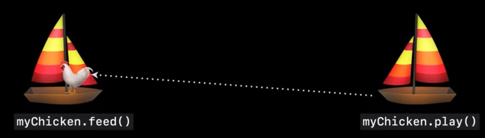

- [Eliminate data races](#eliminate-data-races)
- [To explain briefly](#to-explain-briefly)
  - [Task isolation](#task-isolation)
    - [Tasks](#tasks)
    - [Communication between Tasks](#communication-between-tasks)
    - [`Sendable` protocol](#sendable-protocol)
      - [`Sendable` types are safe to share](#sendable-types-are-safe-to-share)
      - [`Sendable` checking for types](#sendable-checking-for-types)
      - [`Sendable` function types](#sendable-function-types)
  - [Actor isolation](#actor-isolation)
    - [Actors](#actors)
    - [Mutual exclusion](#mutual-exclusion)
    - [Maintain isolation](#maintain-isolation)
    - [Reference isolation](#reference-isolation)
    - [Non-isolated code](#non-isolated-code)
    - [@MainActor](#mainactor)
      - [@MainActor types](#mainactor-types)
  - [Atomicity (Preventing high-level data races)](#atomicity-preventing-high-level-data-races)
  - [Ordering](#ordering)
- [Explain using analogy](#explain-using-analogy)
  - [Task isolation](#task-isolation-1)
    - [Communication between Tasks](#communication-between-tasks-1)
    - [Value types - mutations have only local effects](#value-types---mutations-have-only-local-effects)
    - [Reference types - mutations have global effects and cause data races](#reference-types---mutations-have-global-effects-and-cause-data-races)
    - [Sendable protocol](#sendable-protocol-1)
    - [Checking Sendable across task boundaries](#checking-sendable-across-task-boundaries)
    - [Sendable constraints in Task APIs](#sendable-constraints-in-task-apis)
    - [Sendable checking for type](#sendable-checking-for-type)
    - [Sendable checking during task creation](#sendable-checking-during-task-creation)
    - [Sendable function types](#sendable-function-types-1)
  - [Actor isolation](#actor-isolation-1)
    - [Actors](#actors-1)
    - [Actors provide mutual exclusion](#actors-provide-mutual-exclusion)
    - [Actors are reference isolation](#actors-are-reference-isolation)
    - [Non-isolated async code](#non-isolated-async-code)
    - [Non-isolated synchronous code](#non-isolated-synchronous-code)
    - [Actors summary](#actors-summary)
  - [@MainActor](#mainactor-1)
    - [@MainActor functions and closures](#mainactor-functions-and-closures)
    - [@MainActor types](#mainactor-types-1)
  - [Atomicity (Preventing high-level data races)](#atomicity-preventing-high-level-data-races-1)
    - [Non-transactional code](#non-transactional-code)
  - [Ordering](#ordering-1)
    - [Actors are not strictly first-in, first-out](#actors-are-not-strictly-first-in-first-out)
    - [Tools for ordering](#tools-for-ordering)
      - [Tasks run code in order](#tasks-run-code-in-order)
      - [AsyncStreams deliver elements in order](#asyncstreams-deliver-elements-in-order)

# Eliminate data races

Learn a way of structuring our program to make efficient use of concurrency without introducing data races

# To explain briefly

They show good explanation using analogy, but as a reference, showing essences at first.

## Task isolation

### Tasks

- Swift's concurrency model ensures that data is not shared in a manner that can introduce data races
- Tasks perform sequentially from start to finish
- Tasks are asynchronous, and their work can be suspended any number of times at "await" operations
- Tasks are self-contained. Each task has its own resources, so it can operate independently

### Communication between Tasks

- Value types(e.g. struct, enum) maintain isolation. They won't have any effect on the other one
- Reference types only give us a reference to that specific object. That shared mutable data is prone to data races. The Swift compiler ensures that they aren't accidentally passed from one to another

### `Sendable` protocol

#### `Sendable` types are safe to share

- `Sendable` protocol is used to describe types that can safely be shared across different isolation domains without creating data races
- The result type of a `Task`, called `Success`, must conform to the `Sendable` protocol
- We should use `Sendable` constraints where we have generic parameters whose values will be passed across different isolation domains

#### `Sendable` checking for types

- Enums and structs generally define value types. They can be `Sendable` so long as all of their instance data is also `Sendable`
- `Sendable` can be propagated through collections and other generic types using conditional conformance
- All of these `Sendable` conformance can even be inferred by the Swift compiler for non-public types
- Classes are reference types, so they can only be made `Sendable` under very narrow circumstances, such as when a final class only has immutable storage
- It is possible to implement reference types that do their own internal synchronization(e.g. using a lock consistently), then We can use `@unchecked Sendable` to disable the compiler's checking.
- But, be careful with this, because `@unchecked Sendable` undermines the data race safety guarantees Swift is providing.
- There is similar support for tuples of `Sendable` types conforming to the `Sendable` protocol

#### `Sendable` function types

- Task creation involves executing a closure in a new, independent task. When we do this, we can capture values from the original task and pass them into the new task, so we need `Sendable` checking to ensure we don't introduce data races
- The closure is being inferred to be a `Sendable` closure
- `Sendable` closures are values of `Sendable` function type. `@Sendable` can be written on a function type to indicate that the function type conforms to the `Sendable` protocol. That implies that values of that function type can be passed to other isolation domains and called there without introducing data races on their captured state

## Actor isolation

### Actors

- Actors provide a way to isolate state that can be accessed by different tasks, but in a coordinated manner that eliminates data races
- An actor is self-contained with its own state. To access that state, our code needs to be running on the actor


### Mutual exclusion

- Actors run only one task at a time, which ensures that there is no concurrent access to the state. Once a task frees up again at a suspension point, another task can run

### Maintain isolation

- Interactions between a task and an actor need to maintain isolation of both, by making sure that non-`Sendable` types don't pass between the two.

### Reference isolation

- Actors are reference types, but unlike classes, they isolate all of their properties and code to prevent concurrent access, so having a reference to an actor from a different isolation domain is safe
- All actor types are implicitly `Sendable`
- The instance properties of an actor are isolated to that actor
- Instance methods on the actor or an extension of the actor are also isolated by default
- Closures that are not `Sendable`, such as the closure passed to the reduce algorithm, stay on the actor and are actor-isolated when they are in an actor-isolated context
- The task initializer inherits actor isolation from its context, so the created task will be scheduled on the same actor as it was initiated from
- A detached task does not inherit actor isolation from its context, because it is completely independent of the context where it was created

### Non-isolated code

- Non-isolated code is code that does not run on any actor at all. We can explicitly make a function that's within an actor non-isolated by using the `nonisolated` keyword. If we want to read some of the state that's isolated to the actor, we'll need to use "await" and grab a copy of the state we need
- Non-isolated async code always runs on the global cooperative pool
- Most Swift code is synchronous, non-isolated to any actor, and only operates on the parameters it's been given, so it stays in the isolation domain where it is called

|  caller / callee  |  non-isolated  sync  |  non-isolated async |
| ---- | ---- | ---- |
|  Actor  |  run on Actor  |  run on GCP  |
|  non-isolated async  |  run on GCP  |  run on GCP  |

GCP: global cooperative pool  

### @MainActor

- The main actor contains a lot of state related to the program's user interface
- It represents the main thread, where all of the drawing and interaction for our user interface occurs
- It's an actor, so it only runs one job at a time
- **Be careful not to put too much or long-running work on the main actor, because it can make our UI unresponsive**
- Isolation to the main actor is expressed with the MainActor attribute
- This attribute can be applied to a function or closure to indicate that the code must run on the main actor
- The Swift compiler will guarantee that main-actor-isolated code will only be executed on the main thread

#### @MainActor types

- The main actor attribute can be applied to types, in which case the instances of those types will be isolated to the main actor
- The properties are only accessible while on the main actor
- The methods are isolated to the main actor unless they explicitly opt out
- Main actor classes are `Sendable`
- We can share a reference to our view controller with other tasks and actors in our program, and they can asynchronously call back into the view controller to post results.
- Other program logic should be separated from that main actor, using other actors to safely model shared state and tasks to describe independent work

## Atomicity (Preventing high-level data races)

- We need to reason about atomicity at a high level.
- Actors only run one task at a time. This ensures that the program makes progress, eliminating the potential for deadlocks
- However, when we stop running on an actor, the actor can run other tasks. It prevents deadlocks, but it also requires us to consider our actor's invariants carefully around await statements.
- Otherwise, we can end up with a high-level data race where the program is in an unexpected state, even though no data is actually corrupted
- For example, We have two awaits in a method for access to a state on the same actor, and we're making an assumption that it doesn't change between those two awaits. However, our task could get suspended and the actor could do other higher-priority work. If another method on the same actor changed the state when our first method were suspending at the first await, the state had changed when getting it at the second await
- We should make our method as synchronous code on the actor since it will run on the actor without interruption. So the state of the actor will be unchanged by anyone else throughout the entire function
- The point is think transactionally. Identify synchronous operations that can be interleaved, Keep async actor operations simple

## Ordering

- Actors execute the highest-priority work first, to help the overall system stay responsive This eliminates priority inversions where lower-priority work ends up happening before higher-priority work on the same actor. **This is a significant difference from serial Dispatch queues, which execute in a strictly First-In, First-Out order**
- Tasks execute from beginning to end, with the normal control flow we're used to, so they naturally order work
- `AsyncStream` can iterate over the stream of events with a `for-await-in` loop, processing each event in turn. An `AsyncStream` can be shared with any number of event producers, which can add elements to the stream while maintaining order

# Explain using analogy

The sea of concurrency is unpredictable, with many things going on at once, but with we at the helm and Swift helping we navigate the waters, it can produce amazing things.


## Task isolation

One of the key ideas of Swift's concurrency model, ensuring that data is not shared in a manner that can introduce data races.

In our sea of concurrency, tasks are represented by boats. Boats are our main workers.

They
- perform sequentially from start to finish
- are asynchronous, and their work can be suspended any number of times at "await" operations in the code
- are self-contained: each task has its own resources, so it can operate by itself, independently of all of the other boats in the sea.

### Communication between Tasks

If our boats are completely independent, we have concurrency without data races, but it's not very useful without some way to communicate.

For example, one boat might have a pineapple that it wants to share with another boat.　So the boats meet on the open sea, and we transfer the pineapple from one boat to the other.


### Value types - mutations have only local effects

Make the pineapple a struct that's defined by its weight and ripeness.


```swift
enum Ripeness {
    case hard
    case perfect
    case mushy(daysPast: Int)
}

struct Pineapple {
    var weight: Double
    var ripeness: Ripeness

    mutating func ripen() async { … }
    mutating func slice() -> Int { … }
}
```

When the boats meet on the open sea, we're really passing a copy of the pineapple instance from one boat to the next, and each boat goes away with its own copy.


If we were to mutate the copies, such as by calling the slice() and ripen() methods, it won't have any effect on the other one.


Swift has always preferred value types for exactly this reason -- mutations have only local effects.

That principle helps value types maintain isolation.

### Reference types - mutations have global effects and cause data races

Add chickens. Unlike pineapples, which are pretty much only good for eating, chickens are beautiful creatures with their own unique personalities. So, we're going to model them with a class.

```swift
final class Chicken {
    let name: String
    var currentHunger: HungerLevel
    
    func feed() { … }
    func play() { … }
    func produce() -> Egg { … }
}
```

When our boats meet, we share the chicken, except that copying a reference type like chicken gives us a reference to that specific object.


So once our boats have gone their separate ways, we can see that we have a problem: both boats are doing their work concurrently, but they are not independent because they both reference the same chicken object.

That shared mutable data is prone to data races, such as when one boat is trying to feed the chicken and the other wants to play with it, leading to one very confused chicken.



We need some checking in place in the Swift compiler to ensure that chickens aren't accidentally passed from one boat to another.

### Sendable protocol

The `Sendable` protocol is used to describe types that can safely be shared across different isolation domains without creating data races.

### Checking Sendable across task boundaries

The Pineapple struct conforms to `Sendable` because it's a value type, but the Chicken class cannot because it's an unsynchronized reference type.

```swift
struct Pineapple: Sendable { … } // conforms to Sendable because its a value type
class Chicken: Sendable { } // cannot conform to Sendable because its an unsynchronized reference type.
```

Modeling Sendable as a protocol allows us to describe the places where data is going to be shared across isolation domains.

We are trying to return a Chicken from our Task, and we get an error stating that this is unsafe because Chicken is not `Sendable`.

```swift
// will get an error because Chicken is not Sendable
let petAdoption = Task {
    let chickens = await hatchNewFlock()
    return chickens.randomElement()!
}
let pet = await petAdoption.value
```

### Sendable constraints in Task APIs

The actual `Sendable` constraint comes from the definition of the `Task` struct itself. The result type of a Task, called `Success`, must conform to the `Sendable` protocol.


```swift
struct Task<Success: Sendable, Failure: Error> {
    var value: Success {
        get async throws { … }
    }
}
```

We should use `Sendable` constraints where we have generic parameters whose values will be passed across different isolation domains.


### Sendable checking for type

When two boats meet on the high seas and want to share data, we need someone to consistently check all of the goods to make sure they're safe to share.


The Swift compiler makes sure that only `Sendable` types are exchanged.

The compiler is involved in checking `Sendable` correctness at many different points. `Sendable` types must be correct by construction, and cannot allow any shared data to be smuggled through them.

Enums and structs generally define value types, which copy all of their instance data along with them to produce independent values. Therefore, they can be `Sendable` so long as all of their instance data is also `Sendable`.

```swift
enum Ripeness: Sendable {
    case hard
    case perfect
    case mushy(daysPast: Int)
}

struct Pineapple: Sendable {
    var weight: Double
    var ripeness: Ripeness
}
```

`Sendable` can be propagated through collections and other generic types using conditional conformance.

```swift
//contains an array of Sendable types, therefore is Sendable
struct Crate: Sendable {
    var pineapples: [Pineapple]
}
```

An array of `Sendable` types is `Sendable`, so a Crate full of pineapples is also `Sendable`.

All of these `Sendable` conformance can even be inferred by the Swift compiler for non-public types, so Ripeness, Pineapple, and Crate are all implicitly `Sendable`.


But,

```swift
//stored property 'flock' of 'Sendable'-conforming struct 'Coop' has non-sendable type '[Chicken]'
struct Coop: Sendable {
    var flock: [Chicken]
}
```

This type cannot be marked as `Sendable`, because it contains non-`Sendable` state: Chicken isn't `Sendable`, so the array of chickens isn't `Sendable`.

Classes are reference types, so they can only be made `Sendable` under very narrow circumstances, such as when a final class only has immutable storage.

```swift
//Can be Sendable if a final class has immutable storage
final class Chicken: Sendable {
    let name: String
    var currentHunger: HungerLevel //'currentHunger' is mutable, therefore Chicken cannot be Sendable
}
```

To make the Chicken class `Sendable` will produce an error because it contains mutable state.

It is possible to implement reference types that do their own internal synchronization, for example, by using a lock consistently.

```swift
//@unchecked can be used, but be careful!
class ConcurrentCache<Key: Hashable & Sendable, Value: Sendable>: @unchecked Sendable {
    var lock: NSLock
    var storage: [Key: Value]
}
```

These types are conceptually `Sendable`, but there is no way for Swift to reason about that.

Use `@unchecked Sendable` to disable the compiler's checking.

Be careful with this, because smuggling mutable state through `@unchecked Sendable` undermines the data race safety guarantees Swift is providing.

### Sendable checking during task creation

Task creation involves executing a closure in a new, independent task, like sending off a rowboat from our boat.

When we do this, we can capture values from the original task and pass them into the new task, so we need `Sendable` checking to ensure we don't introduce data races.

If we do try to share a non-`Sendable` type across this boundary, the Swift compiler has us covered, producing an error message like this one.

```swift
let lily = Chicken(name: "Lily")
Task.detached {
	lily.feed() // captures lily with non-Sendable type Chicken
}
```

The closure is being inferred to be a `Sendable` closure, which could have been written explicitly with `@Sendable`.

```swift
let lily = Chicken(name: "Lily")
Task.detached { @Sendable in
	lily.feed()
}
```

### Sendable function types

`Sendable` closures are values of `Sendable` function type.

`@Sendable` can be written on a function type to indicate that the function type conforms to the `Sendable` protocol.

```swift
struct Task<Success: Sendable, Failure: Error> {
    static func detached(
        priority: TaskPriority? = nil,
        operation: @Sendable @escaping () async throws -> Success
    ) -> Task<Success, Failure>
}
```

That implies that values of that function type can be passed to other isolation domains and called there without introducing data races on their captured state.

※ Normally, function types cannot conform to protocols, but `Sendable` is special because the compiler validates the semantic requirements for it. 

There is similar support for tuples of `Sendable` types conforming to the `Sendable` protocol, which allows `Sendable` to be used throughout the entire language.


## Actor isolation

The `Sendable` protocol describes types that can be safely shared among tasks, and the Swift compiler checks `Sendable` conformance at every level to maintain isolation of the tasks.

However, without any notion of shared mutable data anywhere, it's hard for the tasks to coordinate in a meaningful manner.

So we need some way to share data amongst our tasks that doesn't re-introduce data races. This is where actors come in.

### Actors

Actors provide a way to isolate state that can be accessed by different tasks, but in a coordinated manner that eliminates data races.

Actors are the islands in our sea of concurrency.


```swift
actor Island {
    var flock: [Chicken]
    var food: [Pineapple]

    func advanceTime()
}
```

Like boats, each island is self-contained, with its own state that is isolated from everything else in the sea.

To access that state, our code needs to be running on the island. 


### Actors provide mutual exclusion

Only one boat can visit the island to run code at a time, which ensures that there is no concurrent access to the island's state. 


```swift
func nextRound(islands: [Island]) async {
    for island in islands {
        await island.advanceTime()
    }
}
```

Once the island frees up again, at a suspension point, another boat can visit. 

Interactions between a boat and an island need to maintain isolation of both, by making sure that non-`Sendable` types don't pass between the two.

For example, adding a chicken from our boat to the flock on the island would create two references to the same chicken object from different isolation domains, so the Swift compiler rejects it.


```swift
// cannot be shared
❌ await myIsland.addToFlock(myChicken)
```

Similarly, if we try to adopt a pet chicken from the island and take it away on our boat, `Sendable` checking ensures that we cannot create this data race.


```swift
// cannot be shared
❌ myChicken = await myIsland.adoptPet()
```

### Actors are reference isolation

Actors are reference types, but unlike classes, they isolate all of their properties and code to prevent concurrent access Therefore, having a reference to an actor from a different isolation domain is safe. Therefore, all actor types are implicitly `Sendable`.

It's like having a map to an island: we can use the map to go visit the island, but we still need to go through the docking procedure to access its state.


Actor isolation is determined by the context we're in.

- The instance properties of an actor are isolated to that actor
- Instance methods on the actor or an extension of the actor are also isolated by default, like this `advanceTime` method
- Closures that are not `Sendable`, such as the closure passed to the reduce algorithm, stay on the actor and are actor-isolated when they are in an actor-isolated context
- The task initializer also inherits actor isolation from its context, so the created task will be scheduled on the same actor as it was initiated from
- A detached task does not inherit actor isolation from its context, because it is completely independent of the context where it was created

```swift
actor Island {
    var flock: [Chicken] // ⭕️ isolated
    var food: [Pineapple] // ⭕️ isolated

    func advanceTime() { // ⭕️ isolated
        let totalSlices = food.indices.reduce(0) { (total, nextIndex) in
            total + food[nextIndex].slice()
        }

        Task { // ⭕️ isolated
            flock.map(Chicken.produce)
        }

        Task.detached { // ❌ non-isolated
            let ripePineapples = await food.filter { $0.ripeness == .perfect }
            print("There are \(ripePineapples.count) ripe pineapples on the island")
        }
    }
}
```

We can see that the code in the detached task's closure is considered to be outside the actor because it needs to use "await" to refer to the isolated "food" property.

It's non-isolated code. Non-isolated code is code that does not run on any actor at all. We can explicitly make a function that's within an actor non-isolated by using the `non-isolated` keyword, putting it outside of the actor.

### Non-isolated async code

```swift
extension Island {
    nonisolated func meetTheFlock() async {
        let flockNames = await flock.map { $0.name }
        print("Meet our fabulous flock: \(flockNames)")
    }
}
```

Non-isolated **async** code always runs on the global cooperative pool.

Think of it as only running when a boat is out on the open sea, so we have to leave the island we're visiting to do the work.

That means checking to ensure that we aren't taking any non-`Sendable` data with us. The compiler detects the potential data race, where an instance of the non-`Sendable` Chicken is trying to leave the island.

### Non-isolated synchronous code

The "greet" operation is non-isolated, synchronous code. It knows nothing about boats or islands or concurrency in general.

```swift
func greet(_ friend: Chicken) { }

extension Island {
    func greetOne() {
        if let friend = flock.randomElement() { 
            greet(friend)
        }
    }
}
```

We can call it from the actor-isolated `greetOne` function. 

This synchronous code, when called from the island, will stay on the island, so it's free to operate on the chicken from the flock.

If instead we had a non-isolated async operation that calls `greet`, then it will run there, on a boat, in the open sea.

```swift
func greet(_ friend: Chicken) { }

func greetAny(flock: [Chicken]) async {
    if let friend = flock.randomElement() { 
        greet(friend)
    }
}
```

Synchronous, non-isolated to any actor, and only operates on the parameters it's been given, so it stays in the isolation domain where it is called.

### Actors summary

- Each actor instance is isolated from everything else in the program
- Only one task can run on an actor at a time
- `Sendable` checking occurs whenever we enter or exit an actor
- Actors themselves are `Sendable`

## @MainActor

Think of the main actor as a big island in the middle of the sea. The main actor is "big", what we mean is that it contains a lot of state related to the program's user interface.


It represents the main thread, where all of the drawing and interaction for our user interface occurs. There's a lot of code, both in the UI frameworks and in our apps, that needs to run on it. However, it's still an actor, so it only runs one job at a time.

Be careful not to put too much or long-running work on the main actor, because it can make our UI unresponsive.


### @MainActor functions and closures

Isolation to the main actor is expressed with the MainActor attribute.

```swift
@MainActor func updateView() { … }

Task { @MainActor in
    // …
    view.selectedChicken = lily
}

nonisolated func computeAndUpdate() async {
    computeNewValues()
    await updateView()
}
```

This attribute can be applied to a function or closure to indicate that the code must run on the main actor. The Swift compiler will guarantee that main-actor-isolated code will only be executed on the main thread.

### @MainActor types

The main actor attribute can also be applied to types, in which case the instances of those types will be isolated to the main actor.

```swift
@MainActor
class ChickenValley {
    var flock: [Chicken]
    var food: [Pineapple]

    func advanceTime() {
        for chicken in flock {
        chicken.eat(from: &food)
        }
    }
}
```

- The properties are only accessible while on the main actor
- The methods are isolated to the main actor unless they explicitly opt out
- Main-actor classes are Sendable

We can share a reference to our view controller with other tasks and actors in our program, and they can asynchronously call back into the view controller to post results. In our app, our views and view controllers will be on the main actor. Other program logic should be separated from that main actor, using other actors to safely model shared state and tasks to describe independent work.


## Atomicity (Preventing high-level data races)

The goal of the Swift Concurrency model is to eliminate data races. What that really means is that it eliminates low-level data races, which involve data corruption. 

We still need to reason about atomicity at a high level.

Actors only run one task at a time. However, when we stop running on an actor, the actor can run other tasks. This ensures that the program makes progress, eliminating the potential for deadlocks. However, it requires us to consider our actor's invariants carefully around await statements. Otherwise, we can end up with a high-level data race where the program is in an unexpected state, even though no data is actually corrupted.

### Non-transactional code

There is a function that intends to deposit some additional pineapples on an island. It's outside of an actor, so it's non-isolated async code. That means it runs out here in the open sea.

```swift
func deposit(pineapples: [Pineapple], onto island: Island) async {
    var food = await island.food
    food += pineapples
    await island.food = food
}
```

The first operation gets a copy of the food array from the island.


The boat needs to visit the island, signaled by the "await" keyword. It heads back out to the open sea to add the pineapple from the pineapples parameter to the two it got from the island.


We can move along to the last line of the function. Our boat needs to visit the island again to set the island's food array to those three pineapples.


Everything worked out fine. But things could have gone a bit differently. 

A pirate ship snuck in and stole all of the pineapples while our first boat was waiting its turn to visit the island.

```swift
await island.food.takeAll()
```


Our original ship deposits its three pineapples on the island. The three pineapples have suddenly turned into five pineapples. We have two awaits for access to state on the same actor, and we're making an assumption that the food array on the island doesn't change between those two awaits. So, our task could get suspended and the actor could do other higher-priority work, like battling pirates.

We should really rewrite our deposit operation as synchronous code on the actor.

```swift
extension Island {
    func deposit(pineapples: [Pineapple]) {
        var food = self.food
        food += pineapples
        self.food = food
    }
}
```

This is synchronous code, it will run on the actor without interruption. So the state of the island will be unchanged by anyone else throughout the entire function.

The point is think transactionally.
- Identify synchronous operations that can be interleaved
- Keep async actor operations simple

## Ordering

In a concurrent program, many things are happening at once, so the order in which those things happen can vary from one execution to the next.

Programs often rely on handling events in a consistent order. (e.g. User input, Messages from a server)

Swift Concurrency provides tools for ordering operations, however, actors are not the tool for doing so.

### Actors are not strictly first-in, first-out

Actors execute the highest-priority work first, to help the overall system stay responsive. This eliminates priority inversions where lower-priority work ends up happening before higher-priority work on the same actor.

This is a significant difference from serial Dispatch queues, which execute in a strictly First-In, First-Out order.

### Tools for ordering

Swift Concurrency has several tools for ordering work.

#### Tasks run code in order

Tasks execute from beginning to end, with the normal control flow we're used to, so they naturally order work.

#### AsyncStreams deliver elements in order

`AsyncStream` can be used to model an actual stream of events.

One task can iterate over the stream of events with a `for-await-in` loop, processing each event in turn.

```swift
for await event in eventStream {
    await process(event)
}
```

An `AsyncStream` can be shared with any number of event producers, which can add elements to the stream while maintaining order.