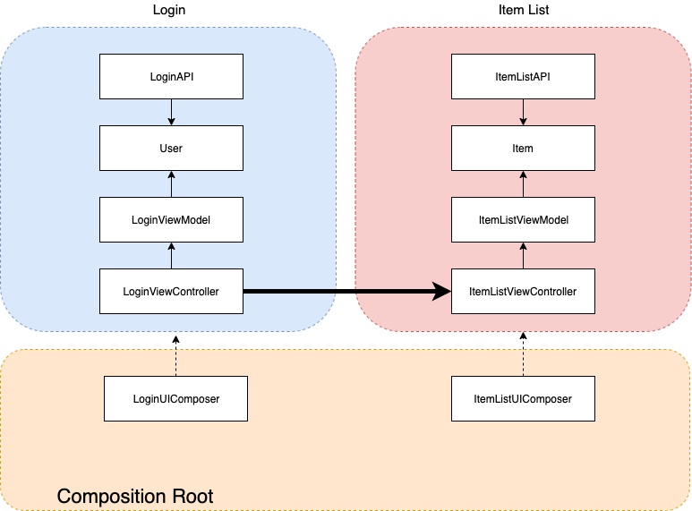

- [Words](#words)
- [Some aspects of good architecture](#some-aspects-of-good-architecture)
- [Modular design goal](#modular-design-goal)
- [Decoupling business logics(rules) from any framework(infrastructure) logics](#decoupling-business-logicsrules-from-any-frameworkinfrastructure-logics)
  - [Two types of business logic](#two-types-of-business-logic)
    - [Application-specific business logic](#application-specific-business-logic)
    - [Application-agnostic business logic](#application-agnostic-business-logic)
  - [Framework (Infrastructure) logic](#framework-infrastructure-logic)
  - [Dependency Inversion](#dependency-inversion)
- [Two kinds of dependencies](#two-kinds-of-dependencies)
  - [Stable dependencies](#stable-dependencies)
  - [Volatile dependencies](#volatile-dependencies)
- [Composition Root](#composition-root)
  - [What are the merits of composition root?](#what-are-the-merits-of-composition-root)
    - [Make parallel development easier](#make-parallel-development-easier)
    - [Testability](#testability)
    - [Controllable Object Lifetime management](#controllable-object-lifetime-management)
    - [Explicit object graph](#explicit-object-graph)
  - [Where is composition root?](#where-is-composition-root)
    - [Composition Root should not be public](#composition-root-should-not-be-public)
  - [Composer](#composer)
    - [Composer rules](#composer-rules)
  - [Composition Root and navigation across modules](#composition-root-and-navigation-across-modules)
  - [Composition Root and dependency lifetime management](#composition-root-and-dependency-lifetime-management)
    - [Singleton Lifestyle](#singleton-lifestyle)
    - [Transient Lifestyle](#transient-lifestyle)
    - [Scoped Lifestyle](#scoped-lifestyle)
  - [Does the Composition Root become too big?](#does-the-composition-root-become-too-big)
  - [Do we need to inject so much dependencies in Composition Root?](#do-we-need-to-inject-so-much-dependencies-in-composition-root)
  - [We don't need all dependencies should be initialized immediately](#we-dont-need-all-dependencies-should-be-initialized-immediately)
  - [How to test the Composition Root?](#how-to-test-the-composition-root)
- [DI patterns](#di-patterns)
  - [Constructor injection](#constructor-injection)
  - [Method injection](#method-injection)
  - [Property injection(Setter injection)](#property-injectionsetter-injection)
  - [Which one do we choose?](#which-one-do-we-choose)
- [Some stages of DI](#some-stages-of-di)
  - [The Singleton pattern (from the Design Patterns book of GOF)](#the-singleton-pattern-from-the-design-patterns-book-of-gof)
  - [Swift singleton](#swift-singleton)
  - [Singleton and test](#singleton-and-test)
    - [Property injection](#property-injection)
  - [Global Mutable Shared State](#global-mutable-shared-state)
  - [Singleton(Global Mutable Shared State)'s (possible) problems](#singletonglobal-mutable-shared-states-possible-problems)
  - [S(s)ingleton(Global Mutable Shared State) itself is not bad](#ssingletonglobal-mutable-shared-state-itself-is-not-bad)
  - [Depending on one shared concrete type tends to affect unrelated components](#depending-on-one-shared-concrete-type-tends-to-affect-unrelated-components)
  - [Avoid breaking modules](#avoid-breaking-modules)
    - [extension](#extension)
    - [Dependency Inversion](#dependency-inversion-1)
  - [Component Adapter Pattern](#component-adapter-pattern)
- [Don't skip stages](#dont-skip-stages)
- [More consideration about DI](#more-consideration-about-di)
  - [Injection Constructor should be simple (don't add behavior)](#injection-constructor-should-be-simple-dont-add-behavior)
  - [Constructor Over-injection is code smell](#constructor-over-injection-is-code-smell)
  - [Create a good abstraction](#create-a-good-abstraction)
    - [Interface Segregation Principle](#interface-segregation-principle)
    - [Interfaces have several roles](#interfaces-have-several-roles)
    - [Interfaces should be single-purpose and small](#interfaces-should-be-single-purpose-and-small)
    - [How can we collaborate these different interfaces in different module?](#how-can-we-collaborate-these-different-interfaces-in-different-module)
    - [Similar is not same](#similar-is-not-same)
    - [short code　≠ clean dependencies](#short-code-clean-dependencies)
  - [Restrict from creating and using dependencies in the same class](#restrict-from-creating-and-using-dependencies-in-the-same-class)
    - [Middle man anti-pattern](#middle-man-anti-pattern)
  - [Transition via delegate or closure](#transition-via-delegate-or-closure)
    - [Factory does not reduce coupling](#factory-does-not-reduce-coupling)
  - [Add a new method to an existing protocol should be considered a red flag](#add-a-new-method-to-an-existing-protocol-should-be-considered-a-red-flag)
    - [Break all the components conforming to the protocol,](#break-all-the-components-conforming-to-the-protocol)
    - [Implement all methods](#implement-all-methods)
    - [Lose its Single Responsibility](#lose-its-single-responsibility)
    - [Expose methods that not all clients need](#expose-methods-that-not-all-clients-need)
    - [It passes a message to the team that “it’s ok to add many methods to this protocol”](#it-passes-a-message-to-the-team-that-its-ok-to-add-many-methods-to-this-protocol)
    - [How to solve?](#how-to-solve)
  - [Interception](#interception)
    - [The Decorator pattern](#the-decorator-pattern)
    - [Command-Query Separation(CQS)](#command-query-separationcqs)
    - [Cache(Example)](#cacheexample)
    - [Cross-cutting concerns](#cross-cutting-concerns)
    - [The Decorator pattern and code duplication(DRY violation)](#the-decorator-pattern-and-code-duplicationdry-violation)
    - [Event driven design](#event-driven-design)
    - [AOP(Aspect Oriented Programming)](#aopaspect-oriented-programming)
    - [Side-effect free core business rules](#side-effect-free-core-business-rules)
    - [Functional core, Imperative share](#functional-core-imperative-share)
  - [Unified vs Segregated models](#unified-vs-segregated-models)
    - [The problem of a unified model](#the-problem-of-a-unified-model)
    - [Creating Segregated models (DTO)](#creating-segregated-models-dto)
    - [Be careful not to cross boundaries when they are in the same project](#be-careful-not-to-cross-boundaries-when-they-are-in-the-same-project)
    - [Be careful not to diverge related concepts too much at the same time](#be-careful-not-to-diverge-related-concepts-too-much-at-the-same-time)
    - [Using a unified model controlled by an external team](#using-a-unified-model-controlled-by-an-external-team)
  - [Domain model and DI](#domain-model-and-di)
- [From dependency injection to dependency rejection](#from-dependency-injection-to-dependency-rejection)
- [Separation pros/cons](#separation-proscons)
- [External dependencies count & Introducing 3rd-party libraries](#external-dependencies-count--introducing-3rd-party-libraries)
- [Resources](#resources)

# Words

component: functions, modules, classes, protocols, interfaces, data structures, dependencies and any language/platform or component-like types in the codebase

# Some aspects of good architecture

- Low cost for change
    - Welcome requirement changes
    - Allow the business to adapt quickly
- Easy to develop, extend, maintain, test
- Break down complexity into simple constructs
- Make it easier to maintain a fast and constant pace
- Protect the system against volatile dependencies(later)
- Improve estimation accuracy
- Low coupling, high cohesion
- Allow independent development(and development), and testing in isolation/parallel)

# Modular design goal

The goal is to achieve low coupling between modules, and high cohesion within each individual module.

It makes our code:

- Understandable
- Reusable
- Testable
- Scalable
- Easy to improve
- Easy to refactor

As a guideline, ask ourselves:

"Can we refactor or add new features to this module without touching any files of the other module?"

# Decoupling business logics(rules) from any framework(infrastructure) logics 

- Business logics(rules): **what** the system do
- Framework(Infrastructure) logics: **how** to do

The dependency should be from the framework to the business logic since the "how to do" needs to conform to the "what to do" and "what" is agnostic of "how".

This difference is very important to achieve the modular design goal

-  A clear separation of concerns enables us to create decentralized components that are agnostic of the internals of their collaborators and have access only to essential-for-their-functionality behaviors
- It makes changes in the codebase easier and cheaper, enabling the team to welcome new requirements
- It makes the codebase more resilient as it decreases the number of places that can break when a code change is required(avoiding component, modular and even systemic level break)

## Two types of business logic

There are two common types of business logic. If we don’t distinguish between them when discussing with other developers, the lack of context can lead to miscommunication.

### Application-specific business logic

Use Cases describe application-specific business logic and is often implemented by a Controller (there are many alternative names like Interactor, Service, etc) type collaborating with other components (coordinating domain models and application infrastructure abstractions). Controllers deal with application interactions (e.g., coordinating asynchronous operations from collaborators) with strict boundaries (protocol/closure) to protect the application from depending on low-level details (e.g. 3rd-party frameworks). 

It should not depend on concrete (specific) framework details.

### Application-agnostic business logic

Domain Models describe application-agnostic business logic. This kind of logic is independent of application, also known as core business logic. 

Core business logic is often reused across Use Cases within the same application and even across other applications. 

It should not depend on any application or framework details. 

Domain Models are usually tiny little objects when compared with the size of the system. But its importance is much greater than its size. Domain Models implement the essential business logic (the code that really matters to the business), so we don’t lose sight of the domain within the technical and infrastructure complexities. Notice how, for example, we strive to keep our models simple, with no asynchronous or impure behavior (application detail) leaking into the domain models.

## Framework (Infrastructure) logic

Framework (Infrastructure) logic should not implement any business rules. Mixing business logic with infrastructure details is one of the most common (and one of the biggest mistakes) we find in codebases (e.g. Database and Network clients implementing validation or business rules operations or Domain Models inheriting from framework types, CoreData’s `NSManagedObject`). Doing so will scatter business logic across your code with no central source of truth. Tangled business rules and infrastructure code is harder to use, reuse, maintain, and test.

For example, assuming that changing our local database from CoreData to Realm forced to change(more to say rewrite) our business logics, it's not good.

The more we separate code (the less a piece of code knows/does), the easier it is to develop, use, reuse, maintain, and test (because it will naturally depend on less context). Infrastructure interface implementations should be as simple as possible. It should only fulfill infrastructure commands sent by the Controller types through the abstract interface (protocol/closure) like fetch something from the cache, store cache, download an image from a remote URL, etc.


## Dependency Inversion

To achieve the separation between business and framework logics, Dependency Inversion is essential. It means that instead of depending on framework requirements, we make the framework depend on our needs.

Dependency inversion between business and framework logics is the basis for designing modular systems. 

Three roles take part in the dependency inversion

1. A high-level component, such as business rules has no references to low-level implementation details, such as the delivery mechanism (e.g. UI, hardware, databases, network, etc).
2. A low-level component that is aware of the delivery mechanism (e.g., UI, hardware, databases, network, etc).
3. A boundary component, such as a protocol or closure, acting as an abstraction to guarantee the high-level component doesn’t depend on low-level details.


When the high-level component needs to communicate with low-level implementation details, it does so through the boundary abstraction. The low-level component implements the boundary abstraction and performs actions based on the high-level component’s commands.

The boundary provides the flexibility for making the other two participants (high and low level components) free from ever knowing about each other’s existence.


# Two kinds of dependencies

What to inject and what not to inject

Don’t have to treat all dependencies equally.
It’s important to know how to distinguish between types that pose no danger and types that may tighten an application’s degree of coupling.

## Stable dependencies

- Are classes or modules which have already exist (primitive classes like `String`, `Int`)
- Expect that new versions won't contain breaking changes
- Only contains deterministic algorithms
- Never expect to have to replace, wrap, decorate, or Intercept the class or module with another (No need to mock in tests)

※ Many components of `Foundation` can be treated as a stable dependency(e.g. `JSONDecoder`). But, `URLSession` is different. An HTTP request is a slow, asynchronous, and non-deterministic operation. The request may fail for multiple reasons that we cannot predict (server is down, server is broken, slow/no connectivity...). `URLSession` also exposes an awkward API, with a lot of optionals.
So, this is a **Volatile dependency**.

## Volatile dependencies

Volatile Dependencies are dependencies that change frequently. It's advised to avoid coupling our code with them to avoid having to recompile/reimplement/retest/redeploy our code all the time.

- Introduce a requirement to set up and configure a runtime environment for the application (e.g. `URLSession`, File system)
- Don’t yet exist, or is still in development(self-developing library)
- Aren’t installed on all machines in the development organization(= optional)
- Contain nondeterministic behavior(e.g. `Date`)

# Composition Root

> A Composition Root is a (preferably) unique location in an application where modules are composed together.  
> [Composition Root](https://blog.ploeh.dk/2011/07/28/CompositionRoot/)

It is near the entry point of the application.

It is an application detail. Thus, only applications should have a Composition Root, not frameworks.

The key point to is **Where should we compose object graphs?**

When creating independent modules, they should not have any reference to components that belong to another module.

For example, if we want to decouple a Login module from a Items module, they should not reference each other. For instance, a component in the Login module should not instantiate a component from the Items module.

So, the idea is to create a Main module(mostly the app target) responsible for instantiating and composing all independent modules in a centralized place. This is the Composition Root.

If after login, we want to transition to the items screen, this transition can be delegated through an abstraction that will be implemented by a component in the Composition Root. Then, the modules are independent of each other. 

Also, we could easily replace the transition to the Friends screen after login. We can make those changes without affecting the Login or the Items module by simply changing the composition from the Composition Root.

Centralizing our app’s instantiation and composition simplifies drastically the development and management of modules, components, and their dependencies.

The Composition Root usually doesn't have logic. Its responsibility is to instantiate and compose all the modules.

Also, common misunderstanding point is that: 
**The Composition Root isn’t a method or a class, it’s a concept. It can be a part of the Main method, or it can span multiple classes, as long as they are all in a single module.**

## What are the merits of composition root?

### Make parallel development easier

Each modules are independent. They don't know anything about other modules. Even when we want to add new feature, we don't need to touch other modules.

### Testability

Each feature module can be tested independently.  
We can do unit tests for each of them(including snapshot test= UI regression test).  
Also we can do integration tests and acceptance tests since we can easily replace dependencies with mocks by composing modules like the Composition Root.

### Controllable Object Lifetime management

Only Composition Root knows when and how instances are created and released. Modules should not know whether lifecycle of other modules' instances(singleton, transient... described later)  

Also we can control framework specific things (e.g. UI must add `weak` to avoid retain cycle, and so on). This is the Virtual Proxy Pattern. It depends on what we want to achieve, but we could understand our code base more since we can see what's happening in a collected areas(the Composition Root).

Object instantiation is a responsibility that should ideally take place in a single place, rather than scattered around the codebase.
Otherwise, if at some point some class needs more dependencies, we would have to change the other class which creates it to provide those dependencies. That's a violation of the Open/Closed principle (a change in one component should not need a change in another component). It could affect parallel development.

### Explicit object graph  

Composition root is the single point which create instances and compose them, so we can confirm all dependencies from the Composition Root explicitly.
※ It does not mean that Composition root is a class or a method.

## Where is composition root?

It's said,

> As close as possible to the application's entry point.

In iOS apps, the `UISceneDelegate.willConnectToSession` or `@main` can be considered the app entry point in single window.

The Composition Root is the most concrete place in our app as it instantiates the concrete components for the app’s composition. the Composition Root is an application detail. Thus, only applications should have a the Composition Root.
(In reverse, frameworks shouldn’t need the Composition Roots as they shouldn’t hold or depend on application-specific details)

It only composes modules and not reusable and the only one who knows every concrete implementation.

In the below image, the `SceneDelegate` centralizes the instantiation and composition of our app in a single class.


### Composition Root should not be public

The Composition Root is the root of the object graph. Thus, it and its components shouldn’t be referenced by other modules.

Making sure the Composition Root types are not public is a great way to enforce such rules, as the project wouldn’t even compile if another module references the Composition Root.


## Composer

Like `SceneDelegate` in the above example, an any object or method that composes dependencies is called **Composer**. It’s an important part of the Composition Root.

Composer could be a DI Container, but it can also be any method that constructs object graphs manually. 
※ In Swift world, I think we would use manual dependency management in many cases.

For example, we can define composers for each our module.


### Composer rules

Composers should only be used in the Composition Root. And only composers can use other composers. What that means is that we shouldn’t be interacting with composers anywhere else in our codebase.

## Composition Root and navigation across modules

In a large app, it's very important that we can develop each module separately. So, it's better not to bind modules each other since it could disturb our progress.

For example, after login, we want to show an item list. We need to navigate from the login page to the list page. The simplest way to do that is to directly push to the list page.



But, there could be some problems.

- If the list page is changed, it's probable that we need to change the login page too.
- We have to manage the list page dependencies in the login page.
- Moreover, whenever change which is unrelated to Login module is added to ItemList module, Login module is recompiled since it's import ItemList module.

To avoid such problems, we can delegate the login event to the Composition Root and navigate to the list page from there.

The above assumes that `SceneDelegate` manages navigation stack (It's the simplest way).


Of course, if we handle more complicated app, it's easy to make `SceneDelegate` quite messy. So, we can define new components to do navigation logics in the Composition Root like Flow, Coordinator, Router.

## Composition Root and dependency lifetime management

As described in the [Controllable Object Lifetime management](#controllable-object-lifetime-management), the Composition Root(Composer) controls the lifetime of dependencies.

The Composition Root decides when instances are created, whether to share instances, it determines whether a dependency goes out of scope with a single consumer, or whether all consumers must go out of scope before the dependency can be released.

Then, we need to think of the lifetime of the dependencies(= lifestyle). There are some lifestyle patterns.

### Singleton Lifestyle

※ It's different from the Singleton design pattern.

A single instance is perpetually reused. The resulting behavior is similar to the Singleton design pattern, but the structure is different. The Singleton Lifestyle does not provide a global access point. It can be referenced from the Composition Root. Using a shared instance is important for app efficiency like saving memory, battery, etc. But it's details, so feature modules should not know about it. 

Note that, single lifestyle instances need to be thread-safe since it can be shared across many modules.


### Transient Lifestyle

Another lifestyle is the Transient Lifestyle. A transient instance is created and destroyed as requested. It's not shared across modules, so we don't need to care about thread-safety. But be careful to use it since it's the least efficient way since it can cause huge instances.

In many cases, we can safely exchange the Transient Lifestyle for a Scoped Lifestyle, where access to the Dependency is also guaranteed to be sequential[

### Scoped Lifestyle

At most, one instance of each type is served per an implicitly or explicitly defined scope. We can reuse them only in the defined scope. For example, an instance can be alive during one process(OperationQueue, button tap action, etc).

## Does the Composition Root become too big?

Like the above, we can create several components in the Composition Root. The Composition Root isn’t a method or a class, it’s a concept. It can be a part of the Main method, or it can span multiple classes, as long as they are all in a single module. 

In addition, we could define Factory to create a proper instance in each module. But be careful that we should use it only in the Composition Root.

## Do we need to inject so much dependencies in Composition Root?

Apparently yes. But in facet, it's often said that we have many implicit dependencies. So, actual number of dependencies are not different. The Composition Root makes them explicit and we can get a clear dependency graph.


## We don't need all dependencies should be initialized immediately

Instantiating the concrete components does not mean that all dependencies are needed to load immediately. We can lazily load them if we need(e.g. using closures to provide dependencies's instances).

## How to test the Composition Root?

They need to test in the Integration Test. For example, we can test it by simulating app Launch, state transitions.

When testing our app with Integration Tests, simulating the app launch and state transitions (e.g., background/foreground) is just a matter of invoking a method.

But, we could meet the difficulties. We can not invoke `SceneDelegate` method. For example, to invoke the `UISceneDelegate.willConnectToSession` method, we need to pass an instance of the `UIScene.ConnectionOptions` class. However, this class doesn’t have a public initializer.

So, we need to move the logic within the method we cannot invoke into a method we can invoke

One way is to use convenience initializers of `SceneDelegate`.
This allows us to pass stubbed infrastructure implementations during tests instead of making real calls to the network and database.

Plus, we can use `lazy` properties whose initial value is not calculated until the first time they are used. So, if we provides their initial values via the convenience initializer, the system use them. If not, the system uses the default ones.

# DI patterns

## Constructor injection

It is the act of statically defining the list of required Dependencies by specifying them as parameters to the class’s constructor.

It's the most preferable way and we should use it as much as possible.

Inject dependencies when constructing an object. It guarantees the existence of dependencies when instantiated and can eliminate unnecessary optionality and mutability. Also, client of the object can understand the dependencies explicitly.

## Method injection

It supplies a consumer with dependencies by passing it as method argument on a method called.

It's useful when...

- Dependencies can vary with each method call e.g. [Domain model and DI](#domain-model-and-di)
- A consumer of the dependency can vary on each call e.g. runtime information like `Date()` it changes every time

It is different from other patterns the injection happens dynamically at invocation. This allows the caller to provide an operation-specific context.

- Enables the caller to provide operation-specific context
- Enables injecting dependencies into data-centric objects

On the other hand, it needs to add limited applicability to public API. This means that adding not always necessary dependencies.


It is unsuitable when used within the Composition Root([Composition Root](#composition-root)). Within a Composition Root, it can initialize a previously constructed class with its dependencies. Doing so, however, leads to [Temporal Coupling](https://blog.ploeh.dk/2011/05/24/DesignSmellTemporalCoupling/), so it’s highly discouraged.

## Property injection(Setter injection)

It allows a "local" default to be replaced via a public settable property.

※ "local" means "not across module boundaries". 

If we have a good local default, but still want to open for extensibility. It's useful.

Constructor injection is more preferable and the usage should be limited like:

- Legacy codes which are difficult to do Constructor injection.
- Dealing with 3rd-party frameworks that force us to do that. (e.g. UIKit's UIViewController/UIView in Storyboards before iOS13)
- with delegate/data source that can be swapped. For example, UITableView (and UIView's in general) can be expensive to create/layout/render/destroy, so it's a good advise to reuse the instance when re-rendering the screen.
- when we don't have the property to inject when we create our instance (e.g., a property that will only be available after some asynchronous operation). ※This is often a design flaw and should raise some warnings in our heads to improve the design.

※ We need to be careful not to forget to supply the dependencies. This is Temporal Coupling.

## Which one do we choose?

In most cases, default choice should be constructor injection, but there are situations where one of the other patterns affords a better alternative.

[Injection Pattern](./images/injection_patterns.png)

# Some stages of DI

※ There is nothing wrong with them. It's just a level of abstraction. Each of them has pros/cons. It depends on what we want to achieve and it's important to think of our situations.

## The Singleton pattern (from the Design Patterns book of GOF)

The Singleton pattern is a way to make sure that a class has only one instance

- It provides a single point of access to it
- The class itself should be responsible for keeping track of its sole instance
- No other instance can be created by intercepting requests for creating new objects and provide a way to access the sole instance
- The class can't be instantiated from the outside world more than once, so prohibits the declaration of a (visible to the module) initializer.

```swift
final class ServerAPIClient {
    static let shared = ServerAPIClient()
    private init() {}
}

let client = ServerAPIClient.shared
```

※ The Design pattern book said static `getInstance` method was needed, but in Swift, `static let` is constant and lazy loaded, so we don't need it. Also it said we shouldn't make the class `final` since a Singleton may be extended in the future and allow subclassing to add methods. But in Swift we can use extensions for the purpose. if we aren't going to override existing methods, we can add `final`.

```swift
extension ServerAPIClient {}
```

## Swift singleton

In Swift, singleton which Swift developer used is different from the above definition. For example,

```swift
URLSession.shared
```

Apple provides so-called the singleton instance. But we can still create a new `URLsession` instance by ourselves. It breaks the contract of GOF's Singleton Pattern.

By following Swift way, delete `private init(){}`, then we can create new instances.

```swift
final class ServerAPIClient {
    static let shared = ServerAPIClient()
    //private init() {}
}
```

## Singleton and test

How can we test a singleton? 

For example,

```swift
struct User {}
final class LoginViewModel {
    func login() {
        ServerAPIClient.shared.login { /* ... */ }
    }
}

final class ServerAPIClient {
    static let shared = ServerAPIClient()
    func login(completion: @escaping (Result<User, Error>) -> Void) { /*...*/ }
}
```

Like the above, we can use the singleton instance(`shared`), but how can we replace it with something like mock for test purpose in Swift?

### Property injection

One option is using property injection by changing some points. 

```swift
class LoginViewModel {
    var client = ServerAPIClient.shared // 3
    func login() {
        client.login { /* ... */ }
    }
}

class ServerAPIClient { /* ... */ } // 2
class MockServerAPIClient: ServerAPIClient {} // 3

let loginViewModel = LoginViewModel()
loginViewModel.client = MockServerAPIClient() // 4
```

1. Create a variable and assign `shared` to it.
2. Remove `final` from `ServerAPIClient`.
3. Create a mock(`MockServerAPIClient`) as a subclass of `ServerAPIClient`.
4. Set the mock to `client` property.

By doing this, we can test `LoginViewModel` without calling actual API calls.

※ Of course, this change affects all tests, so if we need another behavior, we need to create a new mock class and replace it with the old one. It's likely that we have to setup and clean up the mocks in every tests in the long run. Also, we can not predict what happens in parallel tests(flaky tests).

## Global Mutable Shared State

Another way is to make `shared` mutable.

```swift
class ServerAPIClient {
    static var shared = ServerAPIClient() // 1
}

class LoginViewModel {
    func login() {
        ServerAPIClient.shared.login { /* ... */ } // 2
    }
}
ServerAPIClient.shared = MockServerAPIClient()
```

1. Make `shared` `var`.
2. Set the mock instance to `shared`.

It looks singleton(and people call it singleton), but actually it's not singleton. Probably this is because when people see `shared` like name, they tend to think it's singleton pattern.

It's not good since someone can change `shared` instance freely and it causes problems which hard to find the cause(as described in the next column). 

So, back to property injection.

```swift
class ServerAPIClient {
    static let shared = ServerAPIClient()
}

class LoginViewModel {
    var client = ServerAPIClient.shared
}
```

## Singleton(Global Mutable Shared State)'s (possible) problems

Singleton(Global Mutable Shared State) is convenient, but some problems could happen:

It's not said that we must not use Singleton(Global Mutable Shared State) at all. For example, it could be fine when the dependency is stable, or even if it's a volatile dependency, it's used only in a proper place. The problem could cause by using volatile dependencies all over the place.

- Their dependencies are hidden from clients. Clients can't see the dependencies.
- Testing becomes more difficult. As described the above, it's likely that we have to setup and clean up the mocks in every tests in the long run(It's easy to forget). Also, we can not predict what happens in parallel tests(flaky tests).
- It's hard to decouple them. Clients probably need to import all dependencies which Singleton(Global Mutable Shared State) depends.
- We have to setup them before they're used.
- It could cause threading issues since it can be changed in multiple threads(= data races) if it's not thread-safe. It might cause unpredictable behavior, and in the worst case, it could cause data corruption, app crash, ...


## S(s)ingleton(Global Mutable Shared State) itself is not bad

S(s)ingleton(Global Mutable Shared State) makes sense if we need to enforce a single instance. However, the problem happens when we try to use it directly all over the place. As said the above, there could be many problems. If we want to use a single instance, the Composition Root should know if an instance is a singleton ot not then it should be injected into other components(modules).By this, we can facilitate threading, state management, and it also makes our code more testable.

## Depending on one shared concrete type tends to affect unrelated components

Let's define another class which uses `ServerAPIClient`.

```swift
class ServerAPIClient {
    func fetchItems(completion: @escaping (Result<Item, Error>) -> Void) { /*...*/ } // 1
}

// 2
struct Item {}
class ItemListViewModel {
    var client = ServerAPIClient.shared
    func getList() {
        ServerAPIClient.shared.fetchItems { _ in /* ... */ }
    }
}
```

1. Define a new method which fetch items.
2. Create `ItemListViewModel`

So, what's the problem?


Imagine, we have `ServerAPIClient` Login, Items, Friends and more modules. All the modules share `ServerAPIClient` class, but Login does't care about Items. Items does't care about Friends...
Every time we need to add a new method in `ServerAPIClient`, we need to recompile all the other modules because they depend on this concrete type. They have source code dependency on this `ServerAPIClient`. If we want to reuse Login modules in a different application(a different context), we can't bring it without `ServerAPIClient`. Even if `ServerAPIClient` is in a shared modules, it's the same since other modules need to import it.

## Avoid breaking modules

Global shared state is very convenient. It's easy to create and use.
But, if we need to care about modular design(reusability), we should solve this.

### extension

A simple way is using extensions.


- Create a generic method(`execute(request)`).
- Every module has each own `ServerAPIClient` extension with whatever method they need.

```swift
// ServerAPI Module
class ServerAPIClient {
    static var shared = ServerAPIClient()
    func execute(_ request: URLRequest,
                 completion: @escaping (Result<Data, Error>)-> Void) {/*...*/}
}

// Login Module
extension ServerAPIClient {
    func login(completion: @escaping (Result<User, Error>) -> Void) {
        execute(/* ... */)
     }
}
class LoginViewModel {
    var client = ServerAPIClient.shared
    func login() {
        ServerAPIClient.shared.login { _ in/* ... */ }
    }
}

// Items Module
extension ServerAPIClient {
    func fetchItems(completion: @escaping (Result<Item, Error>) -> Void) { /*...*/ }
}
struct Item {}
class ItemListViewModel {
    var client = ServerAPIClient.shared
    func getList() {
        ServerAPIClient.shared.fetchItems { _ in/* ... */ }
    }
}
```


Now, we have a generic client in the middle and specialize the client for each module.

We could break the dependencies without breaking the implementation. It's safer and more flexible, but we still share `ServerAPIClient` between all other modules. If we add a new method in it, we need to recompile them.

### Dependency Inversion

If we need to be more flexible without breaking the clients, we can invert dependencies which mean instead of the modules depending on a concrete `ServerAPIClient`, we make it depend on the modules.

`ServerAPIClient` is just  a detail and it's not important for business. So, it's reasonable to contain business logics in feature modules and details(like `ServerAPIClient`) depend on the features.

To do so, we introduce protocol or closures ot any type of interface for the modules.


For example, Login needs a function or a type that implements a function talking to an API.

It doesn't need to know where it comes from. It doesn't care about anything else.

We have generic `ServerAPIClient` in the center, we have modules with only what they need and we implement the adapters.

It's completely modular since we can use this `ServerAPIClient` in other applications, we can use `Login` in other applications in other contexts, and os on.

We can compose it all those things together and when we're testing, we compose it with mocks or stubs... whatever we need.

For example,

```swift
// Main Module
extension ServerAPIClient {
    func login(_ completion: @escaping (Result<User, Error>) -> Void) { /*...*/ }
}

extension ServerAPIClient {
    func fetchItems(_ completion: @escaping (Result<Item, Error>) -> Void) { /*...*/ }
}

// Login Module
class LoginViewModel {
    typealias Login = (@escaping LoginCompletion) -> Void
    typealias LoginCompletion = (Result<User, Error>) -> Void

    var loginAPI: Login
    init(loginAPI: @escaping Login) {
        self.loginAPI = loginAPI
    }

    func login() {
        loginAPI { user in /* ... */ }
    }
}

// Items Module
class ItemListViewModel {
    typealias FetchItems = (@escaping FetchItemsCompletion) -> Void
    typealias FetchItemsCompletion = (Result<[Item], Error>) -> Void

    let fetchItems: FetchItems
    init(fetchItems: @escaping FetchItems) {
        self.fetchItems = fetchItems
    }
    func getList() {
        fetchItems { result in/* ... */ }
    }
}

// Test Module
class MockServerAPIClient {
    func login(_ completion: @escaping (Result<User, Error>) -> Void) {
        completion(.success(User()))
    }
}

// In the Main module
let viewModel = LoginViewModel(loginAPI: ServerAPIClient.shared.login)

// In the Test module
let viewModel = LoginViewModel(loginAPI: MockServerAPIClient().login)
```

※ We use `ServerAPIClient` extensions as adapters since it's very simple. And this time we use closures for abstraction since they are the only one method in each module.


## Component Adapter Pattern

To be more modular, we can use Adapter pattern.

Adapter pattern enables components with incompatible interfaces to work together seamlessly. The purpose is to convert the interface of a component into another interface a client expects. It enables us to decouple components from complex dependencies. It is often implemented as a class, nothing stops us from following its principles to implement adapter functions.


Adapter can live in Composition Root. That's why each components doesn't need to know each other.


⚠️ Adapter pattern can complicate the design. So avoid them if not necessary. Keep it simple puts before it.

# Don't skip stages

The bigger the codebase it is, the more complex requirements are. And we can get more benefits from modular design.
It doesn't come easily and we need to be very disciplined.
We should not start with complex design. When needed, just understand how we can go from one step to the other, understand the difference and make the choices for our current problem.

- We can Swift Singleton testable by allowing subclasses and using property injection.
- We can change the singleton to a global mutable state and replace it in tests.
...and so on.

The point is that we need to know where to go to the next step when the problem occurs.


# More consideration about DI

Some of them are not related to DI directly. But considering them could lead to a good DI strategy.

## Injection Constructor should be simple (don't add behavior)

More to say, an initializer which does DI should do no more than receiving the dependencies.

There are some reasons:

- We want to create all object graphs as efficient as possible since if it's fully initialized, app might crash.
- If we have circular dependencies and invoke one of them before initialized, it might also cause crash.
- The constructor's responsibility is demand and receive the dependencies. According to the Single Responsibility Principle, it should not try to do some other things.

## Constructor Over-injection is code smell

Sometimes, we feel that a constructor has too many dependencies. We might try to create a encapsulated model(so called Facade), but it's not the solution.

We need to think about:
- If it contains cross-cutting concerns(e.g. logging, error handling, etc.), it's not a good idea. Instead, we can use Decorator or Domain Event, etc.
- The class could have too many responsibilities, so we need to think about splitting it into smaller classes according to the Single Responsibility Principle.

## Create a good abstraction

By hiding concrete implementations from an interface, it is open for extension and closed for modification (Open/Closed principle). If not, we might change it when applying other implementation.

### Interface Segregation Principle

Clients should not depend on methods they do not use. by this, we can keep clear interfaces, single responsibility, etc. If it's violated, there could be some problems:

- have to recompile and redeploy modules, which will increase build and test times
- break the foundation of independent development, meaning developers will have to add/fix code to components already conforming to the broken interface
- then, internal merge and versioning conflicts become more likely
- also, introducing potential bugs and regressions since unrelated codes could be changed at the same time

The bigger out team becomes, the more this violation has effect on us.

### Interfaces have several roles

Interfaces can be used in several situations:

- As boundaries between business logics and infrastructure details(like HTTP, File system, etc). Protocol adapts the communication between them. It doesn't contain any core business logics. 
- AS contracts between business logics(e.g. other feature modules, client and server).

In Swift, many developers think that interface protocol, but we can use other things like closure, struct, etc... as interfaces.

### Interfaces should be single-purpose and small

Following to Interface Segregation Principle, interfaces could become small since they should be single-purpose. If not, it could violate other SOLID principles like Single Responsibility Principle.

Exposing too many operations are often not very good abstractions. They end up becoming bottlenecks and increasing the coupling in the system (we end up depending on modules which not needed)

For example, assuming that there is a protocol to communicate with an interface to access web services via HTTP. If a client wants only get method, but another one wants get and post methods, they should be separate interfaces. If they share the same one and one client comes to need delete method, we need to change both clients.

### How can we collaborate these different interfaces in different module?

TO decouple a module from other one, such a adapting thing should be done in the Composition Root. If a behavior needs some more business logic after that, we might delegate it to another feature. If we don't need any other business logic, we just call the infrastructure implementations. For example, we want to delete cache when the specific time is passed by. The judgement if it's over or not is business logic, then deleting the actual cache from the system is the infrastructure implementation. 

### Similar is not same

When we find the similar methods(e.g. get, delete, etc) in two interfaces, we are tempered to create one shared interface. But, sometimes it's not right since the usage of them are different by their clients, and the shared interface could not represent what each client needs. 

In addition, it gets harder in case of multiple modular design. If we create "Shared" module and put the shared interfaces in it, other features which need the interfaces always have to import the shared module into their modules. And this will increase maintenance cost (e.g., every time the shared module changes, we need to recompile and redeploy all other modules). 

Each feature should define its own protocols in its own module. Then, the modules can become simpler to maintain since the features are fully decoupled, and the code is simpler since the protocols define the precise methods they need.

※ It won't say that we must have separate concrete implementations for each interface. We can use the same implementations across several interfaces(e.g. store data in CoreData, accessing a server, etc)


### short code　≠ clean dependencies

As said in the above, just being small does not make sense. The key is "single-purpose". For example, not every protocol necessarily has only one method.

## Restrict from creating and using dependencies in the same class

When composing small components, probably we try to create and use them in a aggregation class. The main problem is that, as long as it creates its collaborators, it needs to provide their dependencies. And many times it just passes the dependencies to the collaborators. It' an anti-pattern called Middle man.

```Swift
final class ListViewController: UIViewController {
    ...

    func showDetail(with item: Item) {

    }
}

```

### Middle man anti-pattern

If an object method is simply forwarding a method to another object without any extra logic, it could be an anti-pattern called middle man.
It's also applied to DI. If a parent class creates a child class which has its own dependencies not used in the parent, the parent has to hold unnecessary dependencies and just passes them to the child. Then:

- It could cause constructor over-injection(too many dependencies) in the parent and it makes the parent overcomplicated.
- If the child changes its dependencies, the parent will have to change too


## Transition via delegate or closure

Separating the instantiation of our views from the presentation/navigation will help us build more maintainable, extendable, replaceable, reusable, and testable components. The idea is to decouple ViewControllers when possible. Especially when they belong to different features.

A class could handle all the transitions initially, but it can inflate the number of responsibilities the class has. So, we extract and encapsulate the view coordination responsibility in a new object responsible solely for that. For example, as we add more features and transitions to our app, we could breakdown the navigation into dedicated Flows or Coordinators in the Composition Root.

### Factory does not reduce coupling

In this lecture, we demonstrated how using a concrete factory directly in the client code does not provide any value regarding Dependency Injection, modularity, or decoupling. In fact, even Abstract Factories can increase the number of redundant dependencies and complicate the design.

Factories should be used to remove duplication / encapsulate the logic of creating complex instances, not to reduce coupling. To reduce coupling, Factories (such as Composers) should be used only in the Composition Root.

## Add a new method to an existing protocol should be considered a red flag

In most cases, adding more methods to a protocol should be considered a red flag.

In fact, adding many methods to a protocol is a common behavior we see in many iOS code bases.
The problem is that is leads to bloated and leaky abstractions.

### Break all the components conforming to the protocol,

They would have to implement this extra mandatory method. 
This is especially cumbersome on large code bases, as it’s typical (and desired) to have many components conforming to the same protocol.

### Implement all methods

Not all components will have a clear reason or the means to implement all methods.
When this happens, the number of changes (and duplication!) will cascade as we add more dependencies and copy/paste implementations into many components. 
To avoid the cascading effect, developers may decide to add faulty implementations or `fatalError(“not implemented”)`, a clear violation of the Liskov Substitution Principle.

### Lose its Single Responsibility

Adding new behavior means adding new responsibilities to it. In many cases, it violates Single Responsibility Principle.

### Expose methods that not all clients need

It's a clear violation of the Interface Segregation Principle.

### It passes a message to the team that “it’s ok to add many methods to this protocol”

Potentially giving the green light for dumping any feed image related method to it and amplifying the problems mentioned above.

### How to solve?

Instead of adding new methods in existing protocols, creating a new protocol or intercepting them via Decorator(described later) has some merits.

## Interception

The concept of Interception is simple: we want to be able to intercept the call between a consumer and a service, and to execute some code before or after the service is invoked. And we want to do so in such a way that neither the consumer nor the service has to change.

Interception is the ability to intercept calls between two collaborating components in such a way that we can enrich or change the behavior of the Dependency without the need to change the two collaborators themselves.

ld not be possible without a polymorphic interface

### The Decorator pattern

The Decorator pattern attaches additional responsibilities to an object dynamically. 

The Decorator implementation should share the same interface as the decorated object. This means that they should have the same method signature.

That's polymorphism: a single interface/abstraction with many implementations.

For example, we define a protocol and its implementation.

```swift
protocol Repository {
    func get(with key: Key) throws -> Data
}
```

Then, we want to check urls which passed by callers, so we want to add logs for every request. For it, we can decorate `Repository`.

```swift
final class LoggingRepository: Repository {
    private let repository: Repository
    init(repository: Repository) {
        self.repository = repository
    }
    func get(with key: Key) throws -> Data {
        print("Requesting: \(key)")
        let data = try repository.get(with: key)
        print("Response: \(data)")
        return data
    }
}
```

For users of `Repository`, they don't need to know the implementation details of `LoggingRepository`(the Single Responsibility Principle). And it's replaceable with any other implementation without changing their implementation (the Open/Closed Principle). When users are in other modules, we don't need to recompile it, avoid disturbing parallel development, etc. Also, we can avoid duplicate code.

The idea is to maintain the same logic when decorating.

Another example which want to introduce is threading. Threading is an UIimplementation detail. So, ideally, the client of protocol should not be aware of the implementation details(= threading).

```swift
protocol ItemsClient {
    func fetchItems(completion: @escaping (Result<[Item], Error>) -> Void)
}

class ItemListViewModel {
    let client: ItemsClient
    //...
    func getList() {
        client.fetchItems { result in
            // ...
            DispatchQueue.main.async { [weak self] in
                self?.delegate?.didFetchItems(items)
            }
            // ...
        }
    }
}
```

There could be many problems:

- We need to do this threading all over the place(a lot of duplicate code)
- If `APIClient` is changed not to work on background thread, it could cause sweeping change in many modules
- We can't catch where we handle logics on the main thread
- On testing, `DispatchQueue.main.async` closure disturbs direct assertions since it run after the test finished, then we have to use `expectation` and wait for the result  in the closure.

In this case, we can use the Decorator pattern.

```swift
final class DispatchMainQueueDecorator<T> {
    private let base: T
 	init(base: T) {
 		self.base = base
 	}
 	func dispatch(completion: @escaping () -> Void) {
 		guard Thread.isMainThread else {
 			return DispatchQueue.main.async(execute: completion)
 		}
 		completion()
 	}
}

extension DispatchMainQueueDecorator: ItemsClient where T: ItemsClient {
    func fetchItems(completion: @escaping (Result<[Item], Error>) -> Void) {
        base.fetchItems { result in
            self.dispatch {
                completion(result)
            }
        }
    }
}

// the Composition Root
let itemViewModel = ItemViewModel(client: DispatchMainQueueDecorator(base: APIClient()))
```

It might not be the best solution. This could also need extra logics. The thing is that by using the Decorator pattern, we can avoid duplication of code all over the place and change behavior without affecting existing components. It depends on the situation(e.g. team's understanding and agreement)


### Command-Query Separation(CQS)

CQS promotes the idea that each method should either

- Return a result, but not mutate the observable state of the system
- Mutate the state, but not produce any value

### Cache(Example)

For example, imagine we want to cache items after fetching them from the server.

One way is to add a new method in the existing protocol.

```swift
protocol ItemsClient {
    func fetchItems(completion: @escaping (Result<[Item], Error>) -> Void)
    func save(_ items: [Item]) throws
}
```

But, there are some problems:

- Caching is not related to fetching items from the server. It violates the Single Responsibility Principle.
- Not every client would need cache.
- It affects existing clients

Instead of it, we can follow CQS by using the decorator pattern.

```swift
protocol ItemsCache {
    func save(_ items: [Item]) throws
}

final class CachableItemsClient: ItemsClient {
    private let base: ItemsClient
    private let cache: ItemsCache
    init(base: ItemsClient, cache: ItemsCache) {
        self.base = base
        self.cache = cache
    }
    func fetchItems(completion: @escaping (Result<[Item], Error>) -> Void) {
        base.fetchItems { result in
            switch result {
            case .success(let items):
                do {
                    try self.cache.save(items)
                } catch {
                    completion(.failure(error))
                }
            case .failure(let error):
                completion(.failure(error))
            }
            completion(result)
        }
    }
}
```

### Cross-cutting concerns

Like the above, we can **intercept** the original behavior. Logging is one of cross-cutting concerns. 

Cross-cutting concerns are aspects of a program that affect a larger part of the application. They’re often non-functional requirements. They don’t directly relate to any particular feature, but, rather, are applied to existing functionality.

e.g. Logging, Security, Auditing, Error handling, etc.

So, Cross-Cutting Concerns should be applied at the right granular level in the application.

### The Decorator pattern and code duplication(DRY violation)

If we need to observe a cross-cutting concern in several different clients at once, the decorator pattern would cause code duplication since it's often a one-to-one relationship. It can cause major maintainability issues as the system gets bigger.

For example, if we want to add an other implementation of `Repository`(e.g. `ItemRepository`), we need to add a new `LoggingRepository` to the `ItemRepository`, too.

### Event driven design

Instead, we can use an event-driven design.

For example,

- Closures: we can observe an event and handle it in the closure body freely.
- Observer pattern: we can add observers in a class and emit an event to the registered observers from the class.
- Reactive programming: We can publish an event which many observers can subscribe. e.g. Combine

We can compose subscriptions in the Composition Root. It's important since it becomes a single place to change/remove code when necessary and get maintainability.

### AOP(Aspect Oriented Programming)

The primary aim of AOP is to keep our cross-cutting concerns DRY(Don't repeat yourself). There’s a strong relationship between the OCP(the Open/Closed Principle) and the DRY principle. They both strive for the same objective, which is to reduce repetition and prevent sweeping changes.

### Side-effect free core business rules

Keeping our core domain free from side-effects makes it extremely easy to build, maintain and test.

Side-effects (e.g. I/O, database writes, UI updates, etc) do need to happen, but not at the core of the application. The side-effects can happen at the boundary of the system, in the Infrastructure implementations.

### Functional core, Imperative share

This separation is called Functional Core, Imperative Shell.


Since there are no side-effects in the Functional Core components, they are deterministic (always return the same output for a given input).

## Unified vs Segregated models

### The problem of a unified model

A model should be a simple and consistent representation of a domain concept. When we share models across boundaries, it gets easy to start adding methods and properties that one of the modules need, but the others don't. When this happens, our models grow in size and start to lose consistency. For example, in a module, we need some special properties for API, but not for UI, Cache etc. In multiple modules environment, all dependencies on one model leads to tremendous change all over the place. It disturbs parallel development(many conflicts).

The system's boundaries, based on their specifications, may require multiple model representations. Opting to use a single model across modules may lead to complex, costly-to-maintain, and hard-to-use code. Trying to solve everyone’s problems at once will solve no one’s.

As developers, we often strive to find perfect abstractions, so multiple representations of a data model seem inelegant. For this reason, it’s common to see code bases where a desire to fully unify the domain model leads to inconsistent and hard to reason/maintain design. A unified model can be a good starting solution, but it is often not scalable or cost-effective.

※ Of course, a unified model is not always bad. For example, we believe  model won't change or the domain model and all seg always change together.

### Creating Segregated models (DTO)

Thus, instead of always passing models across boundaries, consider using a data transfer representation (also known as data transfer objects or DTO). Creating separate model representations helps us keep the code concise and easy to develop, use and maintain. At first, the separate representations may look similar, but over time they often change at a distinct pace and for different reasons. 

When the models start becoming different, it's important to be ready to separate the concepts in a way which will prevent the system from being in inconsistent states. In addition, team members should have a common/shared view of the context for each model, and work towards maintaining its consistency. The context breakdown will vary from project to project, depending on the domain and subdomain models, frameworks in use, parts of the application that requires separation, and even cross-team structure.

### Be careful not to cross boundaries when they are in the same project

When we keep them within the same module, we must be disciplined with our actions as it’s much easier to cross boundaries accidentally or to trade modularity for quick conveniences (but costly and debt in the end). To prevent such unwanted dependency accidents, separate modules. Also, if modules reused in other projects is ever a requirement, moving such modules to isolated projects will be necessary. The cost of maintenance and extension might increase with separate projects, but when done right, the collaboration/integration friction is minimal, and the modularity and reuse benefits are high. 

### Be careful not to diverge related concepts too much at the same time

However, we must also be careful with the other extreme: a design that diverges related concepts too much. Otherwise, the system grows in complexity, the cost of integration increases, communication between teams becomes harder, and we won’t be able to clearly see the correlations within the boundaries. 

We prevent harmful model diversion by keeping the translation layer (the mapping to and from data representations) very close to the model representations (within the same project) and having a continuous integration process in place.
- When we separate related classes into many separate modules. And every time we need to use one of those classes, we could need to import all those modules together in the long run since they are related and there is high possibility to use them together.

- When we always need to import separate modules to use a specific model or class, that's a sign that those concepts should be bundled together in the same module. Separating them will increase the cost of change and maintenance with no big benefits (which can be harmful to the team productivity).

- If changing one module always requires changes in another module, that's a sign of high-coupling

- We could duplicate the exact same model logic in multiple modules. And when there's a change in the logic, we need to change it in multiple places to keep the system consistent.

On the other hand, by keeping modules within the same project, we must be disciplined with our actions as it’s much easier to cross boundaries accidentally or to trade modularity for quick (but costly) conveniences (debt). If we want to prevent such unwanted dependency accidents, separate modules in different projects. Also, if module reuse in other projects is ever a requirement, moving such modules to isolated projects will be necessary. The cost of maintenance and extension might increase with separate projects, but don’t be discouraged from doing so. When done right, the collaboration/integration friction is minimal, and the modularity and reuse benefits are high. 

※ We don't always need one DTO per module. It's a choice. If we believe both modules should always change together, we don't need a separate DTO. And if they change together, we should probably combine them into a single module. Also, if the model is just a data(no logic), we could not need its DTO.

### Using a unified model controlled by an external team

This approach (e.g. using backend API models directly) throughout the application has merits as it can speed up development at early stages of simple API-consumer app projects. If the app we’re building does nothing more than consuming and displaying data from some external APIs, such an approach might pay off while its requirements don’t change. If there is possibility to change it, it's better to have more options to be able to identify when to switch strategies and refactor the design towards independence/freedom from external actors.

## Domain model and DI

The domain model could do the operation and enforce business rules(e.g. keeping items cache for a day).

Injecting functionality into domain models can lead to an anti-pattern called [Anemic Domain Model](https://martinfowler.com/bliki/AnemicDomainModel.html).

Domain model often prefers method Injection to constructor injection does not match with domain model since:

- It's used in many ways and all of its dependencies could not be always necessary (e.g. it could be used in some methods). Especially it complicates test setup
- It is not always created in the Composition Root and difficult to manage its dependencies, also via method injection, we can call proper method in the proper components (which have proper dependencies)

# From dependency injection to dependency rejection

In object-oriented program, DI is a useful tool since we can composite any functions without breaking its clients and also it expresses explicit dependency graph(mainly with constructor dependency injection).

But in functional programming, there is another approach to manage dependencies. It's called "dependency rejection".  
(Rejection means that we don't need to inject our dependencies.)

A function(method, etc) takes input and produce output. They are direct. On the other hand, if it uses dependencies, it can be regarded as having indirect input and output. We can refactor it to produce direct output.

For example, let's see the following example.

```swift

protocol HTTPClient {
    func get(from url: URL, completion: @escaping (Result<Data, Error>) -> Void)
}

final class URLSessionHTTPClient: HTTPClient {
    let session: URLSession
    init(session: URLSession) {
        self.session = session
    }

    func get(from url: URL, completion: @escaping (Result<Data, Error>) -> Void) {
        session.dataTask(with: url) {_,_,_ in
            //... some handling
        }.resume()
    }
}

protocol ItemsCache {
    func save(_ items: [Item]) throws
}

protocol ItemsClient {
    func fetchItems(completion: @escaping (Result<[Item], Error>) -> Void)
}

final class RemoteItemsClient: ItemsClient {
    // ⚠️ using URLSession directly just for simplicity 
    let urlSession: URLSession
    init(urlSession: URLSession) {
        self.urlSession = urlSession
    }

    func fetchItems(completion: @escaping (Result<[Item], Error>) -> Void) {
        //... mapping Data to [Item]
    }
}

final class CachableItemsClient: ItemsClient {
    private let base: ItemsClient
    private let cache: ItemsCache
    init(base: ItemsClient, cache: ItemsCache) {
        self.base = base
        self.cache = cache
    }
    func fetchItems(completion: @escaping (Result<[Item], Error>) -> Void) {
        base.fetchItems { result in
            guard let items = try? result.get() else {
                completion(result)
                return
            }
            do {
                try self.cache.save(items)
            } catch {
                // ignore this time
            }
            completion(result)
        }
    }
}

let httpClient = URLSessionHTTPClient(session: .shared)
let itemsClient = RemoteItemsClient(httpClient: httpClient)
let itemsCache = MemoryItemsCache()
let cache = CachableItemsClient(base: itemsClient, cache: itemsCache)
```

`ItemsCache` is completely hidden from the client (It's good since we can hide unnecessary implementation details).
As one of functional approaches, we can use `Combine`.

```swift
import Combine

extension HTTPClient {
    func getPublisher(from url: URL) -> AnyPublisher<Data, Error> {
        Deferred {
            Future {
                self.get(from: url, completion: $0)
            }
        }
        .eraseToAnyPublisher()
    }
}

extension Publisher where Output == [Item] {
    func cache(to cache: ItemsCache) -> AnyPublisher<Output, Failure> {
        handleEvents(receiveOutput: { items in
            do {
                try cache.save(items)
            } catch {
                // ignore this time
            }
            cache.save(items)
        }).eraseToAnyPublisher()
    }
}

let httpClient = URLSessionHTTPClient(session: .shared)
let itemsCache = MemoryItemsCache()
let cachableItemsClient = httpClient
    .getPublisher(from: URL(string: "https://api-server/items")!)
    // map from data to [Item]
    .tryMap { _ in return [] }
    .cache(to: itemsCache)
```

The point is that we can achieve to

- We can compose our dependencies in the Composition Root
- We can use concrete infrastructure  components directly without creating abstract like protocol and they are replaceable
- Express the flow by type explicitly `URL -> Data -> [Item] -> Void`
- Separate it into pure and impure(contains side-effects) functions(CQS)

```swift
let cachableItemsClient = httpClient
    .getPublisher(/* ... */) // impure
    .tryMap {/* ... */} // pure
    .cache(/* ... */) // impure
```

We can not say that which one is better. It depends on team's situation, preference, etc...

# Separation pros/cons

Separation is basically good, but we need to consider how much we do it with considering the following:

1) Breaking down into more models/protocols may make our code more complex and harder to understand.

2) Combining everything in one model/protocol may make our code harder to extend or reuse.

# External dependencies count & Introducing 3rd-party libraries

External dependencies count indicates the exposure to risk in the codebase and product road map to external actors.

A very large value for this metric should be considered alarming and harmful in some cases. External dependencies might enforce suboptimal design choices, cause unrecoverable and hard to trace crashes in runtime, security vulnerabilities, licensing and legal complications and the evolution of the dependency might not match the pace of our project which can negatively influence the product road map. 

The key idea to understand is that these libraries or frameworks can become a liability instead of the asset we initially thought they were. To protect ourselves, the team and the company from the downsides of such dependencies, we can decouple them from our systems by using dependency inversion. To do so, create an abstraction between third-party libraries and our application.

# Resources

- [Composition Root](https://blog.ploeh.dk/2011/07/28/CompositionRoot/)
- [dependency rejection](https://blog.ploeh.dk/2017/02/02/dependency-rejection/)
- [Dependency Injection Principles, Practices, and Patterns 1st Edition](https://www.amazon.com/Dependency-Injection-Principles-Practices-Patterns-ebook-dp-B09783WN5C/dp/B09783WN5C)
- [Design Patterns: Elements of Reusable Object-Oriented Software 1st Edition](https://www.amazon.com/Design-Patterns-Object-Oriented-Addison-Wesley-Professional-ebook/dp/B000SEIBB8)
- [Domain Event](https://martinfowler.com/eaaDev/DomainEvent.html)
- [functional-core-imperative-shell](https://www.destroyallsoftware.com/screencasts/catalog/functional-core-imperative-shell)
- [Refactoring: Improving the Design of Existing Code (Addison-Wesley Signature Series (Fowler)) 2nd Edition](https://www.amazon.com/Refactoring-Improving-Existing-Addison-Wesley-Signature-ebook/- [Temporal Coupling](https://blog.ploeh.dk/2011/05/24/DesignSmellTemporalCoupling/)
dp/B07LCM8RG2)
