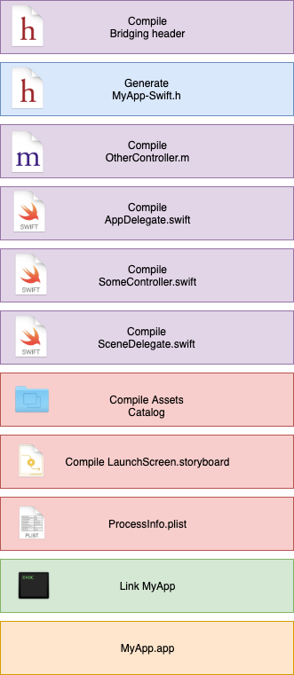
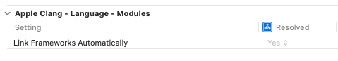

# How our codes are built?

- [How our codes are built?](#how-our-codes-are-built)
  - [Exploring the Xcode Build Process](#exploring-the-xcode-build-process)
  - [Execution of a Collection of Tasks](#execution-of-a-collection-of-tasks)
  - [What happens when you press build?](#what-happens-when-you-press-build)
    - [Clean Build](#clean-build)
    - [Incremental Build](#incremental-build)
      - [How does the build system actually detect changes?](#how-does-the-build-system-actually-detect-changes)
  - [Where do dependencies come from?](#where-do-dependencies-come-from)
  - [How you can help the build system do its job?](#how-you-can-help-the-build-system-do-its-job)
  - [Linking](#linking)
    - [What is the Linker?](#what-is-the-linker)
    - [What is Symbols?](#what-is-symbols)
    - [What is Object Files (.o)](#what-is-object-files-o)
    - [What is Libraries?](#what-is-libraries)
  - [Interaction between Swift and Objective-C](#interaction-between-swift-and-objective-c)
    - [How Swift find declarations?](#how-swift-find-declarations)
      - [Find declarations within a Swift Target](#find-declarations-within-a-swift-target)
        - [Generate interfaces to use in other Swift Targets](#generate-interfaces-to-use-in-other-swift-targets)
        - [swiftmodule file](#swiftmodule-file)
      - [Find declarations from Objective-C](#find-declarations-from-objective-c)
        - [Conversion Objective-C codes into Swift codes](#conversion-objective-c-codes-into-swift-codes)
        - [NS_SWIFT_NAME](#ns_swift_name)
        - [NS_SWIFT_UNAVAILABLE](#ns_swift_unavailable)
        - [Nullability](#nullability)
    - [How Objective-C finds declarations?](#how-objective-c-finds-declarations)
      - [Header Files](#header-files)
        - [import and include](#import-and-include)
        - [Semantic import](#semantic-import)
      - [How Xcode find header files?](#how-xcode-find-header-files)
    - [Share codes with other modules](#share-codes-with-other-modules)
      - [Headers categories](#headers-categories)
      - [Umbrella Header and Module Map](#umbrella-header-and-module-map)
        - [Umbrella Header](#umbrella-header)
        - [ModuleMap](#modulemap)
      - [Forward Declaration](#forward-declaration)
      - [Generate interfaces to use in Objective-C](#generate-interfaces-to-use-in-objective-c)
      - [Change name convention](#change-name-convention)
  - [Good Coding Practices to improve build efficiency](#good-coding-practices-to-improve-build-efficiency)
    - [Include Framework Names in Import Statements](#include-framework-names-in-import-statements)
      - [Why?](#why)
      - [Example](#example)
    - [Minimize the number of symbols you share between Swift and Objective-C](#minimize-the-number-of-symbols-you-share-between-swift-and-objective-c)
      - [Why?](#why-1)
      - [Objective-C -> Swift](#objective-c---swift)
      - [Swift -> Objective-C](#swift---objective-c)
    - [Provide the Swift Compiler with Explicit Type Information](#provide-the-swift-compiler-with-explicit-type-information)
      - [Why?](#why-2)
      - [Example](#example-1)
      - [Define Delegate Methods in Explicit Protocols](#define-delegate-methods-in-explicit-protocols)
      - [Why?](#why-3)
      - [Example](#example-2)
    - [Simplify Complex Swift Expressions](#simplify-complex-swift-expressions)
      - [Why?](#why-4)
      - [Example](#example-3)
    - [Improving the Speed of Incremental Builds](#improving-the-speed-of-incremental-builds)
      - [Measure the Time It Takes for Each Build Task](#measure-the-time-it-takes-for-each-build-task)
      - [Declare Inputs and Outputs for Custom Scripts and Build Rules](#declare-inputs-and-outputs-for-custom-scripts-and-build-rules)
      - [Create Module Maps for Custom Frameworks and Libraries](#create-module-maps-for-custom-frameworks-and-libraries)
      - [Make Sure Your Target’s Dependencies Are Accurate](#make-sure-your-targets-dependencies-are-accurate)
        - [If a target depends on code in a different Xcode project](#if-a-target-depends-on-code-in-a-different-xcode-project)
      - [Refactor Your Targets to Improve Parallelism](#refactor-your-targets-to-improve-parallelism)
    - [Resources](#resources)
## Exploring the Xcode Build Process


<br/>

## Execution of a Collection of Tasks

So when your app is built, there's a number of steps involved to go from the source code and resources in your project to the package that is shipped to customers or uploading to the App Store for distribution. 

- Compile and link source code
- Copy and process resources like headers, asset catalogues and storyboards
- Code sign 
- Custom work in a shell script 
- Make file like building API documentation for your framework
- Running code linting and validation tools

Most of these tasks in the build process are performed by running command line tools

- `swiftc` (Swift compiler)
- `clang` (C, C++, ObjC compiler)
- `ld` (linker)
- `actool` (assets catalog tool)
- `ibtool` (interface builder tool)
- ...

Like this:

```
$ swiftc -module-name PetWall -target arm64-apple-ios12.0 -swift-version 4.2 ... $ clang -x objective-c -arch arm64 ... PetViewController.m -o PetViewController.o $ ld -o PetWall -framework PetKit PetViewController.o ...
$ actool --app-icon AppIcon ... Assets.xcassets
$ ...
$ [thousands more]
```

These tools have to be executed with a very specific set of arguments and in a particular order based on the configuration of the Xcode project. 





The build process automates the orchestration and execution of these tasks each time you perform a build.

The order in which build tasks are executed is determined from the dependency information of each task:

- the inputs that a task consumes
- the outputs that a task produces


For example:

- a compilation task consumes a source code file (`.swift`, `.m`) as input, and produces an object file (`.o`) as output

<br/>

<br/>
<br/>

- a linker task consumes a number of object files (`.o`) produced by the compiler in previous tasks, and produces and executable or library output


You can see hoe the compilation tasks are totally independent in their own lanes and can therefore run in parallel. And because the linker task takes everything else's input, we know that has to come last.


<br/>
<br/>

## What happens when you press build?

### Clean Build

1. the build system takes the build description in your Xcode project file, parses it, takes into account all the files in your project, your targets, the dependency relationships, your build settings, etc.

2. the build system will generate a Directed Graph (from the info of step 1), which represents all the dependencies between the input and output files in your project. It will generate the tasks that will be executed to process them.


3. the low-level execution engine (`llbuild`, it's open source) processes this graph, looks at the dependency specifications and figures out which tasks to execute, the sequence or order in which they must be run, which tasks can be run in parallel. Then proceeds to execute them.


### Incremental Build

When `llbuild` runs, besides outputting the object file (`.o`), it might also output a listing file (`.d`), containing which header files (imports) were included by that source file.


The next time you build, the build system uses the information from this file (`.d`) to make sure that it recompiles the source file if you change any of the header files that it includes.
Having an accurate dependency information (via `.d`) is very important in order for incremental builds to work correctly and efficiently.


#### How does the build system actually detect changes?

- Each task in the build graph has an associated signature(hash)
- Signature computed from:
    - Task's inputs: file paths, modification time stamps
    - The command line indication used to perform the command
    - Task-specific metadata(e.g. the version of the compiler that's being used)
- Build system tracks task signatures among multiple builds
- A task is re-run when the hash is different between builds, it's skipped otherwise

## Where do dependencies come from?

- Built-in(Build Rules) - the various tools within the build system know which tasks accept which input and produce which output (e.g. `atool`, `ld`, ..)  


- Dependencies(Target Dependencies)
    - targets can start building sooner
    - all run script phases need to complete before this parallelization can take effect  
    

- Implicit dependencies(Link library With Binaries)
    - If you list a target in your `Link library With Binaries` build phase, and `Find Implicit Dependencies` are enabled in the scheme editor (on by default), the build system will establish an implicit dependency on that target (even if it's not listed in target dependencies)  

<br/>

<br/>

- Build phase dependencies
    - Each phase is a separate task
    - The build system might run these phases in a different order (e.g. if `Link Binary with libraries` phase is ordered before Compile sources)
    - A wrong phase order might cause a build failure  


- Scheme order dependencies
    - If you choose the `Dependency Order` in your scheme settings, you get better build performance and the order of your targets in your scheme doesn't matter
    - If you turn `Manual Order`, Xcode will attempt to build your targets in the order you listed them in the build action of the scheme one by one  
    

※ In Xcode 13, the `Parallelize Build` checkbox was replaced with two radio buttons: `Dependency Order` (the same as a checked old checkbox) and `Manual Order` (the same as an unchecked old checkbox)

## How you can help the build system do its job? 

The build is represented as a directed graph.
Instead of thinking about the order in which these tasks should be executed because that's the build system's job, as developers, we need to think about dependencies between tasks and let the build system figure out how to best execute them according to the graph's structure.

- Set input/outputs on your build phases (lets the build system avoid re-running the script tasks unnecessarily)
- Avoid Auto-link for project dependencies
    - This setting allows the compiler to automatically link to the frameworks corresponding to any modules you import without having to explicitly link them in your link library's build phase
    - Auto-link does not establish dependency on that framework at the build system level (won't guarantee that the target you depend on is actually built before you try to link against it)
    - You should rely on this feature only for frameworks from the platform SDK (UIKit, etc.)  
    
    <br/>
    <br/>

    - For targets in your own projects, make sure to add explicit library dependencies  
    
    <br/>

## Linking

### What is the Linker?

- It's the final task in building an executable Mach-O
- It combines the output of all compiler invocations into a single file
- Moves and patches code generated by the compilers (it cannot create code)
- Take two kinds of input files
    - object files(`.o`) which are what come out of your build process
    - libraries which consist of several types including `.dylib`, `.tbd`, and `.a` files or `.a` static archives

### What is Symbols?

- A symbol is a name to refer to a fragment of code or data
- Fragments of code may reference other symbols (e.g. when a function calls another function)
- Symbols can have attributes on them that alter the linker’s behavior
    - e.g. Weak is one of those attributes
        - Weak symbols state that the symbol might not be there when we run the executable on the system
        - This is what all the availability markup that says this API is available on iOS x
- Languages often encode data into a symbol "mangling" the symbol

### What is Object Files (.o)

- Output of individual compiler actions
    - They are collections of code and data we refer via symbols
    - A non-executable Mach-O file containing code and data fragments
    - while they are compiled code, they have bits missing, which is what the linker is going to glue together
    - Each fragment in these `.o` is represented by a symbol
    - Fragments may reference “undefined” symbols
        - When a `.o` refers to a function in another `.o` file, the linker is responsible to find those undefined symbols and link them

### What is Libraries?

- Libraries define symbols that are not built as part of your target
    - Dylibs: Dynamic libraries (`.dylib`)
        - Mach-O file that exposes code and data fragments executables can use
        - Some of those are distributed as part of the OS, that's what Apple's frameworks are
        - Can also be from 3rd parties
    - TBDs: Text Based Dylib Stubs (`.tbd`)
        - Only contains symbols
        - No bodies for any symbols, just their names (no binary code)
        - Used for distributing Apple's SDKs to reduce their size (it reduces the size of the SDK you download with Xcode, not the size of the app you're building)
    - Static archives (`.a`)
        - Archive of multiple `.o` files built with the `ar` tool
        - It's just a `.zip` file with `.a` extension (`.a` was the original archive format used by UNIX)
        - Only `.o` files with symbols you reference are included in your app
            - If you're using some sort of non-symbol behavior like a static initializer, or you're re-exporting them as part of your own dylib, you may need to explicitly use something like force load or all load to the linker to tell it bring in everything


## Interaction between Swift and Objective-C

### How Swift find declarations?

#### Find declarations within a Swift Target

- When compiling one Swift file (with `swiftc`), the compiler will parse all the other Swift files in the target. To examine the parts of them that are relevant to the interfaces
- It will only parse the files headers, not the implementations
- The compiler gather multiple files into groups (that will be compiled in separated processes) to share as much work as possible (avoids repeating parsing within a group, only need to parse again across groups/processes).
- Swift has no headers, so Swift compiler does some additional bookkeeping
    - Find declarations both within Swift targets and from Objective-C (to compile Swift files depending on Objective-C declarations)
    - Generate interfaces describing the contents of each file (to compile Objective-C files depending on Swift declarations)

##### Generate interfaces to use in other Swift Targets

- It must first import other modules to see their declarations
- It can import Clang/Objective-C modules(e.g. XCTest)
- In Xcode, each Swift target produces a separate module
- When importing a module, the compiler deserializes a special Swift module file (`.swiftmodule`) to check the types when you use them

##### swiftmodule file

We expose declarations to other modules via `.swiftmodule`.

- Serialized, binary representation of module’s declarations
- Includes bodies of `@inlinable` functions
- Includes private declarations (for debugging)


In the case of incremental build,

- The compiler produces partial Swift module files and then merges them into a single file that represents the contents of the entire module
- This merging process also makes it possible to produce a single Objective-C header (out of the final `.swiftmodule`)

#### Find declarations from Objective-C

- `swiftc` embeds `clang` and uses it as a library
- This makes it possible to directly import Objective-C (without having to manually create a Swift interface for each declaration)
- In any target, when you import an Objective-C framework, the importer finds declarations in the headers exposing Clang's module map for that framework
- Within **a framework** that mixes Swift and Objective-C code, the importer finds declarations in the umbrella header
- Within **app and unit test bundles**, via the target bridging header


##### Conversion Objective-C codes into Swift codes

Clang Importer makes methods more Swifty

- Methods that use the `NSError` idiom become throwing methods in Swift
- Methods will drop parameter type names following verbs and prepositions([list](https://github.com/apple/swift/blob/82568468494fd74dba17ba695c3cdf6fab1c3369/lib/Basic/PartsOfSpeech.def))

※ We can see how the method is converted in `Generated interface`.


##### NS_SWIFT_NAME

We can change Objective-C method name to more Swifty name.

```objective-c
@interface SomeAppClass : NSObject

- (void) say: (NSString *)message NS_SWIFT_NAME(saySwift(message:));
@end
```

##### NS_SWIFT_UNAVAILABLE

We can restrict the method usage in Swift.

```objective-c
@interface SomeAppClass : NSObject

- (void) say: (NSString *)message NS_SWIFT_NAME(saySwift(message:));
- (void) nothing NS_SWIFT_UNAVAILABLE("Can not use in Swift");

@end
```
##### Nullability

When we see the Swift interface of the below method, we can see `!` in Swift.


<br/>
<br/>

We can eliminate this extra optional explicitly by adding `nonnull` to the parameter.


<br/>
<br/>

In another way, we can create special regions by wrapping declarations between `NS_ASSUME_NONNULL_BEGIN` and `NS_ASSUME_NONNULL_END`. Within these regions, any simple pointer type will be assumed to be `nonnull`. If we want to make some `nullable`, add `nullable` explicitly.


### How Objective-C finds declarations?

To find Objective-C declarations used from other Objective-C files via

- Header files
- Forward Declarations

#### Header Files

- Header file(`.h`) with declarations we want to expose
- If you want to refer a class from another file, import headers (e.g. `#import <Foundation/Foundation.h>`)
<br/>

<br/>

```Objective-C
/* SomeObjectiveCClass.h */

NS_ASSUME_NONNULL_BEGIN

@interface SomeObjectiveCClass : NSObject
- (void)say:(NSString*)message;
@end
```
※ Explain about what is `NS_ASSUME_NONNULL_BEGIN` later

- We can import headers(.h) to access the declarations defined in the header files
- The headers must contain the declarations we want to expose to other files
- The declarations in a header file only includes the type signature - without the implementation
- Keep your header files as short as possible - only exposing what is really needed. Keep implementation details hidden in the implementation file

##### import and include

`#import` is a macro that copy the content of the header file into that's importing it(In this case, the content of the Foundation.h header file will be copied into the SomeObjectiveCClass.h file). 
It's similar to `#include` in C/C++. 

This is a recursive process. Importing/including a header that also imports other headers will copy all headers recursively.

`#import` avoids importing the same header twice more than once - prevents duplicate declarations. `#include` doesn't prevent that.

---

Implementation file(.m)

- Implementation file(`.m`) with private declarations

```objective-c
/* SomeObjectiveCClass.m */

#import "SomeObjectiveCClass.h"

@implementation SomeObjectiveCClass
- (void)say:(NSString*)message {
    [self private_say:message];
}

- (void)private_say:(NSString*)message {
    NSLog(@"%@", message);
}
@end
```

- The concrete implementation is declared
- `say` method was declared in the header file, so it can be accessed by any other file that imports the header
- `private_say` method was **NOT** declared in the header file, so it **cannot** be accessed by any other file

##### Semantic import

`@import` is a semantic import. It doesn't need to parse the headers, so build is faster than `#import`. It relies on Module Maps.


#### How Xcode find header files?

Header search Paths


### Share codes with other modules

#### Headers categories

We need to share binaries as well as headers.
This happens in Headers of Build Phase.


We need "Public" header to use it from another files.


After build, we can see this header file in "Headers" in "DerivedData".


The elements in this file are visible to other modules and can be available.


On the other hand, if a file is "Private", another directory called "PrivateHeaders" is created in "DerivedData". Clients can see its symbols, but shouldn't know how to use them. So, you should not import Private headers (It might cause breaking change in the future).


※ If we create a header file from "Header file", we can see this template code.


```Objective-C
#ifndef SomeFrameworkClass_h
#define SomeFrameworkClass_h


#endif /* SomeFrameworkClass_h */
```

This is to avoid duplicating `#include` from C/C++ headers. 


#### Umbrella Header and Module Map

In addition to Header import, Apple improves options to expose Objective-C codes to other modules in both Objective-C and Swift

##### Umbrella Header

It's a domain header for framework. It shares the same name as the framework name. We can use all the public headers want to expose instead of importing all the header files.


※ When creating a framework, you can see this template. We can ignore it, so delete theses codes here.

```objective-c
#import <Foundation/Foundation.h>

//! Project version number for BuildFramework.
FOUNDATION_EXPORT double BuildFrameworkVersionNumber;

//! Project version string for BuildFramework.
FOUNDATION_EXPORT const unsigned char BuildFrameworkVersionString[];

// In this header, you should import all the public headers of your framework using statements like #import <BuildFramework/PublicHeader.h>
```

##### ModuleMap

It's a text file mapping modules and headers. By sharing Module Map, we can import a specific part of the module

```objective-c
framework module BuildFramework {
  umbrella header "BuildFramework.h"

  export *
  module * { export * }
}
```


#### Forward Declaration

This is another approach to use Objective-C codes from other modules.

By importing elements all over the place, it might cause cyclic dependencies (e.g.importing A from B, and B from A).

To avoid it, we can use Forward Declaration. It basically tells the compiler that the element exists, without specifying what exactly it looks like.

Also, we don't need import and can avoid rebuilding extra modules.


```objective-c
#import <Foundation/Foundation.h>

@class SomeObjectiveCClass;
```

※ According to [wikipedia](https://en.wikipedia.org/wiki/Forward_declaration),
In computer programming, a forward declaration is a declaration of an identifier (denoting an entity such as a type, a variable, a constant, or a function) for which the programmer has not yet given a complete definition.


#### Generate interfaces to use in Objective-C

- Swift generates a header that you can `#import`
- This allows you to write classes in Swift and call them from Objective-C


If we don't expose Swift classes as `NSObject` subclasses, methods/properties marked `@objc`, make them `public`, they are not visible from Objective-C.

For example,

```Swift
class SomeSwiftClass {
    var message: String = ""
    var name = ""
}
```

By changing it to the below, it becomes visible.

```swift
public class SomeSwiftClass: NSObject {
    @objc public var message: String = ""
    var name = ""
}
```


We can use if from other modules like this.

```swift
#import "SomeAppClass.h"
#import "BuildFramework/BuildFramework-Swift.h"

@implementation SomeAppClass
- (void) say: (NSString *)message {
    SomeSwiftClass *s = [[SomeSwiftClass alloc] init];
    s.message = message;
}
@end
```

#### Change name convention

To prevent name conflicts in Objective-C, Swift compiler automatically mangles the name like `_TtC14BuildFramework14SomeSwiftClass`.

We can manually change the name using `@objc`.


Then, we can use the name.

```swift
#import "SomeAppClass.h"
#import "BuildFramework/BuildFramework-Swift.h"

@implementation SomeAppClass
- (void) say: (NSString *)message {
    SomeSwiftClassObjc *s = [[SomeSwiftClassObjc alloc] init];
    s.message = message;
}
@end
```

## Good Coding Practices to improve build efficiency 

Shorten compile times by reducing the number of symbols your code exports and by giving the compiler the explicit information it needs.

### Include Framework Names in Import Statements

When you import headers into your source files, always include the name of the parent framework or library in your import statement.

#### Why?
When you include the framework name, the compiler has the option to use module maps to import the headers, which significantly reduces importation time. With module maps, the compiler loads and processes the framework’s header files once, and caches the resulting symbol information on disk.

#### Example

```objective-c
// Imports the framework’s module map
#import <UIKit/UIKit.h>
#import <PetKit/PetKit.h> // Custom framework

// Performs a textual inclusion of the header file.
#import "MyHeader.h"
```

### Minimize the number of symbols you share between Swift and Objective-C

Reducing the size of both The Objective-C bridging headers and The compiler-generated Swift headers reduces the compiler’s workload and improves compilation times.

#### Why?

The compiler handles this exchange of symbol information using two special header files:

- The Objective-C bridging header determines which Objective-C symbols you make available to your Swift code.
- The compiler-generated Swift header is a list of all public Swift symbols you can use in your Objective-C code.

#### Objective-C -> Swift

When configuring the contents of your Objective-C bridging header, include only the headers and symbols you actually reference from your Swift source. If your Swift code uses only part of an Objective-C class, move the symbols your Swift code doesn’t use into categories in your implementation file or in an internal-only header file.

<br/>

<br/>

#### Swift -> Objective-C

The compiler makes all of your public Swift symbols available to your Objective-C code automatically using a generated header. To minimize the size of this generated header, update your Swift code in the following ways:
- Mark internal methods and properties of your Swift classes as private. The presence of that keyword prevents the inclusion of the symbol in the generated header file
- Choose block-based APIs over function-based APIs. Blocks are part of your implementation, and don’t generate public symbol information
- Support the most-recent version of the Swift language

### Provide the Swift Compiler with Explicit Type Information

If you assign a complex value to a variable, the best practice is to provide the type explicitly

#### Why?

The Swift compiler is capable of inferring the type of a variable from the value you assign to it. But, assigning a complex value to a variable forces the compiler to perform extra work to compute any type information.

#### Example

Consider the following structure, in which the `bigNumber` property has no explicit type information. To determine the type of that property, the Swift compiler must evaluate the results of the `reduce(_:_:)` function, which takes a nontrivial amount of time.

```swift
struct ContrivedExample {
    var bigNumber = [4, 3, 2].reduce(1) {
        soFar, next in
        pow(next, soFar)
    }
}
```

Instead of letting the compiler determine the type, provide explicit type information reduces the work the compiler must do, and also allows it to do more error checking.

```swift
struct ContrivedExample {
    var bigNumber : Double = [4, 3, 2].reduce(1) {
        soFar, next in
        pow(next, soFar)
    }
}
```

#### Define Delegate Methods in Explicit Protocols

Although delegation enables communication between arbitrary objects, always provide explicit type information for your delegate objects.

#### Why?

Communication between arbitrary objects actually creates more work for the compiler. The compiler must assume that any object in your project or referenced frameworks contains the function, and so it searches your entire project to make sure that function exists somewhere.

#### Example

Consider the following example of a delegate declared as an optional object of any type. 

```swift
weak var delegate: AnyObject?
func reportSuccess() {
    delegate?.myOperationDidSucceed(self)
}
```

Instead of using any object, a better approach is to supply specific type information. Typically, you specify the type information using a delegate protocol.

```swift
weak var delegate: MyOperationDelegate?
func reportSuccess() {
    delegate?.myOperationDidSucceed(self)
}

protocol MyOperationDelegate {
    func myOperationDidSucceed(_ operation: MyOperation)
}
```

### Simplify Complex Swift Expressions

The Swift language allows you to write code in very expressive ways, but make sure your code doesn’t affect compile times. 

#### Why?

These codes make the code hard to read and harder for the compiler to evaluate.

#### Example

Consider an example of a function that uses the `reduce` function to sum a set of values. If you pass `nil` for all the arguments, the function returns `nil`, but if you pass one or more arguments, it sums the sum of those arguments. 

```swift
func sumNonOptional(i: Int?, j: Int?, k: Int?) -> Int? {
    return [i, j, k].reduce(0) {
        soFar, next in
        soFar != nil && next != nil ? soFar! + next! : (soFar != nil ? soFar! : (next != nil ? next! : nil))
    }
}
```

In fact, the compiler aborts with an error that states it cannot type-check the expression in a reasonable amount of time. The one-line closure is also unnecessary.

Rather than use such a complex expression, it’s better to create something simpler and more readable. The following code offers the same behavior as the single-line closure version, but is easier to read and compiles quickly.

```swift
func sumNonOptional(i: Int?, j: Int?, k: Int?) -> Int? {
    return [i, j, k].reduce(0) {
        soFar, next in
        if let soFar = soFar {
            if let next = next { return soFar + next }
            return soFar
        } else {
            return next
        }
    }
}
```

### Improving the Speed of Incremental Builds

Always ensure that your project’s inter-target dependencies and configuration details are accurate. When you build a target, Xcode does as much work as possible in parallel. Fewer dependencies leads to greater parallelization, but an accurate dependency map is necessary to prevent build and runtime errors. Similarly, providing detailed configuration data helps Xcode schedule build-time tasks correctly and efficiently.

#### Measure the Time It Takes for Each Build Task

Before you perform any build optimizations, always gather timing information to see where optimizations might be most effective.

Xcode and choose Product > Perform Action > Build With Timing Summary


<br/>
<br/>

> To generate timing information using the xcodebuild command-line tool, pass the -showBuildTimingSummary option to the tool.

The first time you build your project, Xcode builds everything, but subsequent builds are incremental. For each incremental build, pay particular attention to the preparation section and the specific tasks that Xcode performs for each target.


<br/>


You need to check:

- If Xcode didn’t build your targets in parallel, open the Scheme Editor for your target and make sure the Parallelize Build option is enabled
- Look for extraneous tasks, such as custom scripts, and assess whether Xcode needs to run those scripts during each incremental build.
- If compilation of a particular file takes significantly longer than other files, examine the file to see if header importation issues are causing the delay.


#### Declare Inputs and Outputs for Custom Scripts and Build Rules

If you use custom build scripts in your Xcode projects, make sure Xcode runs those scripts only when needed. 

By default, Xcode runs custom scripts during every build cycle, including incremental builds. It also executes those scripts serially with respect to other tasks.

If you don’t need Xcode to run your scripts every time you build a target, provide at least one input file and one output file for the script. 

Xcode runs your script when any of the following conditions are true:

- no any input files.
- no output files.
- input files changed.
- output files are missing.

To prevent it, Specify input and output files, along with the script itself, in the Run Script build-phase editor. You may specify input and output files individually or in an Xcode file list — a file with an `.xcfilelist` filename extension that lists the name of each file on a separate line.


<br/>
<br/>


> You must still specify an input and output file to prevent Xcode from running the script every time, even if your script doesn’t actually require those files. For a script that requires no input, provide a file that never changes as the input file. For a script with no outputs, create a static output file from your script so Xcode has something to check.

#### Create Module Maps for Custom Frameworks and Libraries

Module maps improve source compilation times by shortening the time it takes to import header files. 

A module map provides the compiler with a list of headers that the framework contains. When a framework includes a module map, the compiler doesn’t preprocess header files separately for each source file. Instead, it builds a cache of the framework’s symbol information and reuses that cache during subsequent compilations, which saves significant time.


You must provide module maps for any custom frameworks in your project. To add a module map, enable the `DEFINES_MODULE` build setting for your framework or library. Then, the compiler produces a module map with the contents of your target’s public header files.

<br/>

<br/>
<br/>

> NOTE: Xcode enables this build setting automatically for new frameworks, but you might need to set it for older projects. 


Before you create a module map, make sure your framework meets the following requirements:

- Your framework’s header files must not rely on any external contextual information. 
※ Xcode compiles your module map separately from the rest of your project’s source files. Don’t rely on source-specific information to change the meaning or values of symbols in your headers.

- The module must be self contained. 
※ Because Xcode compiles module maps separately, your framework’s header files must include everything they need to compile correctly.

> To get the maximum reuse benefit from module maps, compile your app’s source files with identical build options. Xcode builds your framework’s module map using the same options as the source file that imports that framework.  
> If your app’s source files use different options, Xcode must recompile the module map for each new set of options. Using identical options allows Xcode to reuse the cache in each subsequent source file.

#### Make Sure Your Target’s Dependencies Are Accurate

Verifying that your targets have accurate dependencies ensures they build correctly and in a timely manner.

Because: 
- Out-of-date dependencies might force Xcode to build targets serially when it might have built them in parallel.
- Missing dependencies might cause correctness issues or even build errors. 

e.g. If your app doesn’t have an explicit dependency to a separate code module, like an app extension, Xcode might build the app with an older version of the module that doesn’t work properly.

When you know a dependency exists between two targets in your Xcode project, create an explicit dependency between them.

Xcode creates some dependencies automatically based on how you configure your project.  
e.g. when you embed a new framework inside an existing app, Xcode automatically adds the framework to the app’s list of dependencies. 

At other times, you specify the dependencies yourself using the Dependencies build phase editor.

##### If a target depends on code in a different Xcode project

If a target depends on code in a different Xcode project, create a reference to that project by dragging it into the navigator pane of your current project. 

The presence of the other project in the navigator pane gives Xcode the information it needs to track dependencies on items in the other project. Without this reference, Xcode doesn’t know to build your target when the remote project changes.

#### Refactor Your Targets to Improve Parallelism

To improve build performance, simplify your target’s dependency list, and break up monolithic targets so that Xcode can do more work in parallel.

> Inter-target dependencies require Xcode to build those targets in a specific order. When a target has many dependencies, or when it depends on large, monolithic modules, Xcode must serialize more tasks.


e.g. The below is an XML engine that depends on a monolithic utilities framework. Although the XML engine relies on only a small portion of the framework, Xcode must rebuild the engine when any part of the framework changes. 


<br/>

Breaking up the framework into smaller modules and creating more fine-grained dependencies might eliminate some unnecessary rebuilds.


When one target depends on many child targets, Xcode cannot start to build the target until it finishes all of the children. 

e.g. Consider a single Tests target that executes automated tests on an app, app extension, and private framework. Splitting up the tests by target allows Xcode to run each suite independently as soon as the corresponding target is ready, which increases parallelization.


<br/>
<br/>

> You need to decide whether modifications to your project’s targets offer any benefit. Increasing the number of targets can improve parallelization, but it also adds complexity to your project. Always validate any target or dependency changes to ensure your code still builds correctly. In addition, always measure the speed of the resulting builds to verify that the changes lead to tangible improvements.


### Resources

- [Behind the Scenes of the Xcode Build Process](https://developer.apple.com/wwdc18/415)
- [Refine Objective-C frameworks for Swift](https://developer.apple.com/videos/play/wwdc2020/10680?time=57)
- [Nullability and Objective-C](https://developer.apple.com/swift/blog/?id=25)
- [Importing Swift into Objective-C](https://developer.apple.com/documentation/swift/imported_c_and_objective-c_apis/importing_swift_into_objective-c)
- [Importing Objective-C into Swift](https://developer.apple.com/documentation/swift/imported_c_and_objective-c_apis/importing_objective-c_into_swift)
- [Handling Cocoa Errors in Swift](https://developer.apple.com/documentation/swift/cocoa_design_patterns/handling_cocoa_errors_in_swift)
- [Renaming Objective-C APIs for Swift](https://developer.apple.com/documentation/swift/objective-c_and_c_code_customization/renaming_objective-c_apis_for_swift)
- [WWDC NOTES](http://www.wwdcnotes.com/notes/wwdc18/415/)
- [Improving Build Efficiency with Good Coding Practices](https://developer.apple.com/documentation/xcode/improving-build-efficiency-with-good-coding-practices)
- [Improving the Speed of Incremental Builds](https://developer.apple.com/documentation/xcode/improving-the-speed-of-incremental-builds)

