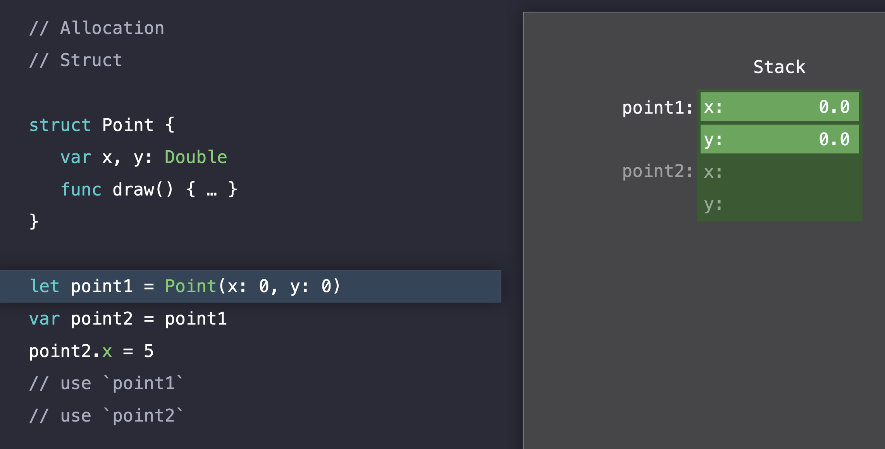
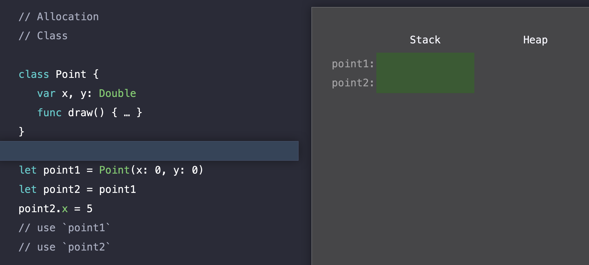
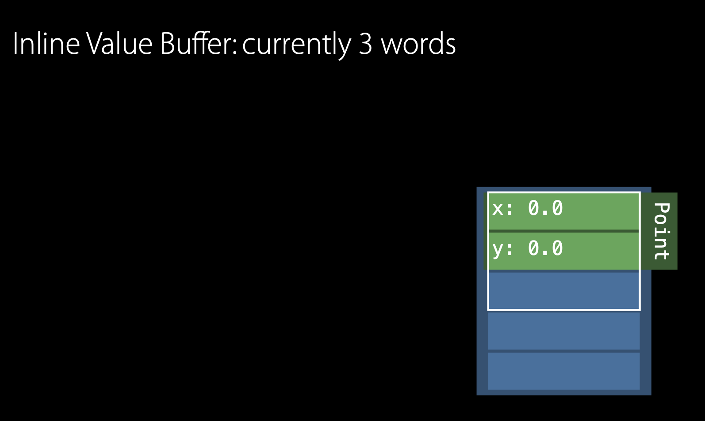

# Struct & Class

- [Struct & Class](#struct--class)
  - [Basic information](#basic-information)
    - [Commonalities between structs and classes](#commonalities-between-structs-and-classes)
    - [Classes have additional capabilities that structs don’t have](#classes-have-additional-capabilities-that-structs-dont-have)
    - [Definition Syntax](#definition-syntax)
    - [Struct and Class Instances](#struct-and-class-instances)
    - [Accessing Properties](#accessing-properties)
    - [Memberwise Initializers for Struct Types](#memberwise-initializers-for-struct-types)
    - [Value Type & Reference Type](#value-type--reference-type)
      - [Structs and Enums Are Value Types](#structs-and-enums-are-value-types)
        - [Freedom from race conditions](#freedom-from-race-conditions)
        - [Copies are cheap (O(1)) with value semantics](#copies-are-cheap-o1-with-value-semantics)
      - [Classes Are Reference Types](#classes-are-reference-types)
        - [Identity Operators](#identity-operators)
        - [Copying in Cocoa[Touch] and Objective-C](#copying-in-cocoatouch-and-objective-c)
        - [Immutability in Cocoa[Touch]](#immutability-in-cocoatouch)
  - [Difference in the light of performance](#difference-in-the-light-of-performance)
    - [Dimension of performance](#dimension-of-performance)
    - [Allocation](#allocation)
      - [Stack](#stack)
      - [Heap](#heap)
      - [The difference between a struct and a class](#the-difference-between-a-struct-and-a-class)
        - [struct](#struct)
        - [class](#class)
        - [Comparison](#comparison)
      - [Modeling tips](#modeling-tips)
    - [Reference Counting](#reference-counting)
      - [The timing when Swift deallocates an instance?](#the-timing-when-swift-deallocates-an-instance)
      - [Pros of reference counting](#pros-of-reference-counting)
      - [Look at what Swift is actually doing on our behalf](#look-at-what-swift-is-actually-doing-on-our-behalf)
      - [How about the case of structs?](#how-about-the-case-of-structs)
        - [If struct has reference types?](#if-struct-has-reference-types)
        - [How does reference counting work with such a struct?](#how-does-reference-counting-work-with-such-a-struct)
      - [Comparison heap allocation of class and struct](#comparison-heap-allocation-of-class-and-struct)
    - [Method dispatch](#method-dispatch)
      - [Static dispatch](#static-dispatch)
      - [Dynamic dispatch](#dynamic-dispatch)
        - [Why do we need dynamic dispatch?](#why-do-we-need-dynamic-dispatch)
      - [Do all classes require dynamic dispatch?](#do-all-classes-require-dynamic-dispatch)
    - [How can struct achieve polymorphic behavior?](#how-can-struct-achieve-polymorphic-behavior)
      - [How does Swift dispatch to the correct method?](#how-does-swift-dispatch-to-the-correct-method)
        - [Protocol Witness Table](#protocol-witness-table)
      - [How can we store different size elements in a fixed size array?](#how-can-we-store-different-size-elements-in-a-fixed-size-array)
        - [Existential Container](#existential-container)
        - [Value Witness Table](#value-witness-table)
      - [How does Swift get to Value Witness Table?](#how-does-swift-get-to-value-witness-table)
      - [How do we get to Protocol Witness Table?](#how-do-we-get-to-protocol-witness-table)
      - [Existential Container example](#existential-container-example)
      - [Protocol type stored property](#protocol-type-stored-property)
        - [Cost of heap allocation](#cost-of-heap-allocation)
        - [References Fit in the Value Buffer](#references-fit-in-the-value-buffer)
        - [How can we avoid unintended sharing of state that reference semantics?](#how-can-we-avoid-unintended-sharing-of-state-that-reference-semantics)
        - [How can we get value semantics?](#how-can-we-get-value-semantics)
        - [Copy on Write](#copy-on-write)
      - [Look back the previous example](#look-back-the-previous-example)
        - [How about performance of using protocol types?](#how-about-performance-of-using-protocol-types)
    - [Generic type](#generic-type)
        - [Does this have the potential to increase code size by a lot?](#does-this-have-the-potential-to-increase-code-size-by-a-lot)
        - [When does the optimization happen?](#when-does-the-optimization-happen)
        - [How about its performance?](#how-about-its-performance)
          - [Specialized Generics - Struct Type](#specialized-generics---struct-type)
          - [Specialized Generics - Class Type](#specialized-generics---class-type)
          - [Unspecialized Generics - Small Value](#unspecialized-generics---small-value)
          - [Unspecialized Generics - Large Value](#unspecialized-generics---large-value)
    - [Performance tips](#performance-tips)
  - [Exclusivity Enforcement](#exclusivity-enforcement)
    - [Background](#background)
    - [Examples](#examples)
    - [Motivation](#motivation)
      - [1. Exclusivity eliminates dangerous program interactions involving mutable state and action at a distance](#1-exclusivity-eliminates-dangerous-program-interactions-involving-mutable-state-and-action-at-a-distance)
      - [2. Enforcement eliminates an unspecified behavior rule from the language.](#2-enforcement-eliminates-an-unspecified-behavior-rule-from-the-language)
      - [3. Enforcement is necessary for ABI stability.](#3-enforcement-is-necessary-for-abi-stability)
      - [4. Enforcement legalizes performance optimization while protecting memory safety.](#4-enforcement-legalizes-performance-optimization-while-protecting-memory-safety)
      - [5. Exclusivity rules are needed to give the programmer control of ownership and move-only types.](#5-exclusivity-rules-are-needed-to-give-the-programmer-control-of-ownership-and-move-only-types)
  - [Mutable value semantics](#mutable-value-semantics)
  - [Resources](#resources)

## Basic information

Structs and classes are general-purpose, flexible constructs that become the building blocks of your program’s code. You define properties and methods to add functionality to your structs and classes using the same syntax you use to define constants, variables, and functions.

### Commonalities between structs and classes

Structs and classes in Swift have many things in common. Both can:

- Define properties to store values
- Define methods to provide functionality
- Define subscripts to provide access to their values using subscript syntax
- Define initializers to set up their initial state
- Be extended to expand their functionality beyond a default implementation
- Conform to protocols to provide standard functionality of a certain kind

### Classes have additional capabilities that structs don’t have

- Inheritance enables one class to inherit the characteristics of another.
- Type casting enables you to check and interpret the type of a class instance at runtime.
- Deinitializers enable an instance of a class to free up any resources it has assigned.
- Reference counting allows more than one reference to a class instance.

### Definition Syntax

You introduce structs with the `struct` keyword and classes with the `class` keyword. Both place their entire definition within a pair of braces.

```swift
struct Resolution {
    var width = 0
    var height = 0
}
class VideoMode {
    var resolution = Resolution()
    var interlaced = false
    var frameRate = 0.0
    var name: String?
}
```

### Struct and Class Instances

Structs and classes both use initializer syntax for new instances. 

```swift
let someResolution = Resolution()
let someVideoMode = VideoMode()
```

### Accessing Properties

You can access the properties of an instance using dot syntax. In dot syntax, you write the property name immediately after the instance name, separated by a period (.), without any spaces:

```swift
print("The width of someResolution is \(someResolution.width)")
// Prints "The width of someResolution is 0"
```

You can drill down into subproperties, such as the width property in the resolution property of a VideoMode:

```swift
print("The width of someVideoMode is \(someVideoMode.resolution.width)")
// Prints "The width of someVideoMode is 0"
```

You can also use dot syntax to assign a new value to a variable property:

```swift
someVideoMode.resolution.width = 1280
print("The width of someVideoMode is now \(someVideoMode.resolution.width)")
// Prints "The width of someVideoMode is now 1280"
```

### Memberwise Initializers for Struct Types

All structs have an automatically generated memberwise initializer, which you can use to initialize the member properties of new struct instances. Initial values for the properties of the new instance can be passed to the memberwise initializer by name:

```swift
let vga = Resolution(width: 640, height: 480)
```

Unlike structs, class instances don’t receive a default memberwise initializer.

### Value Type & Reference Type

#### Structs and Enums Are Value Types

A value type is a type whose value is copied when it’s assigned to a variable or constant, or when it’s passed to a function.

All of the basic types in Swift, integers, floating-point numbers, Booleans, strings, arrays and dictionaries are value types, and are implemented as structs behind the scenes.

All structs and enums are value types in Swift. This means that any struct and enum instances you create and any value types they have as properties are always copied when they’re passed around in your code.

> NOTE  
> Collections defined by the standard library like arrays, dictionaries, and strings use an optimization to reduce the performance cost of copying. Instead of making a copy immediately, these collections share the memory where the elements are stored between the original instance and any copies. If one of the copies of the collection is modified, the elements are copied just before the modification. The behavior you see in your code is always as if a copy took place immediately.  
In detail, see [Copy on Write](#copy-on-write)

> NOTE2
> The compiler also performs all sorts of optimizations to minimize the cost of copying whole structures about. 
> See: [Does swift copy on write for all structs?](https://stackoverflow.com/a/43493749)) 

> NOTE3
> We also have((are going to have) other ways to mutate properties in place  
> See: [Refine didSet Semantics](https://github.com/apple/swift-evolution/blob/master/proposals/0268-didset-semantics.md) & [Modify Accessors](https://forums.swift.org/t/modify-accessors/31872) 

Consider this example, which uses the `Resolution` struct from the previous example:

```swift
let hd = Resolution(width: 1920, height: 1080)
var cinema = hd
```

Because `Resolution` is a struct, a copy of the existing instance is made, and this new copy is assigned to `cinema`. Even though hd and cinema now have the same width and height, they’re two completely different instances behind the scenes.

The `width` property of `cinema` is amended to be the width of the slightly wider 2K standard used for digital cinema projection (2048 pixels wide and 1080 pixels high):

```swift
cinema.width = 2048
```

Checking the `width` property of `cinema` shows that it has indeed changed to be 2048:

```swift
print("cinema is now \(cinema.width) pixels wide")
// Prints "cinema is now 2048 pixels wide"
```

However, the `width` property of the original `hd` instance still has the old value of 1920:

```swift
print("hd is still \(hd.width) pixels wide")
// Prints "hd is still 1920 pixels wide"
```

When `cinema` was given the current value of `hd`, the values stored in `hd` were copied into the new `cinema` instance. The end result was two completely separate instances that contained the same numeric values.


##### Freedom from race conditions

Passing value types across thread boundaries means we don't have to worry about race conditions on those types.
In an array with reference semantics, the code below would cause a race condition because the same array would be shared by both threads. In an array with value semantics, we get logical copies each time, so each thread gets its own array.

```swift
var numbers = [1, 2, 3, 4, 5]
scheduler.processNumbersAsynchronously(numbers)

for i in 0..<numbers.count {
  numbers[i] = numbers[i] * 1
}

scheduler.processNumbersAsynchronously(numbers)
```

##### Copies are cheap (O(1)) with value semantics

- Copying a low-level, fundamental type is constant time (`Int`, `Double`, ...)
  - Just requires copying a few bytes, which happens inside the processor.

- Copying a struct, enum, or tuple of value types is also constant time (`CGPoint`, ...)
  - Fixed number of fields, so it's not `O(n)`.
  - Copying each "building block" is constant time, so copying the whole object is also constant time.

- Extensible data structures use copy-on-write
  - Copying involves a fixed number of reference counting operations.
  - Copying only happens at the point of mutation. This is "sharing behind the scenes", but not logical sharing. These are treated as distinct values when they need to be.
  - `String`, `Array`, `Set`, `Dictionary`, etc.


#### Classes Are Reference Types

Unlike value types, reference types are not copied when they’re assigned to a variable or constant, or when they’re passed to a function. Rather than a copy, a reference to the same existing instance is used.

Here’s an example, using the `VideoMode` class defined above:

```swift
let tenEighty = VideoMode()
tenEighty.resolution = hd
tenEighty.interlaced = true
tenEighty.name = "1080i"
tenEighty.frameRate = 25.0
```

Next, `tenEighty` is assigned to a new constant, called `alsoTenEighty`, and the frame rate of `alsoTenEighty` is modified:

```swift
let alsoTenEighty = tenEighty
alsoTenEighty.frameRate = 30.0
```

Because classes are reference types, `tenEighty` and `alsoTenEighty` actually both refer to the same `VideoMode` instance. Effectively, they’re just two different names for the same single instance, as shown in the figure below:


Checking the `frameRate` property of `tenEighty` shows that it correctly reports the new frame rate of 30.0 from the underlying `VideoMode` instance:

```swift
print("The frameRate property of tenEighty is now \(tenEighty.frameRate)")
// Prints "The frameRate property of tenEighty is now 30.0"
```

Note that `tenEighty` and `alsoTenEighty` are declared as constants, rather than variables. However, you can still change `tenEighty.frameRate` and `alsoTenEighty.frameRate` because the values of the `tenEighty` and `alsoTenEighty` constants themselves don’t actually change. 

##### Identity Operators

Because classes are reference types, it’s possible for multiple constants and variables to refer to the same single instance of a class behind the scenes.

It can sometimes be useful to find out whether two constants or variables refer to exactly the same instance of a class. To enable this, Swift provides two identity operators:

- Identical to (===)
- Not identical to (!==)

Use these operators to check whether two constants or variables refer to the same single instance:

```swift
if tenEighty === alsoTenEighty {
    print("tenEighty and alsoTenEighty refer to the same VideoMode instance.")
}
// Prints "tenEighty and alsoTenEighty refer to the same VideoMode instance."
```

Note that *identical to* (represented by three equals signs, or ===) doesn’t mean the same thing as *equal to* (represented by two equals signs, or ==). *Identical to* means that two constants or variables of class type refer to exactly the same class instance. *Equal to* means that two instances are considered equal or equivalent in value, for some appropriate meaning of equal, as defined by the type’s designer.

##### Copying in Cocoa[Touch] and Objective-C

Cocoa[Touch] requires copying throughout.
- `NSCopying` codifies copying an object
- `NSString`, `NSArray`, `NSDictionary`, `NSURLRequest`, etc. all require copying

Defensive copying pervades Cocoa[Touch] and Objective-C

- `NSDictionary` calls `-copy` on its keys so that any future changes don't affect the hash
- The `copy` attribute provides defensive copying on assignment

All of this results in a performance loss, and bugs can still show up any time there's missed copies.

##### Immutability in Cocoa[Touch]

Cocoa[Touch] has a number of immutable classes:
- `NSDate`, `NSURL`, `UIImage`, `NSNumber`, etc.
- Improved safety (no need to use copy)


## Difference in the light of performance

### Dimension of performance

- Allocation
  - Is the instance going to be allocated on the stack or the heap?
- Reference Counting
  - How much reference counting overhead am I going to incur?
- Method Dispatch
  - When I call a method on this instance, is it going to be statically or dynamically dispatched?

### Allocation

#### Stack

- Really simple data structure
- Push onto the end of the stack and pop off the end of the stack
- Because it can only ever be added or removed to the end of the stack, push and pop can be implemented just by keeping a pointer to the end of the stack

#### Heap

- Lets you do things the stack can't like allocate memory with a dynamic lifetime
- Requires a more advanced data structure
- Have to search the heap data structure to find an unused block of the appropriate size.
- Done with it, to deallocate it, have to reinsert that memory back into the appropriate position. So, clearly, there's more involved here than just assigning an integer like we had with the stack. (But these aren't even necessarily the main costs) 
- A pretty large cost comes from that multiple threads can be allocating memory on the heap at the same time since the heap needs to protect its integrity using locking or other synchronization mechanisms

#### The difference between a struct and a class

In the light of allocation, what's the difference between a struct and a class?

##### struct

Imagine running the below code.

```swift
struct Point {
   var x, y: Double
   func draw() { ... }
}
let point1 = Point(x: 0, y: 0)
var point2 = point1
point2.x = 5
// use `point1`
// use `point2`
```

1. As we enter this function, before we even begin executing any code, we've allocated space on the stack for our point1 instance and our point2 instance


2. When we go to construct our point with an x of 0 and a y of 0, all we're doing is initializing that memory we've already allocated on the stack



3. When we assign point1 to point2, we're just making a copy of that point and initializing the point2 memory, again, that we'd already allocated on the stack.


4. Then we'll go ahead and use point1, use point2. Note that point1 and point2 are independent instances. That means, when we go and assign a value of five to point2.x, point2.x is five, but point1.x is still 0. This is known as value semantics.


5. We're done executing our function. So, we can trivially deallocate that memory for point1 and point2 just by incrementing that stack pointer back up to where we were when we entered our function.


##### class

Convert the above struct with class

```swift
class Point {
   var x, y: Double
   func draw() { ... }
}
let point1 = Point(x: 0, y: 0)
var point2 = point1
point2.x = 5
// use `point1`
// use `point2`
```

1. When we enter this function, just like before, we're allocating memory on the stack.



2. But instead of for the actual storage of the properties on point, we're going to allocate memory for references to point1 and point2.


3. References to memory we're going to be allocated on the heap. So, when we construct our point at (0, 0), Swift is going to lock the heap and search that data structure for an unused block of memory of the appropriate size.


4. Once we have it, we can initialize that memory with a x of 0, a y of 0, and we can initialize our point1 reference with the memory address to that memory on the heap.


Note, when we allocate it on the heap, Swift actually allocated for our class point four words of storage. This is in contrast to the two words it allocated when our point was a struct. This is because now the point is a class, in addition to these stored for x and y, we're allocating two more words that Swift is going to manage on our behalf. Those are denoted with these blue boxes in the heap diagram.

5. When we assign point1 to point2, we're not going to copy the contents of point like we did when point1 was a struct. Instead, we're going to copy the reference. 

So, point1 and point2 are actually referring to the same exact instance of point on the heap. This is known as reference semantics and can lead to unintended sharing of state.


6. We're going to use point1, use point2, and then Swift is going to deallocate this memory on our behalf locking the heap and retraining that unused block to the appropriate position. 


7. Then we can pop the stack.


##### Comparison

Classes are more expensive to construct than structs because classes require a heap allocation.
Because classes are allocated on the heap and have reference semantics, classes have some powerful characteristics like identity and indirect storage. If we don't need those characteristics for abstraction, we're going to better to use a struct. Structs aren't prone to the unintended sharing of state like classes are. So, let's see how we can apply that to improve the performance of some Swift code. 

#### Modeling tips

```swift
enum Color { case blue, green, gray }
enum Orientation { case left, right }
enum Tail { case none, tail, bubble }

              👇
var cache = [String : UIImage]()

func makeBalloon(_ color: Color, orientation: Orientation, tail: Tail) -> UIImage {
    let key = "\(color):\(orientation):\(tail)"
    if let image = cache[key] {
        return image
    }
    ...
}
```

String isn't particularly a strong type for this key. I'm using it to represent this configuration space, but just as easily the name of my dog is put in that key. So, not a lot of safety there. Also, String can represent so many things because it actually stores the contents of its characters indirectly on the heap. So, that means every time we're calling into this makeBalloon function, even if we have a cache hit, we're incurring a heap allocation.

So, instead...

```swift
struct Attributes : Hashable {
   var color: Color
   var orientation: Orientation
   var tail: Tail
}
              👇
var cache = [Attributes : UIImage]()

func makeBalloon(_ color: Color, orientation: Orientation, tail: Tail) -> UIImage {
  let key = Attributes(color: color, orientation: orientation, tail: tail)
  if let image = cache[key] {
    return image
  }
  ...
}
```

This is a much safer way to represent this configuration space than a String. And because structs are first class types in Swift, they can be used as the key in our dictionary. Also, if we have a cache hit, there's no allocation overhead because constructing a struct like this attributes one doesn't require any heap allocation. It can be allocated on the stack. So, this is a lot safer and it's going to be a lot faster.

### Reference Counting

How does Swift know when it's safe to deallocate memory it allocated on the heap?

Swift keeps a count of the total number of references to any instance on the heap. And it keeps it on the instance itself. When you add a reference or remove a reference, that reference count is incremented or decremented.

#### The timing when Swift deallocates an instance?

When Swift deallocates an instance, it's going to decrement the reference count. If the reference count is zero, then it's safe to deallocate the memory on the heap.

#### Pros of reference counting

The key thing to keep in mind with reference counting is this is a really frequent operation and there's actually more to it than just incrementing and 	decrementing an integer. First, there's a couple levels of indirection involved to just go and execute the increment and decrement. But, more importantly, just like with heap allocation, there is thread safety to take into consideration because references can be added or removed to any heap instance on multiple threads at the same time, we actually have to atomically increment and decrement the reference count. And because of the frequency of reference counting operations, this cost can add up.

#### Look at what Swift is actually doing on our behalf

Go back to our point class and look into some generated pseudocope.

```swift
// Reference Counting
// Class (generated code)
class Point {
    var refCount: Int 👈
    var x, y: Double
    func draw() { ... }
}
let point1 = Point(x: 0, y: 0)
let point2 = point1
retain(point2) 👈
point2.x = 5
// use `point1`
release(point1) 👈
// use `point2`
release(point2) 👈
```

We see our point has gained an additional property, refCount. And we see that Swift has added a call to retain and a couple calls to release. Retain is going to atomically increment our reference count and release is going to atomically decrement our reference count.


1. After constructing our point on the heap, it's initialized with a reference count of one because we have one live reference to that point.


2. As we assign point1 to point2, we now have two references and so Swift has added a call to atomically increment the reference count of our point instance.


3. Once we've finished using point1, Swift has added a call to atomically decrement the reference count because point1 is no longer really a living reference as far as it's concerned.


4. Similarly, once we're done using point2, Swift has added another atomic decrement of the reference count. 


At this point, there's no more references that are making use of our point instance.


5. So Swift knows it's safe to lock the heap and return that block of memory to it.


#### How about the case of structs?

When we constructed our point struct, there was no heap allocation involved. When we copied, there was no heap allocation involved. There were no references involved in any of this. So, there's no reference counting overhead for our point struct.


##### If struct has reference types?

If a struct has reference types, that needs to be reference counted. 

##### How does reference counting work with such a struct?

Let's look at a more complicated example.

```swift
 // Reference Counting
 // Struct containing references
struct Label {
    var text: String
    var font: UIFont
    func draw() { ... }
}
let label1 = Label(text: "Hi", font: font)
let label2 = label1
// use `label1`
// use `label2`
```

We have a label struct which contains text which is String type and font which is UIFont type. String, actually stores the contents of its characters on the heap. So, that needs to be reference counted. And font is a class. And so that also needs to be reference counted. 

1. Labels got two references. 


2. When we make a copy of it, we're actually adding two more references, another one to the text storage and another one to the font.


3. The way Swift tracks these heap is by adding calls to retain and release.


#### Comparison heap allocation of class and struct

Because classes are allocated on the heap, Swift has to manage the lifetime of that heap allocation. It does so with reference counting. This is nontrivial because reference counting operations are relatively frequently and because of the atomicity of the reference counting. This is just one more resent to use structs.

But if structs contain references, they're going to be paying reference counting overhead as well. In fact, structs are going to be paying reference counting overhead proportional to the number of references that they contain. So, if they have more than one reference, they're going to retain more reference counting overhead than a class.

### Method dispatch

When you call a method at runtime, Swift needs to execute the correct implementation.

#### Static dispatch

If it can determine the implementation to execute at compile time, that's known as a static dispatch. And at runtime, we're just going to be able to jump directly to the correct implementation. And this is really cool because the compiler actually going to be able to have visibility into which implementations are going to be executed. And so it's going to be able to optimize this code pretty aggressively including things like inlining.

※ What is inlining?

Let's look at a simple example.


It's got a x and y and it's got a draw method. And it's added to drawAPoint method. The drawAPoint method takes in a point and just calls draw on it.

The body of my program constructs a point at (0, 0) and passes that point to drawAPoint. The drawAPoint function and the point.draw method are both statically dispatched which means is that the compiler knows exactly which implementations are going to be executed and so it's actually going to take our drawAPoint dispatch and it's just going to replace that with the implementation of drawAPoint. 

And then it's going to take our point.draw method and, because that's a static dispatch, it can replace that with the actual implementation of point.draw. 


↓


So, when we go and execute this code at runtime, we're going to be able to just construct our point, run the implementation, and we're done. We didn't need the overhead of those two static dispatches and the associated setting up of the call stack and tearing it down. So, this is really cool. And this gets to why static dispatches and how static dispatches are faster than dynamic dispatches.

#### Dynamic dispatch

Dynamic dispatch isn't going to be able to determine a compile time directly which implementation to go to. And so at runtime, we're actually going to look up the implementation and then jump to it. So, on its own, a dynamic dispatch is not that much more expensive than a static dispatch. There's just one level of indirection. None of this thread synchronization overhead like we had with reference counting and heap allocation. But this dynamic dispatch blocks the visibility of the compiler and so while the compiler could do all these really cool optimizations for our static dispatches, a dynamic dispatch, the compiler is not going to be able to reason through it.

##### Why do we need dynamic dispatch?

One of the reasons is it enables really powerful things like polymorphism.

Let's look at a traditional object oriented example.

```swift
class Drawable { func draw() {} }
class Point : Drawable {
    var x, y: Double
    override func draw() { ... }
}
class Line : Drawable {
    var x1, y1, x2, y2: Double
    override func draw() { ... }
}
var drawables: [Drawable]
for d in drawables {
  d.draw() 
}
```

There is a drawable abstract superclass and define a point subclass and a line subclass that override draw with their own custom implementation


We can create an array of drawables. Might contain lines. Might contain points. And it can call draw on each of them.


Because drawable, point, and line are all classes, we can create an array of these things and they're all the same size because we're storing them by reference in the array. 


The compiler can't determine at compile time which is the correct implementation to execute. Because this d.draw, it could be a point, it could be a line. They are different code paths.

The way that the compiler determines which one to call is to add another field to classes which is a pointer to the type information of that class and it's stored in static memory. And so when we go and call draw, what the compiler actually generates on our behalf is a lookup through the type to something called the virtual method table(V-Table) on the type and static memory, which contains a pointer to the correct implementation to execute. And then it passes the actual instance as the implicit self-parameter.


#### Do all classes require dynamic dispatch?

No. If you never intend for a class to be subclassed, you can mark it as final to convey to your follow teammates and to your future self that that was your intention. The compiler will pick up on this and it's going to statically dispatch those methods. Furthermore, if the compiler can reason and prove that you're never going to be subclassing a class in your application, it'll opportunistically turn those dynamic dispatches into static dispatches on your behalf.

### How can struct achieve polymorphic behavior?

It's protocol oriented programming.

#### How does Swift dispatch to the correct method?

Let's look at an example which replaces the above drawable code with protocol types.

```swift
protocol Drawable { func draw() }
struct Point : Drawable {
    var x, y: Double
    func draw() { ... }
}
struct Line : Drawable {
    var x1, y1, x2, y2: Double
    func draw() { ... }
}
var drawables: [Drawable]
for d in drawables {
  d.draw() 
}
```
we have protocol drawable that declares the draw method. And we have value type struct Point and struct Line conformed to the protocol.

We could store both values of types Point and of type Line in our array of drawable protocol type. Note that our value type struct Line and struct Point don't share a common inheritance relationship necessary to do V-Table dispatch.

Protocol uses a table based mechanism called the Protocol Witness Table. 

##### Protocol Witness Table

There's one of those tables per type that implements the protocol in your application. And the entries in that table link to an implementation in the type.


#### How can we store different size elements in a fixed size array?

Line needs four words. Point needs two words. They don't have the same size. But our array wants to store its elements uniformly at fixed offsets in the array. 


Swift uses a special storage layout called the Existential Container. 

##### Existential Container

The first three words in that existential container are reserved for the valueBuffer. 


Small types like our Point, which only needs two words, fit into this valueBuffer. 



Line needs four words. In this case Swift allocates memory on the heap and stores the value there and stores a pointer to that memory in the existential container.


There was a difference between Line and Point. So, somehow the existential container needs to manage this difference. In this case, Swift uses the Value Witness Table.

##### Value Witness Table

The Value Witness Table manages the lifetime of our value and there is one of those tables per type in your program.


Let's consider the lifetime of a local Line variable to see how this table operates.

1. At the beginning of the lifetime of our local variable of protocol type, Swift calls the allocate function inside of that table

This function, because we now have a Line Value Witness Table, we'll allocate the memory on the heap and store a pointer to that memory inside of the valueBuffer of the existential container.


2. Swift needs to copy the value from the source of the assignment that initializes our local variable into the existential container

We have a Line here and so the copy entry of our value witness table will do the correct thing and copy it into the valueBuffer allocated in the heap.


3. At the end of the lifetime of our local variable, Swift calls the destruct entry in the value witness table, which will decrement any reference counts for values that might be contained in our type


4. At the very end, Swift calls the deallocate function in that table


#### How does Swift get to Value Witness Table?

The next entry in the value witness table is a reference. In the existential container is a reference to the value witness table.


#### How do we get to Protocol Witness Table?

It's referenced in the existential container.


#### Existential Container example

Let's look at another example.

```swift
// Protocol Types
// The Existential Container in action
func drawACopy(local : Drawable) {
    local.draw()
}
let val : Drawable = Point()
drawACopy(val)
```
We have a function that takes a protocol type parameter local and executes the draw method on it. And then our program creates a local variable of drawable protocol type and initializes it with a point. And passes this local variable off to a drawACopy function call as its argument.


Let's convert this code into Swift generated pseudocope.

```swift
// Generated code
struct ExistContDrawable {
    var valueBuffer: (Int, Int, Int)
    var vwt: ValueWitnessTable
    var pwt: DrawableProtocolWitnessTable
}
```
For the existential container, there is a struct that has three words storage for valueBuffer and a reference to the value witness and protocol witness table.

1. When the drawACopy function call executes, it receives the argument and passes it off to the function

In the generated code we see that Swift passes the existential container of the argument to that function.

```swift
// Generated code
func drawACopy(val: ExistContDrawable) {
```

2. When the function starts executing, it creates a local variable for that parameter and assigns the argument to it

Swift will allocate an existential container on the heap.

```swift
// Generated code
func drawACopy(val: ExistContDrawable) {
   var local = ExistContDrawable()
```

3. It will read the value witness table and the protocol witness table from the argument existential container and initializes the fields in the local existential container.

```swift
// Generated code
func drawACopy(val: ExistContDrawable) {
   var local = ExistContDrawable()
   let vwt = val.vwt
   let pwt = val.pwt
   local.vwt = vwt
   local.pwt = pwt
```


4. It will call a value witness function to allocate a buffer if necessary and copy the value

This function just copies the value from the argument into the local existential container's valueBuffer.


However, had we passed a line instead, this function would allocate the buffer and copy the value there.


5. The draw method executes and Swift looks up the protocol witness table from the field in the existential container, looks up the draw method in the fixed offset in that table and jumps to the implementation


6. There's another value witness call, projectBuffer

The draw method expects the address of our value as its input. 

Note that depending on whether our value is a small value which fits into the inline buffer, this address is the beginning of our existential container.


Or if we have a large value that does not fit into the inline valueBuffer, the address is the beginning of the memory allocated on the heap for us.


This value witness function abstracts away this difference depending on the type.

7. At the end of our function which means our local variable created for the parameter goes out of scope

Swift calls a value witness function to destruct the value, which will decrement any reference counts if there are references in the value and deallocate a buffer if a buffer was allocated.


8. Our function finishes executing and our stack is removed, which removes the local existential container created on the stack for us


#### Protocol type stored property

Let's look at an example.

```swift
struct Pair {
    init(_ f: Drawable, _ s: Drawable) {
        first = f ; second = s
    }
    var first: Drawable
    var second: Drawable
}
```
We have a pair that contains two stored properties, first and second, of drawable protocol type.

Swift store those two stored properties inline of the enclosing struct. When we allocate a pair, Swift will store the two existential containers necessary for the storage of that pair inline of the enclosing struct.


Our program initializes this pair of the Line and the Point. For our Line, we will allocate a buffer on the heap. Point fits into the inline valueBuffer and can be stored inline in the existential container.


Now, this representation allows storing a differently typed value later in the program. So, the program stores a Line to the second element. This works, but we have two heap allocations now.


##### Cost of heap allocation

Here, let's look at another example to explain cost of heap allocation.

```swift
let aLine = Line(1.0, 1.0, 1.0, 3.0)
let pair = Pair(aLine, aLine)
```

We create a Line and we create a pair and initialize this pair with the Line. So, we have two heap allocations. 


And then we create a copy of that pair again, two existential containers on the stack and then two heap allocations. 

```swift
let aLine = Line(1.0, 1.0, 1.0, 3.0)
let pair = Pair(aLine, aLine)
let copy = pair
```


Heap allocations are expensive. Can we do anything about this?

##### References Fit in the Value Buffer

Our existential container has place for three words and references would fit into those three words because a reference is basically one word. So, if we implemented our Line instead with a class, and the class is a reference semantics so they're stored by reference which would fit into the valueBuffer.


And when we copy the first reference to the second field in our pair, only the reference is copied and the only price we pay is then extra reference count increment.


##### How can we avoid unintended sharing of state that reference semantics?

If we store to the x1 field through the second field in our pair, the first field can observe the change. And that's not what we want to have. 


We want value semantics.

##### How can we get value semantics?

There's a technique called "copy on write" that allows us to work around this.

##### Copy on Write

There's more than one reference outstanding to the same instants, the reference count will be greater than one. And so if this is the case, before we write to our instance, we copy the instance and then write to that copy. This will decouple the state.


```swift
class LineStorage { var x1, y1,  x2, y2: Double }
struct Line : Drawable {
    var storage : LineStorage
    init() { storage = LineStorage(Point(), Point()) }
    func draw() { ... }
    mutating func move() {
        if !isKnownUniquelyReferenced(&storage) {
          storage = LineStorage(storage)
        }
        storage.start = ...
    }
}
```

Instead of directly implementing the storage inside of our Line, we create a class called LineStorage that has all the fields of our Line struct. And then our Line struct references this storage. And whenever we want to read a value, we just read the value inside of that storage. However, when we come to modify, mutate our value, we first check the reference count. If the reference count is greater to one, we create a copy of our Line storage and mutate that. 

```swift
mutating func move() {
    if !isKnownUniquelyReferenced(&storage) {
        storage = LineStorage(storage)
    }
}
```
- [isKnownUniquelyReferenced(_:)](https://developer.apple.com/documentation/swift/2429905-isknownuniquelyreferenced)
- [Copy-on-Write Representation](https://github.com/apple/swift/blob/main/docs/SIL.rst#copy-on-write-representation)

#### Look back the previous example

Let's come back to our example to see what happens here this time using indirect storage. 

```swift
let aLine = Line(1.0, 1.0, 1.0, 1.0)
let pair = Pair(aLine, aLine)
let copy = pair
```

So, again, we create a Line. This will create a line storage object on the heap. And then we use that line to initialize our pair. This time only the references to the line storage are copied. 


When we come to copy our Line, only the references are copied and the reference count is incremented. This is a lot cheaper than heap allocation. It's a good trade off to make.


##### How about performance of using protocol types?

If we have protocol types that contain small values that can fit into the inline valueBuffer of the existential container, there is no heap allocation.

If our struct does not contain any references, there's also no reference counting. So, this is really fast code. On the other hand, because of the indirection through value witness and protocol witness table, we get the full power of dynamic dispatch, which allows for dynamically polymorph behavior.

Large values incur heap allocations whenever we initialize or assign variables of protocol type. Potentially reference counting if our large value struct contain references.

However, using indirect storage with copy on write, that you can use to trade the expensive heap allocation.

Let's look at the drawable example again.

```swift
// Drawing a copy
protocol Drawable {
    func draw()
}
func drawACopy(local : Drawable) {
   local.draw()
}
```

In our application we had to draw a copy that took a parameter of protocol type.

However, the way that we use that is we would always use it on a concrete type. Here we used it on a Line. Later in our program we would use it on a Point.

```swift
// Drawing a copy
protocol Drawable {
    func draw()
}
func drawACopy(local : Drawable) {
    local.draw()
}
let line = Line()
drawACopy(line)
// ...
let point = Point()
drawACopy(point)
```

We have another way to handle different types, generics. So, if we use generic code here, what's the difference?

### Generic type

Let's use generic type to our drawable example.

```swift
// Drawing a copy using a generic method
protocol Drawable {
    func draw()
}
func drawACopy<T: Drawable>(local : T) {
    local.draw()
}
let line = Line()
drawACopy(line)
// ...
let point = Point()
drawACopy(point)
```

Generic code supports a more static form of polymorphism also known as parametric polymorphism. One type per call context. 

Let's look at an example.

```swift
func foo<T: Drawable>(local : T) {
  bar(local)
}
func bar<T: Drawable>(local: T) { ... }
let point = Point()
foo(point)
```

We have the function foo, which takes a generic parameter, T constraint to be drawable, and it passes this parameter off to the function bar.

This function, again, takes a generic parameter T. And then our program creates a point and passes this point to the function foo.

When this function executes, Swift will bind the generic type T to the type used at this call-site, which is in this case, the Point. 


When the function foo executes with this binding and it gets to the function call of bar, the local variable has the type that was just found, namely Point. And so, again, the generic parameter T in this call context is bound through the type Point. As we can see, the type is substituted down the call chain along the parameters. This is what we mean by a more static form of polymorphism or parametric polymorphism. 


Let's look at the draw method again.

```swift
func drawACopy<T : Drawable>(local : T) {
    local.draw()
}
drawACopy(Point(...))
```

we pass a point. Like when we used protocol types, there is one shared implementation. And this shared implementation would look pretty similar. It would use protocol and value witness table to generically perform the operations inside of that function.

However, because we have one type per call context, Swift does not use an existential container here.

Instead, it can pass both the value witness table and the protocol witness table of the Point used at this call-site as additional arguments to the function. 


So, in this case, we see that the value witness table for Point is passed. And then during execution of that function, when we create a local variable for the parameter, Swift will use the value witness table to allocate potentially any necessary buffers on the heap and execute the copy from the source of the assignment to the destination.


And similar when it executes the draw method on the local parameter, it will use the protocol witness table passed, look up the draw method of the fixed offset in the table and jump to the implementation.


For the local variable, it allocates a valueBuffer on the stack. Again, this valueBuffer is three words. Small values like a Point fit into the valueBuffer.


Large values like our Line are, again, stored on the heap and we store a pointer to that memory inside of the local existential container.


And all of this is managed for the use of the value witness table.

Is this faster?

This static form of polymorphism enables the compiler optimization called specialization of generics.

Here is our function drawACopy that takes a generic parameter and we pass a Point to that function call the method. 

```swift
func drawACopy<T : Drawable>(local : T) {
    local.draw()
}
drawACopy(Point(...))
```

And we have static polymorphism so there is one type at the call-site. Swift uses that type to substitute the generic parameter in the function and create a version of that function that is specific to that type. 


↓
```swift
func drawACopyOfAPoint(local : Point) {
    local.draw()
}
drawACopyOfAPoint(Point(...))
```

This can be really fast code. Swift will create a version per type used at a call-site in your program. So, if we call the drawACopy function on a Line in the Point, it will specialize and create two versions of that function.

```swift
func drawACopyOfAPoint(local : Point) {
    local.draw()
}
func drawACopyOfALine(local : Line) {
    local.draw()
}

drawACopyOfAPoint(Point(...))
drawACopyOfALine(Line(...))
```

##### Does this have the potential to increase code size by a lot?

Because the static typing information that is available enables aggressive compiler optimization, Swift can actually potentially reduce the code size here. For example, it will inline the drawACopy of a Point function. And then further optimize the code because it now has a lot more context. And so that function call can basically reduce to this one line and this can be even further reduced to the implementation of draw.

```swift
func drawACopyOfAPoint(local : Point) {
    local.draw()
}
func drawACopyOfALine(local : Line) {
    local.draw()
}
Point().draw()
drawACopyOfALine(Line(...))
```

Now that the drawACopy of a Point method is no longer referenced, the compiler will also remove it and perform similar optimization for the Line example. So, it's not necessarily the case that this compiler optimization will increase code size. Can happen. Not necessarily the case.

```swift
Point().draw()
Line().draw()
```

##### When does the optimization happen?

Let's take a look at a very small example. 


We define a Point and then create a local variable of that type and initialize it to a Point and then pass it for argument to the drawACopy function.

Now, in order to specialize this code, Swift needs to be able to infer the type at this call-site. It can do that because it can look at that local variable, walk back to its initialization, and see that it has been initialized to a Point.

Swift also needs to have the definition of both the type used during the specialization and the generic function itself available. That is, it's all defined in one file.


Now, if we compile those two files separately, when I come to compile the file UsePoint, the definition of my Point is no longer available because the compiler has compiled those two files separately. 

However, with whole module optimization, the compiler will compile both files together as one unit and will have insight into the definition of the Point file and optimization can take place.(default since Xcode 8)


Let's go back to the Pair example.

```swift
struct Pair {
    init(_ f: Drawable, _ s: Drawable) {
        first = f ; second = s
    }
    var first: Drawable
    var second: Drawable
}
```

Whenever we wanted to create a pair, we actually wanted to create a pair of the same type, say a pair of Lines or a pair of Point.

```swift
let pairOfLines = Pair(Line(), Line())

// ...
let pairOfPoint = Pair(Point(), Point())
```
Now, remember that the storage representation of a pair of Lines would cost two heap allocations.


We could use a generic type here.

```swift
struct Pair<T: Drawable> {
    init(_ f: T, _ s: T) {
        first = f ; second = s
    }
    var first: T
    var second: T
}

let pairOfLines = Pair(Line(), Line())

// ...
let pairOfPoint = Pair(Point(), Point())
```
If we define our pair to be generic and then the first and second property of that generic type have this generic type, then the compiler could actually enforce that we only ever create a pair of the same type. Furthermore, we can't store a Point to a pair of Lines later in the program either.

##### How about its performance?

This time the store properties are of generic type.

Remember that I said that the type cannot change at runtime.

What that means for the generated code is that Swift can allocate the storage inline of the enclosing type. So, when we create a pair of Lines, the memory for the Line will actually be allocated inline of the enclosing pair.
No extra heap allocation is necessary.


You cannot store a differently typed value later to that stored property.

###### Specialized Generics - Struct Type

We have performance characteristics identical to using struct types because, the generated code is essentially as if you had written this function in terms of a struct. No heap allocation is necessary when we copy values of struct type around. No reference counting if our struct didn't contain any references. And we have static method dispatch which enables further compiler optimization and reduces your runtime -- execution time. 

###### Specialized Generics - Class Type

If we use class types, we get similar characteristics to classes so heap allocation and creating the instance, reference counting for passing the value around, and dynamic dispatch through the V-Table.

###### Unspecialized Generics - Small Value

There's no reference counting if the value didn't contain any references.

However, we get to share one implementation across all potential call-sites through the use of the witness tables.

###### Unspecialized Generics - Large Value

If we use large values and generic code, we are incurring heap allocation. But we can use indirect storage as a workaround. If the large value contained references, then there's reference counting and we get the power of dynamic dispatch, which means we can share one generic implementation across our code.

### Performance tips

Choose a fitting abstraction for the entities in your application with the least dynamic runtime type requirements.This will enable static type checking, compiler can make sure that your program is correct at compile time, and, in addition, the compiler has more information to optimize your code so you'll get faster code. So, if you can express the entities in your program using value types such as structs and enums, you'll get value semantics, which is great, no unintended sharing of state, and you'll get highly optimizable code.

- If you need to use classes because you need an entity or you're working with an object oriented framework, using some techniques how to reduce the cost of reference counting.
- If parts of your program can be expressed using a more static form of polymorphism, you can combine generic code with value types and get really fast code, but share the implementation for that code. 
- If you need dynamic polymorphism such as in our array of drawable protocol type, you can combine protocol types with value types and get a code that is comparably fast to using classes, but you still can stay within value semantics. 
- If you run into issues with heap allocation because you're copying large values inside of protocol types or generic types, use indirect storage with copy and write how to work around this.

## Exclusivity Enforcement

The below is from [this article](https://www.swift.org/blog/swift-5-exclusivity/).

### Background

To achieve memory safety, Swift requires exclusive access to a variable in order to modify that variable. In essence, a variable cannot be accessed via a different name for the duration in which the same variable is being modified as an `inout` argument or as self within a mutating method.

The below example causes the exclusivity violation because the `modifier` closure both reads the captured `count` variable and is called within the scope of the same variable’s modification. 

```swift
func modifyTwice(_ value: inout Int, by modifier: (inout Int) -> ()) {
    modifier(&value)
    modifier(&value)
}

func testCount() {
    var count = 1
    modifyTwice(&count) { $0 += count }
    print(count)
}
```

Inside the `modifyTwice` function, the `count` variable may only be safely accessed via the value `inout` argument, and within the `modifier` closure it may only safely be accessed as `$0`.

To protect against exclusivity violations and to allow the introduction of language features that depend on safety guarantees, exclusivity enforcement was first introduced in Swift 4.0: [SE-0176: Enforce Exclusive Access to Memory](https://github.com/apple/swift-evolution/blob/master/proposals/0176-enforce-exclusive-access-to-memory.md)

Compile-time (static) diagnostics catch many common exclusivity violations, but run-time (dynamic) diagnostics are also required to catch violations involving escaping closures, properties of class types, static properties, and global variables. 

### Examples

The `testCount` example from the Background section violates exclusivity by passing a local variable as an `inout` argument while simultaneously capturing it in a closure. The compiler detects this at build time, as shown in the screen shot below:

<br/>
<br/>

<br/>
<br/>

`inout` argument violations can often be trivially fixed with the addition of a `let`:

```swift
let incrementBy = count
modifyTwice(&count) { $0 += incrementBy }
```

The next example may simultaneously modify `self` in a `mutating` method, producing unexpected behavior. The `append(removingFrom:)` method appends to an array by removing all the elements from another array:

```swift
extension Array {
    mutating func append(removingFrom other: inout Array<Element>) {
        while !other.isEmpty {
            self.append(other.removeLast())
        }
    }
}
```

However, using this method to append an array to itself will do something unexpected — loop forever. Here, again the compiler produces an error at build time:

<br/>
<br/>

<br/>
<br/>

To avoid these simultaneous modifications, the local variable can be copied into another `var` before being passed as an `inout` to the `mutating` method:

```swift
var toAppend = elements
elements.append(removingFrom: &toAppend)
```

The two modifications are now on different variables, so there is no conflict.

Changing the first example to use a global rather than local variable prevents the compiler from raising an error at build time. Instead, running the program traps with the “Simultaneous access” diagnostic:

```swift
func modifyTwice(_ value: inout Int, by modifier: (inout Int) -> ()) {
    modifier(&value)
    modifier(&value)
}

var count = 1
modifyTwice(&count) { $0 += count }
```

<br/>
<br/>

<br/>
<br/>

In many cases, as shown in the next example, the conflicting accesses occur in separate statements.

```swift
struct Point {
    var x: Int = 0
    var y: Int = 0

    mutating func modifyX(_ body:(inout Int) -> ()) {
        body(&x)
    }
}

var point = Point()

let getY = { return point.y  }

// Copy `y`'s value into `x`.
point.modifyX {
    $0 = getY()
}
```

The exclusivity violation can be avoided by copying any values that need to be available within the closure:

```swift
let y = point.y
point.modifyX {
    $0 = y
}
```

If this had been written without getters and setters:

```swift
point.x = point.y
```
…then there would be no exclusivity violation, because in a simple assignment (with no inout argument scope), the modification is instantaneous.

Why is the original example considered a violation of exclusivity when two separate properties are written and read; `point.x` and `point.y`?

Because `Point` is declared as a `struct`, it is considered a value type, meaning that all of its properties are part of a whole value, and accessing one property accesses the entire value.

The compiler makes exception to this rule when it can prove safety via a straightforward static analysis. In particular, when same statement initiates accesses of two disjoint stored properties, the compiler avoids reporting an exclusivity violation. 

In the next example, the statement that calls `modifyX` first accesses point in order to immediately pass its property `x` as `inout`. The same statement accesses `point` a second time in order to capture it in a closure. Since the compiler can immediately see that the captured value is only used to access property `y`, there is no error.

```swift
func modifyX(x: inout Int, updater: (Int)->Int) {
    x = updater(x)
}

func testDisjointStructProperties(point: inout Point) {
    modifyX(x: &point.x) { // First `point` access
        let oldy = point.y   // Second `point` access
        point.y = $0;        // ...allowed as an exception to the rule.
        return oldy
    }
}
```

Properties can be classified into three groups:
1. instance properties of value types
2. instance properties of reference types
3. `static` and `class` properties on any kind of type

Only modifications of the first kind of property (instance properties of value types) require exclusivity access to entire storage of the aggregate value as shown in the `struct Point` example above. The other two kinds of properties are enforced separately, as independent storage. If this example is converted to a `class`, the original exclusivity violation goes away:

```swift
class SharedPoint {
    var x: Int = 0
    var y: Int = 0

    func modifyX(_ body:(inout Int) -> ()) {
        body(&x)
    }
}

var point = SharedPoint()

let getY = { return point.y  } // no longer a violation when called within modifyX

// Copy `y`'s value into `x`.
point.modifyX {
    $0 = getY()
}
```

### Motivation

The combination of compile-time and run-time exclusivity checks described above are necessary to enforce Swift’s memory safety. Fully enforcing those rules, rather than placing the burden on programmers to follow the rules, helps in at least five ways:

#### 1. Exclusivity eliminates dangerous program interactions involving mutable state and action at a distance

As programs scale in size, it becomes increasingly likely for routines to interact in unexpected ways. The following example is similar in spirit to the `Array.append(removingFrom:)` example above, where exclusivity enforcement is needed to prevent the programmer from passing the same variable as both the source and destination of a move. But notice that, once classes are involved, it becomes much easier for programs to unwittingly pass the same instance of `Names` in both `src` and `dest` position because two variables reference the same object. Again, this causes an infinite loop:

```swift
func moveElements(from src: inout Set<String>, to dest: inout Set<String>) {
    while let e = src.popFirst() {
        dest.insert(e)
    }
}

class Names {
    var nameSet: Set<String> = []
}

func moveNames(from src: Names, to dest: Names) {
    moveElements(from: &src.nameSet, to: &dest.nameSet)
}

var oldNames = Names()
var newNames = oldNames // Aliasing naturally happens with reference types.

moveNames(from: oldNames, to: newNames)
```

To prevent it, the runtime error occurs:

<br/>
<br/>

<br/>
<br/>

#### 2. Enforcement eliminates an unspecified behavior rule from the language.

Prior to Swift 4, exclusivity was necessary for well defined program behavior, but the rules were unenforced. In practice, it is easy to violate these rules in subtle ways, leaving programs susceptible to unpredictable behavior, particularly across releases of the compiler.

#### 3. Enforcement is necessary for ABI stability.

Failing to fully enforce exclusivity would have an unpredictable impact on ABI stability. Existing binaries built without full enforcement may function correctly in one release but behave incorrectly in future versions of the compiler, standard library, and runtime.

#### 4. Enforcement legalizes performance optimization while protecting memory safety.

A guarantee of exclusivity on `inout` parameters and `mutating` methods provides important information to the compiler, which it can use to optimize memory access and reference counting operations. Simply declaring an unspecified behavior rule, as described in point #2 above, is an insufficient guarantee for the compiler given that Swift is a memory safe language. Full exclusivity enforcement allows the compiler to optimize based on memory exclusivity without sacrificing memory safety.

#### 5. Exclusivity rules are needed to give the programmer control of ownership and move-only types.

The [Ownership Manifesto](https://github.com/apple/swift/blob/master/docs/OwnershipManifesto.md) introduces the [Law of Exclusivity](https://github.com/apple/swift/blob/master/docs/OwnershipManifesto.md#the-law-of-exclusivity), and explains how it provides the basis for adding ownership and move-only types to the language.

## Mutable value semantics

It's not an official word in Apple, but personally, this word represents Swift's value type properly. So, I'd like to add it in the last. According to the introduction in [this paper](https://daveabrahams.files.wordpress.com/2022/02/implementation_strategies_for_mutable_value_semantics-preprint.pdf)

> Mutable value semantics is a programming discipline that upholds the independence of values to support local reasoning. In the discipline’s strictest form, references become second-class citizens: they are only created implicitly, at function boundaries, and cannot be stored in variables or object fields. Hence, variables can never share mutable state. Unlike pure functional programming, however, mutable value semantics allows part-wise in-place mutation, thereby eliminating the memory traffic usually associated with functional updates of immutable data. ...Fixed-size values are allocated on the stack, thereby enabling numerous off-the-shelf compiler optimizations, while dynamically sized containers use copy-on-write to mitigate copying costs.

## Resources

- [Structures and Classes](https://docs.swift.org/swift-book/LanguageGuide/ClassesAndStructures.html)
- [Understanding Swift Performance](https://developer.apple.com/videos/play/wwdc2016/416/)
- [WWDC NOTES Building Better Apps with Value Types in Swift](https://www.wwdcnotes.com/notes/wwdc15/414/) 
- [Enforce Exclusive Access to Memory](https://github.com/apple/swift-evolution/blob/main/proposals/0176-enforce-exclusive-access-to-memory.md)
- [Swift 5 Exclusivity Enforcement](https://www.swift.org/blog/swift-5-exclusivity/)
- [Law of Exclusivity](https://github.com/apple/swift/blob/master/docs/OwnershipManifesto.md#the-law-of-exclusivity)
- [Implementation Strategies for Mutable Value Semantics](https://daveabrahams.files.wordpress.com/2022/02/)
