- [MVC(Model-View-Controller)](#mvcmodel-view-controller)
  - [Basic MVC](#basic-mvc)
    - [Model](#model)
    - [View](#view)
    - [Controller](#controller)
  - [Multi-MVCs](#multi-mvcs)
  - [MVCs with Composer](#mvcs-with-composer)
- [MVVM(Model-View-ViewModel)](#mvvmmodel-view-viewmodel)
  - [Stateful MVVM](#stateful-mvvm)
  - [Stateless MVVM](#stateless-mvvm)
- [MVP(Model-View-Presenter)](#mvpmodel-view-presenter)
  - [MVP with UIKit and direct bidirectional communication](#mvp-with-uikit-and-direct-bidirectional-communication)
  - [MVP with indirect bidirectional communication](#mvp-with-indirect-bidirectional-communication)
  - [MVP with unidirectional communication](#mvp-with-unidirectional-communication)
  - [MVP with unidirectional communication and ViewDelegate](#mvp-with-unidirectional-communication-and-viewdelegate)
- [Which one should we choose?](#which-one-should-we-choose)

# MVC(Model-View-Controller)

## Basic MVC

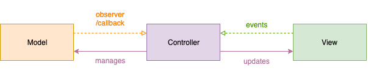

### Model

It represents the business logic. Models are decoupled from Controllers and Views.

### View

It represents elements that users can see and interact with. Views are decoupled from Controllers and typically decoupled from Models.

### Controller

It represents a mediator between the Model and the View. 

For example, 
- A Controller can receive user actions from the View and translate it to the Model commands 
- A Controller can receive the Model notifications and update the View accordingly
- When a Model `Date` property need to be transformed into a presentable `String` that can be rendered by the View, a Controller pass the responsibility to a collaborator to perform the transformation

To mediate the communication between the Model and View, the Controllers should utilize collaborators to distribute responsibilities. 

## Multi-MVCs

One of the biggest misconceptions with MVC is that there’s only one Model, one View and one Controller per screen(so-called Massive Controller). We can separate it into tiny MVC groups.

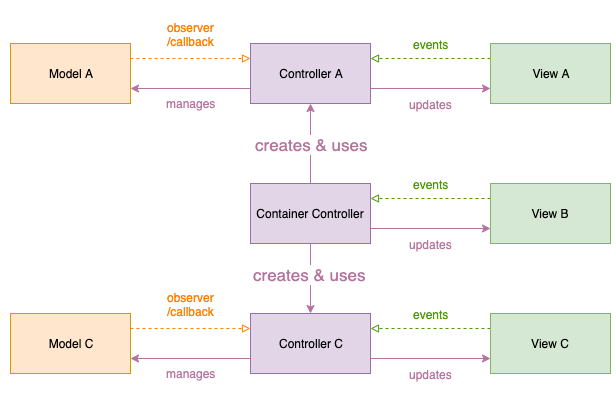

## MVCs with Composer

To achieve low coupling more, we can leave the responsibility to create dependent instances to the Composer. 

See: [Composer](../SwiftDependencyManagement/README.md#composer)

In addition, a Composer has a role of an Adapter. It is also known as Wrapper, which converts the interface of a component into another interface a client expects. So, the Composer should adapt not matching APIs. 

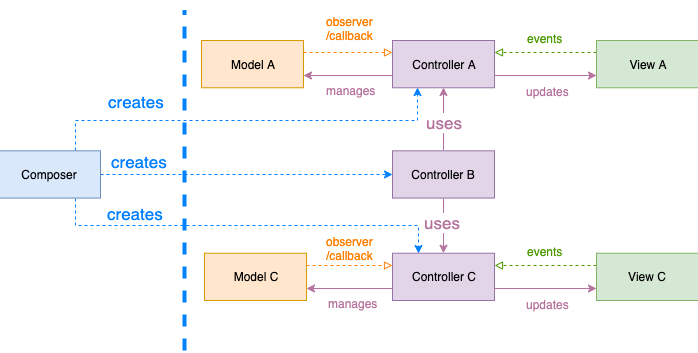

# MVVM(Model-View-ViewModel)

MVVM is an MVC variant created by Microsoft aiming to eliminate the boilerplate of syncing View events and Model updates that Controllers hold in an MVC implementation.

Microsoft’s MVVM solution binds View events with Model updates automatically, but there is no way of binding a ViewModel with a View, so we need to do it by ourselves with pure Swift functions or frameworks like Combine, RxSwift.

In MVVM, a ViewModel does not hold a reference to the View. Their communication should be indirect through a binding mechanism. In UIKit, ViewControllers are good candidates to act as Binders, connecting the View with the ViewModel since ViewControllers already have a reference to their corresponding Views.

Actually, in UIKit, MVVM won’t eliminate a lot of boilerplate code since there’s no automatic binding. But, ViewModels can help us create better architectural separation and reusable logic between the UI and the core components. It’s recommended for ViewModels to be platform-and-framework-agnostic so that we can reuse them on multiple platforms(although It's not mandatory. It depends on what we want to achieve and the team's preference.)

In addition, we’re not forced to have a View Model just because we have a View. Also, we don’t have to choose between MVC or MVVM. We can mix and switch MVC with MVVM to organize our UI layer as needed. 

※ With a reliable and flexible test suite, we can perform such refactoring very quickly and with confidence.

## Stateful MVVM

MVVM holds their states and Views are updated according them.

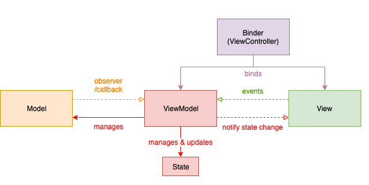

## Stateless MVVM

Opposed to the above, MVVM doesn't need to hold their states. Instead, we can just pass the states transition to the Views.

It's more recommended since stateless components are much simpler and easier to develop, test, and maintain because they are like pure functions with just Input/Output - we send an Input to it and get an Output without changing any internal state. They also eliminate potential threading issues related to accessing shared state.

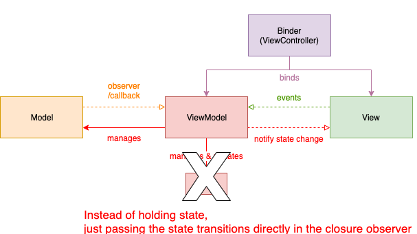

# MVP(Model-View-Presenter)

MVP is a variant of the MVC pattern. MVP is similar to MVC, but instead of a Controller, there is a Presenter.

The MVP Presenter holds a reference to the View. However, the dependency between the Presenter and the View is inverted.

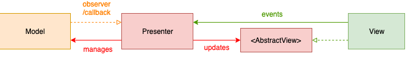

The Presenter holds a reference to an Abstract View type in the form of a protocol. An essential aspect of the MVP component relationship is that the View protocol belongs to the Presentation layer. If the View protocol was in the View layer, that would create a strong dependency between the Presenter and the concrete framework-specific View. In that case, the Presentation layer would not be cross-platform.

In addition, the View talks directly with the Presenter creating a two-way communication channel between the View and the Presenter. So, we need to be careful with a potential retain cycle.

Moreover, the Presenter is responsible for converting domain values into presentable ViewModels.

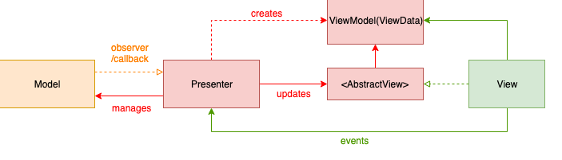

Unlike MVVM, A ViewModel in MVP has **no behavior**. It only holds data. 

## MVP with UIKit and direct bidirectional communication

With UIKit, it could be more common to use ViewController to communicate with Views.

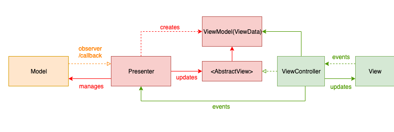

## MVP with indirect bidirectional communication

Another MVP variation of the bidirectional communication between the Presenter and the View is to establish an indirect communication channel.

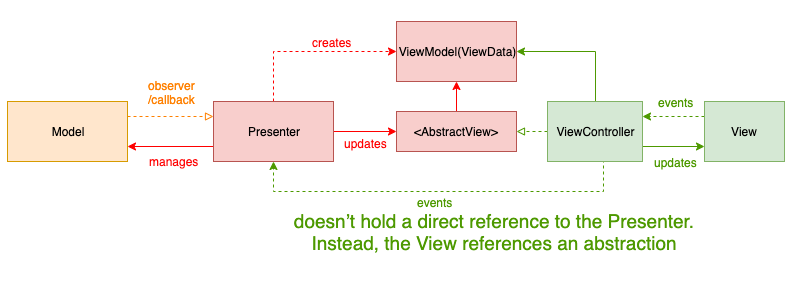

The View doesn’t hold a direct reference to the Presenter. Instead, the View references an abstraction.

Or we can create an abstraction between the Presenter and the View.

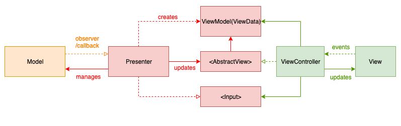

Input protocol is in the Presentation layer, so it doesn't couple with specific UI frameworks.

## MVP with unidirectional communication

Another variation is to establish a unidirectional communication channel between the Presenter and the View through an Adapter.

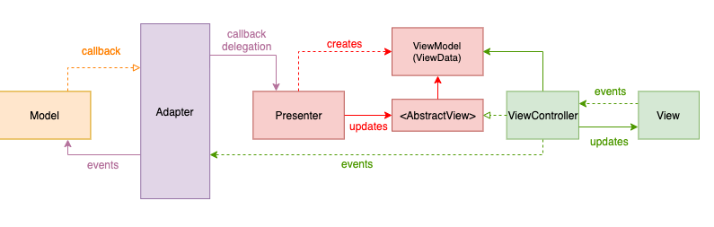

Notice: This pattern could also create a retain cycle if if the Presenter holds a strong reference to the View, the View holds a strong reference to the Adapter and the Adapter holds a strong reference to the Presenter.

The Presenter doesn’t need to communicate with the domain services. This makes the Presenter much simpler as it will have no state management logic.

Also, the View layer doesn’t need to communicate directly with the Presenter, making the system mode composable.

A Adapter is responsible for connecting the interfaces. The Adapter translates View events into the Model requests and delegates responses and state transitions to the Presenter.

## MVP with unidirectional communication and ViewDelegate

The View delegates messages via a protocol. The Adapter conforms to the ViewDelegate and translates View events to the Model requests.

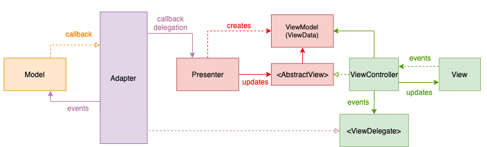

The ViewDelegate protocol belongs in the View layer. But, the Presenter is agnostic of the protocol or any concrete View component.

# Which one should we choose?

It depends on how much isolation and reusability we need.

The simplest versions are less reusable and isolated than the more complex ones. But they’re easier to develop and understand.

The more complex, the more reusable and isolated the modules become. But it also gets complicated with many levels of indirection.

So we need to find a good balance depending on our project needs.

The key point is to continue tying. Software is soft. We should be able to change(refactor) our architecture easily. For doing this, tests are the most important since we must guarantee the existing behavior.